# Mineral themes for Omarchy

[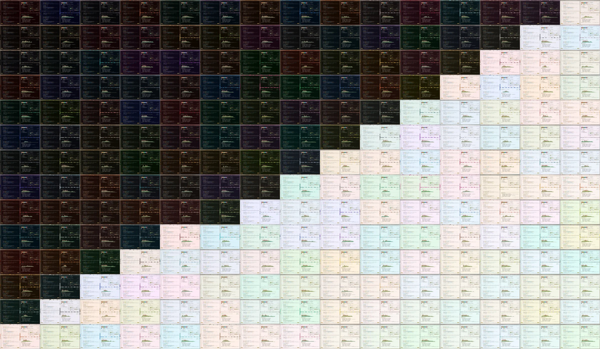](https://bjarneo.github.io/mineral-themes)

This repo has 100 mineral themes for [Omarchy](https://omarchy.org), from gold to lazurite. Each theme has a night variant and a day variant. That makes 200 Omarchy themes. Each variant has a 16-color ANSI palette, 5 backgrounds at 6K and a glint video.

- Site: [bjarneo.github.io/mineral-themes](https://bjarneo.github.io/mineral-themes)
- Screenshots: real captures of an Omarchy desktop with each variant applied
- Backgrounds: 1000 images at 6K, 6144×3456, and 200 glint videos at 3840×2160
- Data: the formula, the crystal system, the Mohs hardness, the luster, the streak, the density and a locality of each mineral

## Variants

| Variant | Theme name | What it is | Lowest ANSI contrast | Lowest text contrast |
| --- | --- | --- | --- | --- |
| Night | `malachite-night` | A dark background in a tint of the mineral. For the evening and dim rooms. | 5.5:1 | 13.8:1 |
| Day | `malachite-day` | A light background in a pale tint of the mineral. For bright rooms and daylight. | 4.5:1 | 11.6:1 |

The contrast columns show the lowest WCAG contrast ratio against the background, over all 100 themes. The script raises or lowers the lightness of each color until it reaches its target. The 6 main ANSI colors reach at least 4.5:1, the WCAG AA level. The muted color for comments reaches at least 3.8:1. Each variant is a complete Omarchy theme with its own folder, so you can install any mix of them.

Alexandrite changes color like the real stone: its night variant is red, and its day variant is green.

## Signature palettes

33 minerals use a signature palette. Like Osaka Jade and Miasma in Omarchy, they fill the 6 ANSI slots with the colors of the mineral, so a slot can hold a color that is not its name. The yellow of Lazurite is the gold of its pyrite flecks, and the blue of Watermelon Tourmaline is the green of its rim. The other minerals keep a classic palette, where red is red and blue is blue.

The contrast targets above apply to both kinds. A check also keeps the 6 slots apart, so no 2 slots look the same.

Signature palettes: [Gold](#gold), [Copper](#copper), [Bismuth](#bismuth), [Kamacite](#kamacite), [Pyrite](#pyrite), [Cinnabar](#cinnabar), [Chalcopyrite](#chalcopyrite), [Bornite](#bornite), [Covellite](#covellite), [Hematite](#hematite), [Ruby](#ruby), [Sapphire](#sapphire), [Spinel](#spinel), [Alexandrite](#alexandrite), [Fluorite](#fluorite), [Malachite](#malachite), [Azurite](#azurite), [Rhodochrosite](#rhodochrosite), [Wulfenite](#wulfenite), [Turquoise](#turquoise), [Vanadinite](#vanadinite), [Erythrite](#erythrite), [Emerald](#emerald), [Watermelon Tourmaline](#watermelon-tourmaline), [Dioptase](#dioptase), [Charoite](#charoite), [Amethyst](#amethyst), [Agate](#agate), [Tiger’s Eye](#tigers-eye), [Opal](#opal), [Labradorite](#labradorite), [Sunstone](#sunstone), [Lazurite](#lazurite).

## Backgrounds

Each variant has 6 backgrounds: 5 images and 1 video. Omarchy shows them in this order. To show the next one, run `omarchy theme bg next`.

| File | What it shows |
| --- | --- |
| `0-omarchy-wordmark.jpg` | The Omarchy wordmark spelled in small pieces of the mineral on a table: crystals, tumbled stones or nuggets. |
| `1-specimen.jpg` | A specimen in the typical habit of the mineral on a seamless backdrop: crystals on their host rock, a stone with a polished face, a geode, a nugget or branches of metal. |
| `2-mineral-card.jpg` | A data card: the formula, a drawing of the crystal, the Mohs scale, the streak, the luster, the density and a locality. |
| `3-close-up.jpg` | A cut gem on a table for 19 gem minerals, a polished slab for 28 minerals with a pattern, and the crystals up close for the other 53. |
| `4-rough.jpg` | Rough pieces or crystals of the mineral, from a low angle with a shallow focus. |
| `5-glint.mp4` | A 12 second loop at 3840×2160. Light glints on the facets of the specimen. |

The wordmark, the specimen, the close-up and the rough pieces are photographic renders. The GPU ray-marches each 3D scene with soft shadows, reflections and depth of field. Light passes through clear crystals and cut gems with refraction, and gems with high dispersion, such as diamond and sphalerite, split it into colors. The data card is a flat drawing.

## Install

`install.sh` copies themes into `~/.config/omarchy/themes`. Each theme variant becomes a normal Omarchy theme folder. The script installs the night and day variants of a theme unless you name one with `--variant`.

### Install one theme without a clone

The script downloads only the themes that you name:

```bash
curl -fsSL https://bjarneo.github.io/mineral-themes/install.sh | bash -s -- malachite --set
```

To install one variant only, add `--variant`:

```bash
curl -fsSL https://bjarneo.github.io/mineral-themes/install.sh | bash -s -- malachite amethyst --variant day
```

`--set` applies the first installed variant of the last theme.

### Install from a clone

```bash
git clone --depth 1 https://github.com/bjarneo/mineral-themes ~/.local/share/mineral-themes
cd ~/.local/share/mineral-themes
./install.sh --all
omarchy theme set malachite-night
```

The full repo is about 2660 MB because it has 1000 backgrounds at 6K. To download less, use the `curl` command above. It downloads only the folders that you name.

### Options

| Command | Result |
| --- | --- |
| `install.sh malachite amethyst` | Installs the night and day variants of the named themes |
| `install.sh malachite --variant day` | Installs only this variant |
| `install.sh --all` | Installs all 200 themes |
| `install.sh --list` | Lists the 100 theme names |
| `install.sh malachite --set` | Installs the theme, then applies its night variant |
| `install.sh --update` | Installs again every theme variant that the script installed |
| `install.sh --remove malachite` | Removes the variants of a theme that the script installed |
| `install.sh --link malachite` | Links to the clone instead of copying. Run `git pull` in the clone to update. |
| `install.sh --force malachite` | Replaces a theme with the same name that the script did not install |

The variant names are `night` and `day`. The script writes a `.mineral-themes` marker file in each theme that it copies. `--update` and `--remove` use this file, so they never change a theme that you made.

### Apply with Aether

[Aether](https://github.com/omacom/aether) can apply a theme straight from the [site](https://bjarneo.github.io/mineral-themes). Open a mineral, pick a variant and a background, and select 1 of these buttons:

| Button | Result |
| --- | --- |
| Apply with Aether | Aether loads the palette and the background, then applies them at once through its own theme. |
| Install as Omarchy theme | Aether adds the variant to `~/.config/omarchy/themes` and activates it at once. This stops if a theme with the same name exists, for example after `install.sh`. |
| Open in editor | Aether opens the palette in its editor. Nothing changes until you select Apply. |

Aether stops a download after 60 seconds. On a slow connection, a 6K background can take longer, so the links download a 3840×2160 copy from `site/assets/aether/`. GitHub does not render `aether://` links, so use the site or build a link yourself:

```text
aether://apply?colors=https://bjarneo.github.io/mineral-themes/malachite/night/colors.toml&wallpaper=https://bjarneo.github.io/mineral-themes/assets/aether/malachite/night/1-specimen.jpg&silent=true
```

Add `&as_omarchy_theme=malachite-night` to install the variant. Use `&edit=true` instead of `&silent=true` to open the editor.

### Name conflicts

All theme names end in `-night` or `-day`, so they do not collide with the themes that ship with Omarchy. The names also differ from the themes of [coffee-themes](https://github.com/bjarneo/coffee-themes) and [100-themes](https://github.com/bjarneo/100-themes). The script does not replace a theme that it did not install. If `~/.config/omarchy/themes/malachite-night` exists, the script skips it and tells you. Rename your theme, or use `--force` to replace it.

`omarchy theme install <url>` does not work with this repo. That command expects one theme at the root of a repo.

## Switch themes and backgrounds

```bash
omarchy theme set malachite-night   # apply a theme
omarchy theme set malachite-day     # the same mineral in daylight
omarchy theme bg next               # show the next background of the current theme
```

## The collection

| Class | Minerals |
| --- | --- |
| Native elements | [Gold](#gold), [Silver](#silver), [Copper](#copper), [Sulfur](#sulfur), [Bismuth](#bismuth), [Diamond](#diamond), [Graphite](#graphite), [Kamacite](#kamacite) |
| Sulfides | [Pyrite](#pyrite), [Galena](#galena), [Sphalerite](#sphalerite), [Cinnabar](#cinnabar), [Chalcopyrite](#chalcopyrite), [Bornite](#bornite), [Stibnite](#stibnite), [Realgar](#realgar), [Orpiment](#orpiment), [Molybdenite](#molybdenite), [Covellite](#covellite) |
| Oxides and hydroxides | [Hematite](#hematite), [Magnetite](#magnetite), [Ruby](#ruby), [Sapphire](#sapphire), [Spinel](#spinel), [Rutile](#rutile), [Cassiterite](#cassiterite), [Alexandrite](#alexandrite), [Cuprite](#cuprite), [Goethite](#goethite) |
| Halides | [Fluorite](#fluorite), [Halite](#halite), [Atacamite](#atacamite) |
| Carbonates | [Calcite](#calcite), [Aragonite](#aragonite), [Malachite](#malachite), [Azurite](#azurite), [Rhodochrosite](#rhodochrosite), [Smithsonite](#smithsonite), [Cerussite](#cerussite) |
| Sulfates and related minerals | [Selenite](#selenite), [Barite](#barite), [Celestine](#celestine), [Chalcanthite](#chalcanthite), [Wulfenite](#wulfenite), [Crocoite](#crocoite), [Scheelite](#scheelite) |
| Phosphates, arsenates and vanadates | [Apatite](#apatite), [Turquoise](#turquoise), [Vanadinite](#vanadinite), [Pyromorphite](#pyromorphite), [Variscite](#variscite), [Adamite](#adamite), [Vivianite](#vivianite), [Wavellite](#wavellite), [Erythrite](#erythrite) |
| Island and group silicates | [Peridot](#peridot), [Almandine](#almandine), [Spessartine](#spessartine), [Uvarovite](#uvarovite), [Topaz](#topaz), [Zircon](#zircon), [Kyanite](#kyanite), [Staurolite](#staurolite), [Titanite](#titanite), [Epidote](#epidote), [Tanzanite](#tanzanite) |
| Ring silicates | [Emerald](#emerald), [Aquamarine](#aquamarine), [Morganite](#morganite), [Watermelon Tourmaline](#watermelon-tourmaline), [Schorl](#schorl), [Dioptase](#dioptase), [Sugilite](#sugilite) |
| Chain silicates | [Jadeite](#jadeite), [Rhodonite](#rhodonite), [Kunzite](#kunzite), [Charoite](#charoite), [Larimar](#larimar) |
| Sheet silicates | [Muscovite](#muscovite), [Lepidolite](#lepidolite), [Chrysocolla](#chrysocolla), [Serpentine](#serpentine), [Talc](#talc), [Apophyllite](#apophyllite), [Cavansite](#cavansite) |
| Framework silicates | [Quartz](#quartz), [Amethyst](#amethyst), [Citrine](#citrine), [Smoky Quartz](#smoky-quartz), [Rose Quartz](#rose-quartz), [Agate](#agate), [Chrysoprase](#chrysoprase), [Tiger’s Eye](#tigers-eye), [Opal](#opal), [Obsidian](#obsidian), [Moonstone](#moonstone), [Amazonite](#amazonite), [Labradorite](#labradorite), [Sunstone](#sunstone), [Lazurite](#lazurite) |

## Native elements

### Gold

[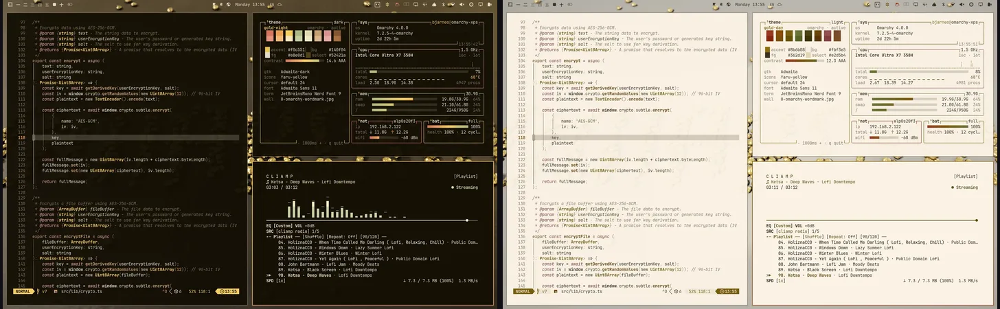](https://bjarneo.github.io/mineral-themes/#gold)

`001` · Signature palette · Folder: [`gold/`](gold/) · [Open on the site](https://bjarneo.github.io/mineral-themes/#gold)

A soft, heavy, yellow metal. It does not tarnish, so a nugget stays bright. The close-up shows the crystals up close.

| Formula | System | Hardness | Luster | Streak | Density | Locality |
| --- | --- | --- | --- | --- | --- | --- |
| Au | Cubic | 2.5 to 3 | Metallic | Golden yellow | 19.3 g/cm³ | Victoria, Australia |

| Variant | Theme name | `background` | `foreground` | `accent` | Icons |
| --- | --- | --- | --- | --- | --- |
| Night | [`gold-night`](gold/night/) | `#140f04` | `#e8e0d1` | `#f0c551` | `Yaru-yellow` |
| Day | [`gold-day`](gold/day/) | `#fbf3e5` | `#362d19` | `#8b6b08` | `Yaru-yellow` |

<details>
<summary>All 16 ANSI colors of each variant</summary>

| Variant | Normal, 0 to 7 | Bright, 8 to 15 |
| --- | --- | --- |
| Night | `#241d0f` `#dc785f` `#b2bf84` `#fed25f` `#cca273` `#de9493` `#e8dfb2` `#d2cab9` | `#7b705b` `#e9957f` `#c9d4a4` `#ffedc3` `#ddba93` `#edaead` `#f7f0ca` `#faf6ef` |
| Day | `#ebe1cc` `#973219` `#667133` `#765b06` `#684004` `#934a4c` `#473e0f` `#554c3a` | `#847b67` `#831e01` `#55601e` `#634b00` `#533201` `#81383b` `#372e00` `#1c1507` |

</details>

```bash
curl -fsSL https://bjarneo.github.io/mineral-themes/install.sh | bash -s -- gold --set
```

### Silver

[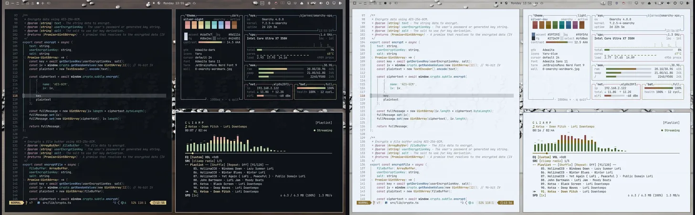](https://bjarneo.github.io/mineral-themes/#silver)

`002` · Folder: [`silver/`](silver/) · [Open on the site](https://bjarneo.github.io/mineral-themes/#silver)

A white metal that grows as wires and branches. It turns black when it tarnishes. The close-up shows the crystals up close.

| Formula | System | Hardness | Luster | Streak | Density | Locality |
| --- | --- | --- | --- | --- | --- | --- |
| Ag | Cubic | 2.5 to 3 | Metallic | Silver white | 10.5 g/cm³ | Kongsberg, Norway |

| Variant | Theme name | `background` | `foreground` | `accent` | Icons |
| --- | --- | --- | --- | --- | --- |
| Night | [`silver-night`](silver/night/) | `#0d1116` | `#dbe2ec` | `#cbd7e7` | `Yaru` |
| Day | [`silver-day`](silver/day/) | `#f0f5fd` | `#272e39` | `#597293` | `Yaru-blue` |

<details>
<summary>All 16 ANSI colors of each variant</summary>

| Variant | Normal, 0 to 7 | Bright, 8 to 15 |
| --- | --- | --- |
| Night | `#1b2026` `#d4908a` `#9abd8b` `#dec588` `#83afdb` `#ce97bc` `#77c7ca` `#c4cbd6` | `#69727f` `#e3aaa4` `#b4d1a7` `#f1dcaa` `#a0c5e9` `#dfb1cf` `#9bdbde` `#f3f7fe` |
| Day | `#dce3ee` `#96534e` `#567945` `#866d2a` `#396792` `#8a5479` `#187c80` `#464e59` | `#747c89` `#85413c` `#436631` `#725908` `#265681` `#794268` `#03666a` `#11161f` |

</details>

```bash
curl -fsSL https://bjarneo.github.io/mineral-themes/install.sh | bash -s -- silver --set
```

### Copper

[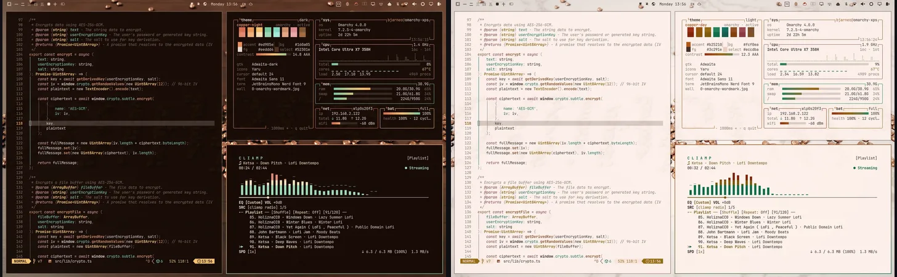](https://bjarneo.github.io/mineral-themes/#copper)

`003` · Signature palette · Folder: [`copper/`](copper/) · [Open on the site](https://bjarneo.github.io/mineral-themes/#copper)

A red metal that grows in branches. Air turns the surface brown, then green. The close-up shows the crystals up close.

| Formula | System | Hardness | Luster | Streak | Density | Locality |
| --- | --- | --- | --- | --- | --- | --- |
| Cu | Cubic | 2.5 to 3 | Metallic | Copper red | 8.9 g/cm³ | Keweenaw Peninsula, Michigan, USA |

| Variant | Theme name | `background` | `foreground` | `accent` | Icons |
| --- | --- | --- | --- | --- | --- |
| Night | [`copper-night`](copper/night/) | `#160a05` | `#eeddd4` | `#ed905e` | `Yaru` |
| Day | [`copper-day`](copper/day/) | `#fcf0ea` | `#3c291e` | `#b25210` | `Yaru` |

<details>
<summary>All 16 ANSI colors of each variant</summary>

| Variant | Normal, 0 to 7 | Bright, 8 to 15 |
| --- | --- | --- |
| Night | `#261810` `#da6f54` `#7bcba1` `#fcc771` `#d7926b` `#e39096` `#86deca` `#d8c6bd` | `#836c60` `#e68d76` `#9edebb` `#fee4bd` `#e6ac8b` `#f1acb0` `#abf2e1` `#fdf5f1` |
| Day | `#f2dcd0` `#97290a` `#1d7d54` `#92660b` `#8f4b1f` `#97464f` `#0d685a` `#5b483e` | `#8a756a` `#7e1c00` `#066944` `#7a5300` `#7e3902` `#85333e` `#0a5549` `#20120a` |

</details>

```bash
curl -fsSL https://bjarneo.github.io/mineral-themes/install.sh | bash -s -- copper --set
```

### Sulfur

[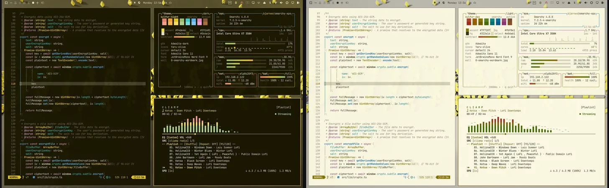](https://bjarneo.github.io/mineral-themes/#sulfur)

`004` · Folder: [`sulfur/`](sulfur/) · [Open on the site](https://bjarneo.github.io/mineral-themes/#sulfur)

Yellow crystals that form near volcanic vents. Sulfur melts at 115 °C and burns with a blue flame. The close-up shows the crystals up close.

| Formula | System | Hardness | Luster | Streak | Density | Locality |
| --- | --- | --- | --- | --- | --- | --- |
| S | Orthorhombic | 1.5 to 2.5 | Resinous | White | 2.07 g/cm³ | Sicily, Italy |

| Variant | Theme name | `background` | `foreground` | `accent` | Icons |
| --- | --- | --- | --- | --- | --- |
| Night | [`sulfur-night`](sulfur/night/) | `#191601` | `#e5e2cc` | `#f4de46` | `Yaru-olive` |
| Day | [`sulfur-day`](sulfur/day/) | `#fbf8e1` | `#322e16` | `#7f7107` | `Yaru-olive` |

<details>
<summary>All 16 ANSI colors of each variant</summary>

| Variant | Normal, 0 to 7 | Bright, 8 to 15 |
| --- | --- | --- |
| Night | `#29250b` `#eb846d` `#97c06e` `#e6c620` `#61b4ed` `#e18abf` `#44cece` `#ceccb5` | `#797453` `#f8a18d` `#b1d491` `#f7de6d` `#87c9f9` `#f0a7d2` `#7ce1e0` `#f8f7f0` |
| Day | `#eae6c6` `#ab422d` `#547d21` `#847101` `#026a9e` `#9b457d` `#097f7e` `#514e38` | `#817e66` `#992c16` `#416800` `#6e5d00` `#055884` `#8a316c` `#016968` `#191606` |

</details>

```bash
curl -fsSL https://bjarneo.github.io/mineral-themes/install.sh | bash -s -- sulfur --set
```

### Bismuth

[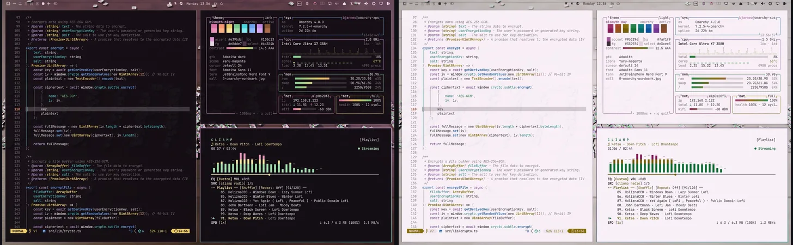](https://bjarneo.github.io/mineral-themes/#bismuth)

`005` · Signature palette · Folder: [`bismuth/`](bismuth/) · [Open on the site](https://bjarneo.github.io/mineral-themes/#bismuth)

A heavy, pink-silver metal. Crystals grown in a lab form stepped squares with a thin rainbow oxide. The close-up shows the crystals up close.

| Formula | System | Hardness | Luster | Streak | Density | Locality |
| --- | --- | --- | --- | --- | --- | --- |
| Bi | Trigonal | 2 to 2.5 | Metallic | Silver white | 9.8 g/cm³ | Schneeberg, Saxony, Germany |

| Variant | Theme name | `background` | `foreground` | `accent` | Icons |
| --- | --- | --- | --- | --- | --- |
| Night | [`bismuth-night`](bismuth/night/) | `#130d13` | `#e8dde7` | `#e39bdc` | `Yaru-magenta` |
| Day | [`bismuth-day`](bismuth/day/) | `#faf1f9` | `#352934` | `#9b5296` | `Yaru-magenta` |

<details>
<summary>All 16 ANSI colors of each variant</summary>

| Variant | Normal, 0 to 7 | Bright, 8 to 15 |
| --- | --- | --- |
| Night | `#231b22` `#de77ab` `#7ccd8e` `#f0ce65` `#6aa7f4` `#c890ea` `#4cdce0` `#d2c6d1` | `#7b6c79` `#eb95be` `#9fe0ac` `#ffe79c` `#8bbefe` `#daabf7` `#86eff2` `#fbf4fa` |
| Day | `#eadde8` `#962e68` `#1f7e3f` `#866c02` `#1c5fad` `#8044a0` `#057c7f` `#554953` | `#847783` `#841557` `#086b30` `#705a05` `#004d99` `#6f3090` `#00676a` `#1c121b` |

</details>

```bash
curl -fsSL https://bjarneo.github.io/mineral-themes/install.sh | bash -s -- bismuth --set
```

### Diamond

[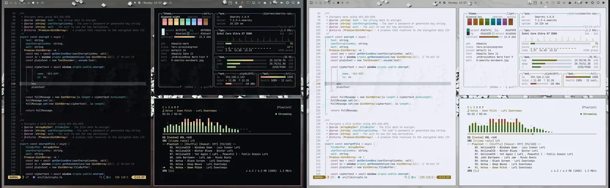](https://bjarneo.github.io/mineral-themes/#diamond)

`006` · Folder: [`diamond/`](diamond/) · [Open on the site](https://bjarneo.github.io/mineral-themes/#diamond)

Pure carbon and the hardest natural mineral. Its high dispersion splits white light into flashes of color. The close-up shows a cut gem on a table.

| Formula | System | Hardness | Luster | Streak | Density | Locality |
| --- | --- | --- | --- | --- | --- | --- |
| C | Cubic | 10 | Adamantine | None, harder than the plate | 3.52 g/cm³ | Kimberley, South Africa |

| Variant | Theme name | `background` | `foreground` | `accent` | Icons |
| --- | --- | --- | --- | --- | --- |
| Night | [`diamond-night`](diamond/night/) | `#07080d` | `#dee1eb` | `#c7f2f9` | `Yaru-prussiangreen` |
| Day | [`diamond-day`](diamond/day/) | `#edf0f8` | `#2a2d38` | `#3d747c` | `Yaru-prussiangreen` |

<details>
<summary>All 16 ANSI colors of each variant</summary>

| Variant | Normal, 0 to 7 | Bright, 8 to 15 |
| --- | --- | --- |
| Night | `#15161c` `#dc8b87` `#95c081` `#e2c479` `#77b1e5` `#cf94c7` `#62cbcb` `#c7cad5` | `#6e717e` `#eba6a1` `#b0d4a0` `#f4dc9f` `#97c7f2` `#e0aed9` `#8ddfde` `#f4f6fe` |
| Day | `#dadde9` `#9e4d4b` `#4d7837` `#876904` `#28679b` `#8c5085` `#007a7b` `#4a4d58` | `#757884` `#8c3a39` `#3a6522` `#715700` `#0c568a` `#7a3e74` `#006566` `#13161e` |

</details>

```bash
curl -fsSL https://bjarneo.github.io/mineral-themes/install.sh | bash -s -- diamond --set
```

### Graphite

[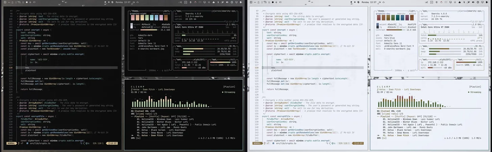](https://bjarneo.github.io/mineral-themes/#graphite)

`007` · Folder: [`graphite/`](graphite/) · [Open on the site](https://bjarneo.github.io/mineral-themes/#graphite)

Pure carbon in soft, black sheets. The sheets slide over each other, so graphite marks paper. The close-up shows the crystals up close.

| Formula | System | Hardness | Luster | Streak | Density | Locality |
| --- | --- | --- | --- | --- | --- | --- |
| C | Hexagonal | 1 to 2 | Metallic to dull | Black | 2.2 g/cm³ | Borrowdale, England |

| Variant | Theme name | `background` | `foreground` | `accent` | Icons |
| --- | --- | --- | --- | --- | --- |
| Night | [`graphite-night`](graphite/night/) | `#0a0a0b` | `#dfe1e8` | `#b9becb` | `Yaru` |
| Day | [`graphite-day`](graphite/day/) | `#edf1f9` | `#2b2e34` | `#5e6c91` | `Yaru-blue` |

<details>
<summary>All 16 ANSI colors of each variant</summary>

| Variant | Normal, 0 to 7 | Bright, 8 to 15 |
| --- | --- | --- |
| Night | `#18181a` `#cc9491` `#a0bb92` `#ddc495` `#8ab0d1` `#d3a4bf` `#8fced4` `#c7cad2` | `#6e7179` `#dcadaa` `#b9d0ae` `#f0dcb5` `#a6c5e2` `#e5bdd3` `#b0e3e8` `#f4f7fe` |
| Day | `#dadfea` `#8f5856` `#5a754c` `#826939` `#416788` `#744862` `#115d63` `#4a4d54` | `#767980` `#7e4645` `#476238` `#6f5723` `#2e5677` `#633752` `#074b51` `#14161c` |

</details>

```bash
curl -fsSL https://bjarneo.github.io/mineral-themes/install.sh | bash -s -- graphite --set
```

### Kamacite

[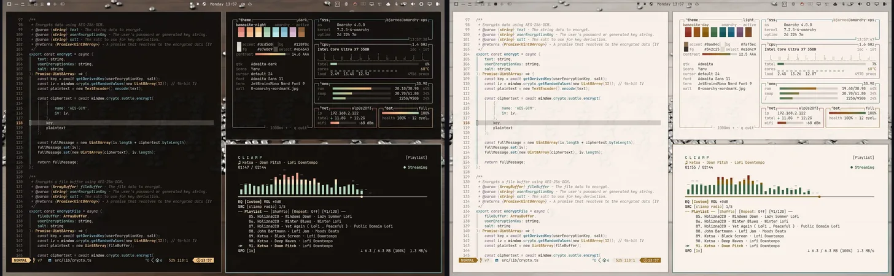](https://bjarneo.github.io/mineral-themes/#kamacite)

`008` · Signature palette · Folder: [`kamacite/`](kamacite/) · [Open on the site](https://bjarneo.github.io/mineral-themes/#kamacite)

An iron-nickel alloy from meteorites. Acid on a cut face shows the crossed bands of the Widmanstätten pattern. The close-up shows a polished slab of the stone.

| Formula | System | Hardness | Luster | Streak | Density | Locality |
| --- | --- | --- | --- | --- | --- | --- |
| α-(Fe,Ni) | Cubic | 4 | Metallic | Gray | 7.9 g/cm³ | Gibeon meteorite, Namibia |

| Variant | Theme name | `background` | `foreground` | `accent` | Icons |
| --- | --- | --- | --- | --- | --- |
| Night | [`kamacite-night`](kamacite/night/) | `#120f0c` | `#e7e0d9` | `#dcd5d0` | `Yaru` |
| Day | [`kamacite-day`](kamacite/day/) | `#faf3ec` | `#342c25` | `#8a684c` | `Yaru` |

<details>
<summary>All 16 ANSI colors of each variant</summary>

| Variant | Normal, 0 to 7 | Bright, 8 to 15 |
| --- | --- | --- |
| Night | `#211d1a` `#df8071` `#98c5a0` `#f8c885` `#79b5cc` `#c8a4c3` `#9cd7da` `#d1c9c1` | `#797067` `#ec9c8f` `#b4d9bb` `#ffe3be` `#99cadd` `#dbbdd7` `#bcecee` `#fcf6f0` |
| Day | `#eae0d7` `#98392d` `#497653` `#956615` `#2a6c84` `#7c5978` `#1c5f62` `#544b44` | `#837a72` `#862419` `#366541` `#7f5400` `#0e5b73` `#6b4868` `#094e51` `#1b150f` |

</details>

```bash
curl -fsSL https://bjarneo.github.io/mineral-themes/install.sh | bash -s -- kamacite --set
```

## Sulfides

### Pyrite

[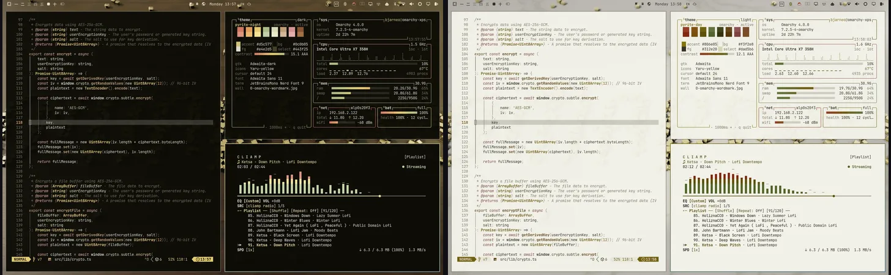](https://bjarneo.github.io/mineral-themes/#pyrite)

`009` · Signature palette · Folder: [`pyrite/`](pyrite/) · [Open on the site](https://bjarneo.github.io/mineral-themes/#pyrite)

Brass-yellow cubes with fine lines on the faces. People call it fool’s gold. The close-up shows the crystals up close.

| Formula | System | Hardness | Luster | Streak | Density | Locality |
| --- | --- | --- | --- | --- | --- | --- |
| FeS₂ | Cubic | 6 to 6.5 | Metallic | Greenish black | 5.0 g/cm³ | Navajún, La Rioja, Spain |

| Variant | Theme name | `background` | `foreground` | `accent` | Icons |
| --- | --- | --- | --- | --- | --- |
| Night | [`pyrite-night`](pyrite/night/) | `#0c0b05` | `#e4e2d5` | `#d5c577` | `Yaru-yellow` |
| Day | [`pyrite-day`](pyrite/day/) | `#f3f2e8` | `#312e20` | `#806e05` | `Yaru-yellow` |

<details>
<summary>All 16 ANSI colors of each variant</summary>

| Variant | Normal, 0 to 7 | Bright, 8 to 15 |
| --- | --- | --- |
| Night | `#1b1a11` `#d77b64` `#acc188` `#ead070` `#c7a47a` `#d99796` `#e2e0bb` `#cdcbbd` | `#757262` `#e49783` `#c4d6a7` `#fce89b` `#d9bc99` `#e9b1b0` `#f2f1d1` `#f8f7f0` |
| Day | `#e2e0d3` `#933720` `#5f7339` `#6e5c09` `#634314` `#8e4e4f` `#403e1a` `#504e40` | `#7c796a` `#812207` `#4e6225` `#5b4c03` `#523302` `#7d3c3e` `#312e07` `#18160b` |

</details>

```bash
curl -fsSL https://bjarneo.github.io/mineral-themes/install.sh | bash -s -- pyrite --set
```

### Galena

[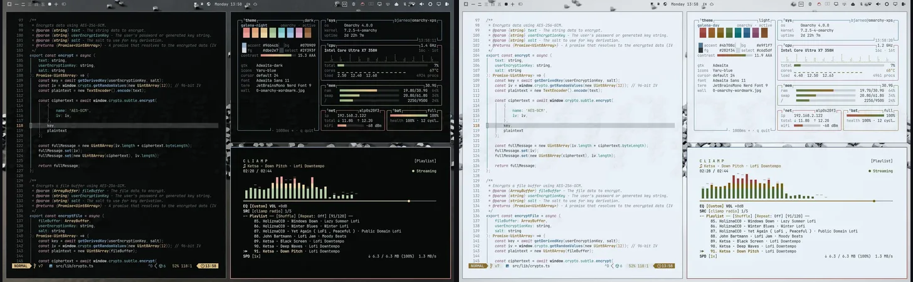](https://bjarneo.github.io/mineral-themes/#galena)

`010` · Folder: [`galena/`](galena/) · [Open on the site](https://bjarneo.github.io/mineral-themes/#galena)

Heavy, lead-gray cubes. It is the main ore of lead, and it breaks into perfect cubes. The close-up shows the crystals up close.

| Formula | System | Hardness | Luster | Streak | Density | Locality |
| --- | --- | --- | --- | --- | --- | --- |
| PbS | Cubic | 2.5 to 2.75 | Metallic | Lead gray | 7.6 g/cm³ | Joplin, Missouri, USA |

| Variant | Theme name | `background` | `foreground` | `accent` | Icons |
| --- | --- | --- | --- | --- | --- |
| Night | [`galena-night`](galena/night/) | `#070909` | `#dbe2e7` | `#96b4cb` | `Yaru-blue` |
| Day | [`galena-day`](galena/day/) | `#e9f1f7` | `#282f34` | `#4b708c` | `Yaru-blue` |

<details>
<summary>All 16 ANSI colors of each variant</summary>

| Variant | Normal, 0 to 7 | Bright, 8 to 15 |
| --- | --- | --- |
| Night | `#151618` `#e18981` `#9dbd88` `#e1c388` `#80b1d9` `#d097b8` `#77c7c9` `#c4ccd1` | `#6b7378` `#efa59d` `#b7d1a6` `#f3dbaa` `#9ec6e8` `#e1b1cd` `#9bdbdd` `#f1f8fd` |
| Day | `#d4e0e8` `#a24a44` `#567540` `#866827` `#346890` `#8c5476` `#12797c` `#474e53` | `#727a80` `#903733` `#43622c` `#735506` `#1f577f` `#7b4265` `#006568` `#11171b` |

</details>

```bash
curl -fsSL https://bjarneo.github.io/mineral-themes/install.sh | bash -s -- galena --set
```

### Sphalerite

[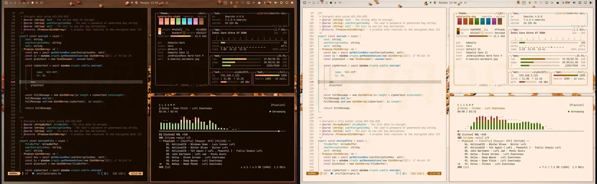](https://bjarneo.github.io/mineral-themes/#sphalerite)

`011` · Folder: [`sphalerite/`](sphalerite/) · [Open on the site](https://bjarneo.github.io/mineral-themes/#sphalerite)

The main ore of zinc. Clear crystals are orange to red, with more fire than diamond. The close-up shows the crystals up close.

| Formula | System | Hardness | Luster | Streak | Density | Locality |
| --- | --- | --- | --- | --- | --- | --- |
| ZnS | Cubic | 3.5 to 4 | Resinous to adamantine | Pale yellow-brown | 4.0 g/cm³ | Picos de Europa, Spain |

| Variant | Theme name | `background` | `foreground` | `accent` | Icons |
| --- | --- | --- | --- | --- | --- |
| Night | [`sphalerite-night`](sphalerite/night/) | `#140800` | `#eedecf` | `#fe9e51` | `Yaru` |
| Day | [`sphalerite-day`](sphalerite/day/) | `#ffeede` | `#3c2a17` | `#a85800` | `Yaru` |

<details>
<summary>All 16 ANSI colors of each variant</summary>

| Variant | Normal, 0 to 7 | Bright, 8 to 15 |
| --- | --- | --- |
| Night | `#241506` `#ec817f` `#96c172` `#ffb670` `#63b4ea` `#e08bbf` `#4bcece` `#d8c7b7` | `#836d58` `#f99f9b` `#b1d595` `#fed6b1` `#89c9f7` `#efa7d2` `#80e1e1` `#fcf6f0` |
| Day | `#f2dbc5` `#ac3f42` `#4e7922` `#a15d00` `#0a6a9c` `#9b457c` `#107a7a` `#5a4939` | `#887563` `#9a2930` `#3b6600` `#844d04` `#005884` `#89326b` `#0c6566` `#1f1307` |

</details>

```bash
curl -fsSL https://bjarneo.github.io/mineral-themes/install.sh | bash -s -- sphalerite --set
```

### Cinnabar

[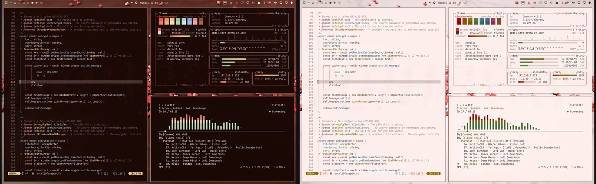](https://bjarneo.github.io/mineral-themes/#cinnabar)

`012` · Signature palette · Folder: [`cinnabar/`](cinnabar/) · [Open on the site](https://bjarneo.github.io/mineral-themes/#cinnabar)

Scarlet crystals of mercury sulfide. People ground it into the red pigment vermilion. The close-up shows the crystals up close.

| Formula | System | Hardness | Luster | Streak | Density | Locality |
| --- | --- | --- | --- | --- | --- | --- |
| HgS | Trigonal | 2 to 2.5 | Adamantine | Scarlet | 8.1 g/cm³ | Hunan, China |

| Variant | Theme name | `background` | `foreground` | `accent` | Icons |
| --- | --- | --- | --- | --- | --- |
| Night | [`cinnabar-night`](cinnabar/night/) | `#1a0705` | `#f5dad6` | `#f36356` | `Yaru-red` |
| Day | [`cinnabar-day`](cinnabar/day/) | `#fdefed` | `#402622` | `#cc2a25` | `Yaru-red` |

<details>
<summary>All 16 ANSI colors of each variant</summary>

| Variant | Normal, 0 to 7 | Bright, 8 to 15 |
| --- | --- | --- |
| Night | `#2c1411` `#e45d53` `#9dc494` `#f2cb83` `#89afd6` `#ea89a1` `#abdbde` `#dec4c0` | `#8b6863` `#f18175` `#b7d9b0` `#ffe4b6` `#a6c5e5` `#f7a6b8` `#c9f0f2` `#fef4f3` |
| Day | `#fcd7d1` `#9e010e` `#4e7646` `#8e680c` `#40668d` `#9d3d59` `#447679` `#5f4642` | `#907470` `#820009` `#3c6533` `#765501` `#2e557c` `#8b2948` `#2e6265` `#22110e` |

</details>

```bash
curl -fsSL https://bjarneo.github.io/mineral-themes/install.sh | bash -s -- cinnabar --set
```

### Chalcopyrite

[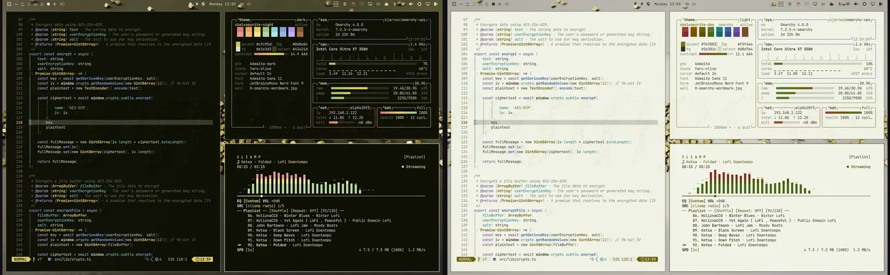](https://bjarneo.github.io/mineral-themes/#chalcopyrite)

`013` · Signature palette · Folder: [`chalcopyrite/`](chalcopyrite/) · [Open on the site](https://bjarneo.github.io/mineral-themes/#chalcopyrite)

Brass-yellow copper ore, deeper in color than pyrite. The surface often tarnishes to blue and purple. The close-up shows the crystals up close.

| Formula | System | Hardness | Luster | Streak | Density | Locality |
| --- | --- | --- | --- | --- | --- | --- |
| CuFeS₂ | Tetragonal | 3.5 to 4 | Metallic | Greenish black | 4.2 g/cm³ | Cornwall, England |

| Variant | Theme name | `background` | `foreground` | `accent` | Icons |
| --- | --- | --- | --- | --- | --- |
| Night | [`chalcopyrite-night`](chalcopyrite/night/) | `#0d0e04` | `#e1e3d3` | `#cfc95d` | `Yaru-olive` |
| Day | [`chalcopyrite-day`](chalcopyrite/day/) | `#f3f4e6` | `#2e301c` | `#767003` | `Yaru-olive` |

<details>
<summary>All 16 ANSI colors of each variant</summary>

| Variant | Normal, 0 to 7 | Bright, 8 to 15 |
| --- | --- | --- |
| Night | `#1c1d0f` `#df7f78` `#a2c580` `#e6d35c` `#80a5e3` `#b699eb` `#89dbdf` `#caccbb` | `#72745e` `#ec9b94` `#bcd9a1` `#faea8e` `#9cbcef` `#cab3f7` `#aeeff3` `#f7f8f0` |
| Day | `#e1e3ce` `#983835` `#55762d` `#695d06` `#3a5f9c` `#6f4fa1` `#117b7f` `#4d4f3c` | `#7a7c68` `#862323` `#446516` `#574c00` `#284d8c` `#5f3c90` `#0e6569` `#161709` |

</details>

```bash
curl -fsSL https://bjarneo.github.io/mineral-themes/install.sh | bash -s -- chalcopyrite --set
```

### Bornite

[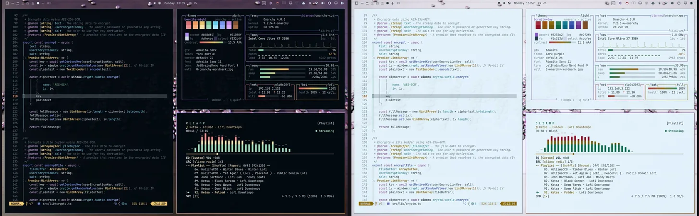](https://bjarneo.github.io/mineral-themes/#bornite)

`014` · Signature palette · Folder: [`bornite/`](bornite/) · [Open on the site](https://bjarneo.github.io/mineral-themes/#bornite)

A copper ore that tarnishes to purple, blue and gold. Miners call it peacock ore. The close-up shows a polished slab of the stone.

| Formula | System | Hardness | Luster | Streak | Density | Locality |
| --- | --- | --- | --- | --- | --- | --- |
| Cu₅FeS₄ | Orthorhombic | 3 | Metallic | Grayish black | 5.1 g/cm³ | Butte, Montana, USA |

| Variant | Theme name | `background` | `foreground` | `accent` | Icons |
| --- | --- | --- | --- | --- | --- |
| Night | [`bornite-night`](bornite/night/) | `#01080f` | `#d4e4ee` | `#b48df4` | `Yaru-purple` |
| Day | [`bornite-day`](bornite/day/) | `#e2f2fb` | `#1c313d` | `#8255c2` | `Yaru-purple` |

<details>
<summary>All 16 ANSI colors of each variant</summary>

| Variant | Normal, 0 to 7 | Bright, 8 to 15 |
| --- | --- | --- |
| Night | `#08171f` `#e17174` `#7bcba1` `#f5cb70` `#7999f5` `#cc8ee7` `#67d5f5` `#bcced8` | `#5f7583` `#ee8f8f` `#9edebb` `#ffe5b0` `#94b1fe` `#ddaaf4` `#a2e7fe` `#f1f8fd` |
| Day | `#cbe1ee` `#9c2834` `#1a7b53` `#896600` `#3853b0` `#83429d` `#0b7791` `#3d505c` | `#667b87` `#8a0822` `#026742` `#725503` `#28409f` `#722e8c` `#006277` `#081821` |

</details>

```bash
curl -fsSL https://bjarneo.github.io/mineral-themes/install.sh | bash -s -- bornite --set
```

### Stibnite

[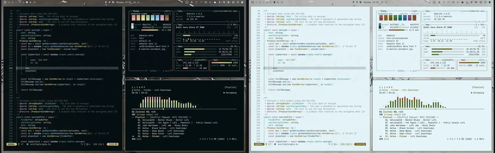](https://bjarneo.github.io/mineral-themes/#stibnite)

`015` · Folder: [`stibnite/`](stibnite/) · [Open on the site](https://bjarneo.github.io/mineral-themes/#stibnite)

Long, steel-gray blades of antimony sulfide. The blades bend and twist, and they melt in a candle flame. The close-up shows the crystals up close.

| Formula | System | Hardness | Luster | Streak | Density | Locality |
| --- | --- | --- | --- | --- | --- | --- |
| Sb₂S₃ | Orthorhombic | 2 | Metallic | Lead gray | 4.6 g/cm³ | Jiangxi, China |

| Variant | Theme name | `background` | `foreground` | `accent` | Icons |
| --- | --- | --- | --- | --- | --- |
| Night | [`stibnite-night`](stibnite/night/) | `#030d10` | `#d3e5ea` | `#b6c7cc` | `Yaru` |
| Day | [`stibnite-day`](stibnite/day/) | `#e5f5f9` | `#1c3238` | `#427684` | `Yaru-prussiangreen` |

<details>
<summary>All 16 ANSI colors of each variant</summary>

| Variant | Normal, 0 to 7 | Bright, 8 to 15 |
| --- | --- | --- |
| Night | `#0d1c20` `#d4908b` `#9dbc89` `#d7c883` `#80b1d8` `#ce97ba` `#79c7c7` `#bbced4` | `#5e767d` `#e4aaa5` `#b7d1a6` `#ebdfa7` `#9ec6e7` `#dfb1ce` `#9cdbdb` `#f0f9fb` |
| Day | `#cee4ea` `#96534f` `#587642` `#756514` `#34688f` `#8b5478` `#197b7c` `#3c5157` | `#677d84` `#85413e` `#45642e` `#635404` `#1f577e` `#794267` `#066566` `#07191d` |

</details>

```bash
curl -fsSL https://bjarneo.github.io/mineral-themes/install.sh | bash -s -- stibnite --set
```

### Realgar

[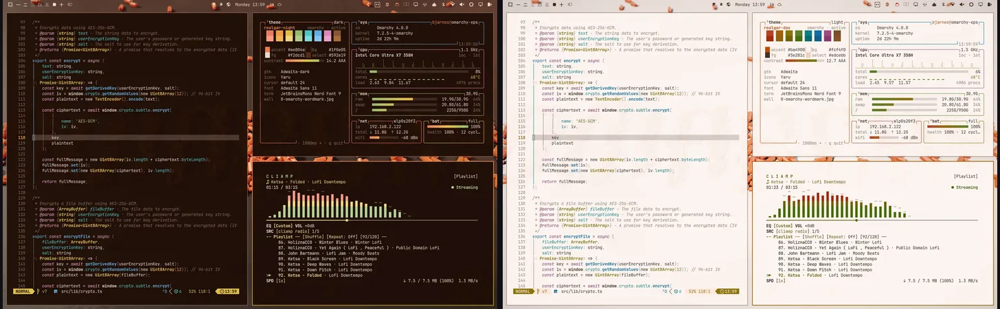](https://bjarneo.github.io/mineral-themes/#realgar)

`016` · Folder: [`realgar/`](realgar/) · [Open on the site](https://bjarneo.github.io/mineral-themes/#realgar)

Orange-red crystals of arsenic sulfide. Light slowly breaks it down into a yellow powder. The close-up shows the crystals up close.

| Formula | System | Hardness | Luster | Streak | Density | Locality |
| --- | --- | --- | --- | --- | --- | --- |
| As₄S₄ | Monoclinic | 1.5 to 2 | Resinous | Orange-red | 3.56 g/cm³ | Shimen, Hunan, China |

| Variant | Theme name | `background` | `foreground` | `accent` | Icons |
| --- | --- | --- | --- | --- | --- |
| Night | [`realgar-night`](realgar/night/) | `#1f0e05` | `#f2dcd1` | `#ee804e` | `Yaru` |
| Day | [`realgar-day`](realgar/day/) | `#fcf4f0` | `#3e281c` | `#ba4900` | `Yaru` |

<details>
<summary>All 16 ANSI colors of each variant</summary>

| Variant | Normal, 0 to 7 | Bright, 8 to 15 |
| --- | --- | --- |
| Night | `#311c11` `#f37e63` `#99c06f` `#e6c547` `#61b4ea` `#e18bbe` `#4bcdcf` `#dcc5ba` | `#896c5c` `#ff9d86` `#b4d492` `#f8dd7e` `#88c9f6` `#f0a7d1` `#7fe1e1` `#fdf5f1` |
| Day | `#fcdccc` `#b33a1f` `#557b21` `#866e00` `#056a9b` `#9b457c` `#007d7e` `#5d483c` | `#8f786b` `#a12100` `#436803` `#705c03` `#095881` `#89316b` `#006869` `#211209` |

</details>

```bash
curl -fsSL https://bjarneo.github.io/mineral-themes/install.sh | bash -s -- realgar --set
```

### Orpiment

[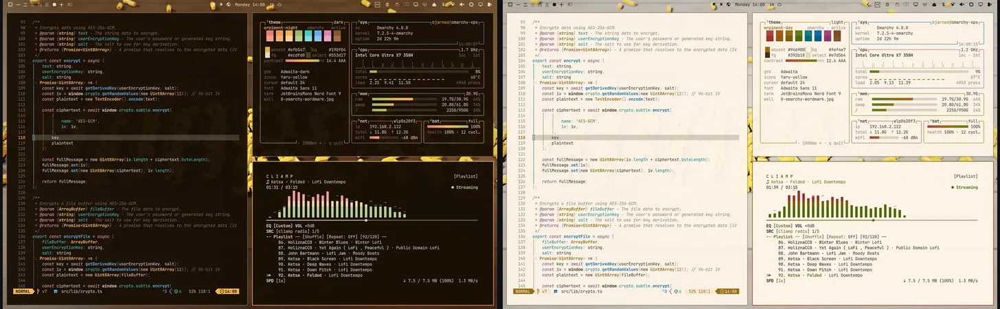](https://bjarneo.github.io/mineral-themes/#orpiment)

`017` · Folder: [`orpiment/`](orpiment/) · [Open on the site](https://bjarneo.github.io/mineral-themes/#orpiment)

Golden-yellow arsenic sulfide with a pearly shine. Painters once used it as a yellow pigment. The close-up shows the crystals up close.

| Formula | System | Hardness | Luster | Streak | Density | Locality |
| --- | --- | --- | --- | --- | --- | --- |
| As₂S₃ | Monoclinic | 1.5 to 2 | Resinous to pearly | Pale yellow | 3.49 g/cm³ | Twin Creeks Mine, Nevada, USA |

| Variant | Theme name | `background` | `foreground` | `accent` | Icons |
| --- | --- | --- | --- | --- | --- |
| Night | [`orpiment-night`](orpiment/night/) | `#190f04` | `#ecdfd0` | `#efb547` | `Yaru-yellow` |
| Day | [`orpiment-day`](orpiment/day/) | `#fef4e7` | `#392b18` | `#946900` | `Yaru-yellow` |

<details>
<summary>All 16 ANSI colors of each variant</summary>

| Variant | Normal, 0 to 7 | Bright, 8 to 15 |
| --- | --- | --- |
| Night | `#291e0f` `#ec8275` `#9fbe6b` `#f8bc50` `#66b3ec` `#e28abb` `#4ccecc` `#d6c8b8` | `#7f6e59` `#f99f93` `#b8d38f` `#ffd89a` `#8bc9f8` `#f1a7ce` `#80e1df` `#fbf6f0` |
| Day | `#f2e0cb` `#ac4036` `#5b7919` `#94690a` `#09699f` `#9c4579` `#027d7c` `#594a38` | `#8a7a67` `#9a2a23` `#4a6600` `#7b5608` `#005787` `#8b3168` `#006867` `#1e1406` |

</details>

```bash
curl -fsSL https://bjarneo.github.io/mineral-themes/install.sh | bash -s -- orpiment --set
```

### Molybdenite

[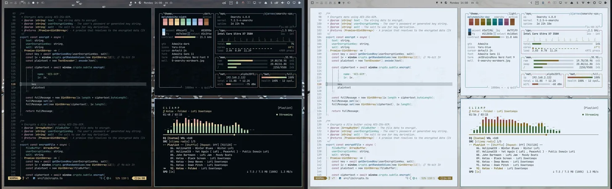](https://bjarneo.github.io/mineral-themes/#molybdenite)

`018` · Folder: [`molybdenite/`](molybdenite/) · [Open on the site](https://bjarneo.github.io/mineral-themes/#molybdenite)

Soft, blue-gray hexagonal plates. It looks like graphite but leaves a greenish streak on glazed porcelain. The close-up shows the crystals up close.

| Formula | System | Hardness | Luster | Streak | Density | Locality |
| --- | --- | --- | --- | --- | --- | --- |
| MoS₂ | Hexagonal | 1 to 1.5 | Metallic | Bluish gray | 4.7 g/cm³ | Quebec, Canada |

| Variant | Theme name | `background` | `foreground` | `accent` | Icons |
| --- | --- | --- | --- | --- | --- |
| Night | [`molybdenite-night`](molybdenite/night/) | `#03090e` | `#d7e3ed` | `#96caf3` | `Yaru-blue` |
| Day | [`molybdenite-day`](molybdenite/day/) | `#e7f1f9` | `#21303b` | `#3a719b` | `Yaru-blue` |

<details>
<summary>All 16 ANSI colors of each variant</summary>

| Variant | Normal, 0 to 7 | Bright, 8 to 15 |
| --- | --- | --- |
| Night | `#0e171e` `#d49089` `#92bf91` `#e0c488` `#7eb1da` `#d096b8` `#77c7c8` `#bfcdd7` | `#647481` `#e3aaa3` `#aed3ad` `#f3dcaa` `#9dc6e8` `#e1b0cc` `#9bdbdb` `#f1f8fd` |
| Day | `#d1dfeb` `#96534d` `#4a774a` `#856926` `#326891` `#8c5476` `#13797b` `#414f5a` | `#6c7b87` `#85413b` `#346335` `#715503` `#1c5780` `#7b4265` `#006566` `#0c1720` |

</details>

```bash
curl -fsSL https://bjarneo.github.io/mineral-themes/install.sh | bash -s -- molybdenite --set
```

### Covellite

[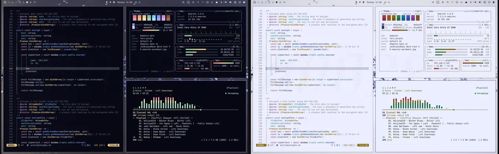](https://bjarneo.github.io/mineral-themes/#covellite)

`019` · Signature palette · Folder: [`covellite/`](covellite/) · [Open on the site](https://bjarneo.github.io/mineral-themes/#covellite)

Thin indigo plates of copper sulfide with a purple shine. The close-up shows the crystals up close.

| Formula | System | Hardness | Luster | Streak | Density | Locality |
| --- | --- | --- | --- | --- | --- | --- |
| CuS | Hexagonal | 1.5 to 2 | Submetallic | Lead gray to black | 4.6 g/cm³ | Sardinia, Italy |

| Variant | Theme name | `background` | `foreground` | `accent` | Icons |
| --- | --- | --- | --- | --- | --- |
| Night | [`covellite-night`](covellite/night/) | `#050614` | `#dde0f4` | `#8d96e8` | `Yaru-purple` |
| Day | [`covellite-day`](covellite/day/) | `#ebeeff` | `#292c42` | `#5e64ba` | `Yaru-purple` |

<details>
<summary>All 16 ANSI colors of each variant</summary>

| Variant | Normal, 0 to 7 | Bright, 8 to 15 |
| --- | --- | --- |
| Night | `#111325` `#df7e86` `#8ac8a6` `#efcc83` `#7a97fb` `#cf8fde` `#7ccffe` `#c6c9de` | `#6b708a` `#ec9ba0` `#a9dcc0` `#fee5b1` `#98b0fc` `#e0abec` `#b5e2fd` `#f5f6fe` |
| Day | `#d6dbf7` `#973744` `#367959` `#896603` `#3b51b6` `#854494` `#0c74a1` `#484b60` | `#74778e` `#852134` `#1b6544` `#715509` `#2c3da6` `#743083` `#006088` `#131524` |

</details>

```bash
curl -fsSL https://bjarneo.github.io/mineral-themes/install.sh | bash -s -- covellite --set
```

## Oxides and hydroxides

### Hematite

[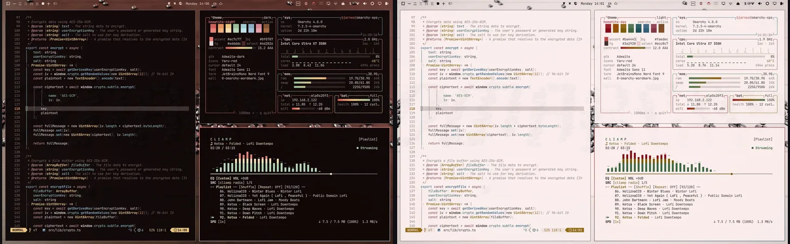](https://bjarneo.github.io/mineral-themes/#hematite)

`020` · Signature palette · Folder: [`hematite/`](hematite/) · [Open on the site](https://bjarneo.github.io/mineral-themes/#hematite)

Iron oxide that looks steel-gray but leaves a red streak. Rounded masses are called kidney ore. The close-up shows the crystals up close.

| Formula | System | Hardness | Luster | Streak | Density | Locality |
| --- | --- | --- | --- | --- | --- | --- |
| Fe₂O₃ | Trigonal | 5 to 6.5 | Metallic to earthy | Reddish brown | 5.3 g/cm³ | Cumbria, England |

| Variant | Theme name | `background` | `foreground` | `accent` | Icons |
| --- | --- | --- | --- | --- | --- |
| Night | [`hematite-night`](hematite/night/) | `#0f0707` | `#eddddc` | `#ec7c77` | `Yaru-red` |
| Day | [`hematite-day`](hematite/day/) | `#faedec` | `#3a2928` | `#ba4443` | `Yaru-red` |

<details>
<summary>All 16 ANSI colors of each variant</summary>

| Variant | Normal, 0 to 7 | Bright, 8 to 15 |
| --- | --- | --- |
| Night | `#1f1514` `#d8625c` `#9cc49c` `#f4ca84` `#89b1cd` `#db8a96` `#a5d4dd` `#d7c6c4` | `#806c6a` `#e8847d` `#b7d8b7` `#fee4ba` `#a5c6de` `#eaa5af` `#c3e9f0` `#fef4f3` |
| Day | `#ebdad8` `#98181f` `#4e764f` `#8e650a` `#3f6885` `#924352` `#2a5b63` `#594847` | `#867472` `#810211` `#39623b` `#775401` `#2c5774` `#813041` `#154b53` `#1f1211` |

</details>

```bash
curl -fsSL https://bjarneo.github.io/mineral-themes/install.sh | bash -s -- hematite --set
```

### Magnetite

[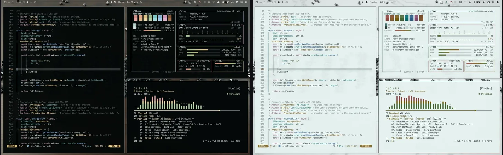](https://bjarneo.github.io/mineral-themes/#magnetite)

`021` · Folder: [`magnetite/`](magnetite/) · [Open on the site](https://bjarneo.github.io/mineral-themes/#magnetite)

Black octahedrons of iron oxide. It is the most magnetic natural mineral. The close-up shows the crystals up close.

| Formula | System | Hardness | Luster | Streak | Density | Locality |
| --- | --- | --- | --- | --- | --- | --- |
| Fe₃O₄ | Cubic | 5.5 to 6.5 | Metallic | Black | 5.2 g/cm³ | Kiruna, Sweden |

| Variant | Theme name | `background` | `foreground` | `accent` | Icons |
| --- | --- | --- | --- | --- | --- |
| Night | [`magnetite-night`](magnetite/night/) | `#030707` | `#d8e4e4` | `#b4d6d4` | `Yaru-prussiangreen` |
| Day | [`magnetite-day`](magnetite/day/) | `#e5f1f0` | `#233131` | `#3d7673` | `Yaru-prussiangreen` |

<details>
<summary>All 16 ANSI colors of each variant</summary>

| Variant | Normal, 0 to 7 | Bright, 8 to 15 |
| --- | --- | --- |
| Night | `#0e1414` `#d49089` `#9bbd8a` `#dfc488` `#83b0db` `#cf97bb` `#77c7ca` `#c0cecd` | `#667575` `#e3aaa3` `#b5d2a7` `#f2dcaa` `#a1c6ea` `#e0b1cf` `#9bdbdd` `#f0f9f9` |
| Day | `#d0e0df` `#96534d` `#537642` `#846926` `#396791` `#8b5478` `#0f787b` `#435050` | `#6c7b7a` `#85413b` `#3f622d` `#705502` `#255681` `#794268` `#006467` `#0d1818` |

</details>

```bash
curl -fsSL https://bjarneo.github.io/mineral-themes/install.sh | bash -s -- magnetite --set
```

### Ruby

[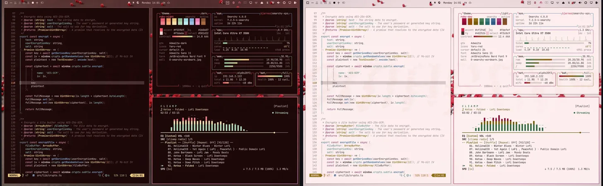](https://bjarneo.github.io/mineral-themes/#ruby)

`022` · Variety of corundum · Signature palette · Folder: [`ruby/`](ruby/) · [Open on the site](https://bjarneo.github.io/mineral-themes/#ruby)

The red variety of corundum. Chromium gives the color and a red glow under ultraviolet light. The close-up shows a cut gem on a table.

| Formula | System | Hardness | Luster | Streak | Density | Locality |
| --- | --- | --- | --- | --- | --- | --- |
| Al₂O₃ | Trigonal | 9 | Vitreous | White | 4.0 g/cm³ | Mogok, Myanmar |

| Variant | Theme name | `background` | `foreground` | `accent` | Icons |
| --- | --- | --- | --- | --- | --- |
| Night | [`ruby-night`](ruby/night/) | `#1b0607` | `#f5dada` | `#f55969` | `Yaru-red` |
| Day | [`ruby-day`](ruby/day/) | `#fdefef` | `#402526` | `#cf1940` | `Yaru-red` |

<details>
<summary>All 16 ANSI colors of each variant</summary>

| Variant | Normal, 0 to 7 | Bright, 8 to 15 |
| --- | --- | --- |
| Night | `#2d1214` `#e75e70` `#93c69d` `#efcc83` `#84afdc` `#f080b8` `#a3dde0` `#dec3c3` | `#8d6666` `#f2808b` `#b0dab7` `#fee5b1` `#a1c5ea` `#fd9fcc` `#c2f2f4` `#fef4f4` |
| Day | `#fcd6d6` `#a10434` `#43784f` `#8c690a` `#3a6693` `#a23070` `#39787b` `#5f4646` | `#907474` `#850229` `#2e663c` `#745600` `#275582` `#90165f` `#1f6468` `#221011` |

</details>

```bash
curl -fsSL https://bjarneo.github.io/mineral-themes/install.sh | bash -s -- ruby --set
```

### Sapphire

[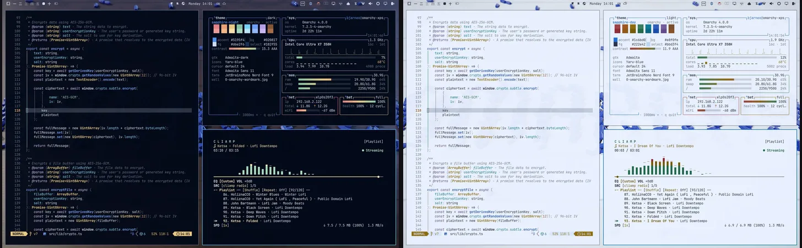](https://bjarneo.github.io/mineral-themes/#sapphire)

`023` · Variety of corundum · Signature palette · Folder: [`sapphire/`](sapphire/) · [Open on the site](https://bjarneo.github.io/mineral-themes/#sapphire)

Corundum in every color but red. Iron and titanium give the classic blue. The close-up shows a cut gem on a table.

| Formula | System | Hardness | Luster | Streak | Density | Locality |
| --- | --- | --- | --- | --- | --- | --- |
| Al₂O₃ | Trigonal | 9 | Vitreous | White | 4.0 g/cm³ | Ratnapura, Sri Lanka |

| Variant | Theme name | `background` | `foreground` | `accent` | Icons |
| --- | --- | --- | --- | --- | --- |
| Night | [`sapphire-night`](sapphire/night/) | `#020817` | `#d6e2f6` | `#5195f4` | `Yaru-blue` |
| Day | [`sapphire-day`](sapphire/day/) | `#e8f0fe` | `#222e42` | `#1c6bd0` | `Yaru-blue` |

<details>
<summary>All 16 ANSI colors of each variant</summary>

| Variant | Normal, 0 to 7 | Bright, 8 to 15 |
| --- | --- | --- |
| Night | `#0c1628` `#e68485` `#8ac8a6` `#efcc83` `#71a3ff` `#bba3e8` `#78d9fe` `#c0cbdf` | `#62728d` `#f3a1a0` `#a9dcc0` `#fee5b1` `#96bbfd` `#cfbcf6` `#bbeafd` `#f3f7fe` |
| Day | `#cedffa` `#9c3b40` `#367959` `#8a6807` `#2859ba` `#71579b` `#037695` `#424e61` | `#6d798e` `#8a262f` `#1d6646` `#735500` `#1446a9` `#60458a` `#00627d` `#0e1624` |

</details>

```bash
curl -fsSL https://bjarneo.github.io/mineral-themes/install.sh | bash -s -- sapphire --set
```

### Spinel

[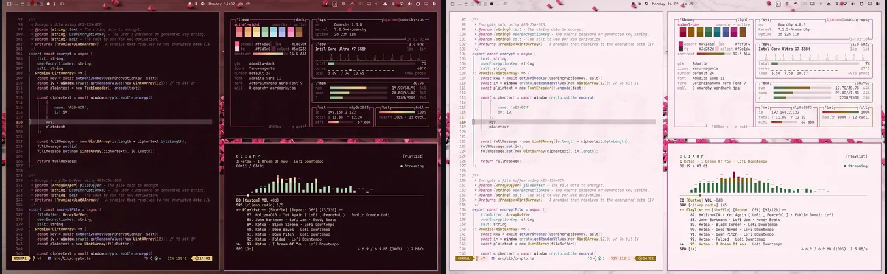](https://bjarneo.github.io/mineral-themes/#spinel)

`024` · Signature palette · Folder: [`spinel/`](spinel/) · [Open on the site](https://bjarneo.github.io/mineral-themes/#spinel)

Bright pink and red octahedrons. In old crowns, people mistook large spinels for rubies. The close-up shows a cut gem on a table.

| Formula | System | Hardness | Luster | Streak | Density | Locality |
| --- | --- | --- | --- | --- | --- | --- |
| MgAl₂O₄ | Cubic | 7.5 to 8 | Vitreous | White | 3.6 g/cm³ | Mahenge, Tanzania |

| Variant | Theme name | `background` | `foreground` | `accent` | Icons |
| --- | --- | --- | --- | --- | --- |
| Night | [`spinel-night`](spinel/night/) | `#1d070f` | `#f3d9e0` | `#ff68a0` | `Yaru-magenta` |
| Day | [`spinel-day`](spinel/day/) | `#fdf0f4` | `#3e252d` | `#c91c6d` | `Yaru-magenta` |

<details>
<summary>All 16 ANSI colors of each variant</summary>

| Variant | Normal, 0 to 7 | Bright, 8 to 15 |
| --- | --- | --- |
| Night | `#2f151d` `#e56d7a` `#93c69d` `#efcc83` `#9ea4e9` `#f57cb5` `#94d8e4` `#dcc3ca` | `#8b6670` `#f18c95` `#b0dab7` `#fee5b1` `#b6bcf6` `#fda0c9` `#b6edf7` `#fdf4f6` |
| Day | `#fbd7e1` `#9f203b` `#43784f` `#8c690a` `#585b9f` `#a7296d` `#2d7985` `#5e454c` | `#8e737b` `#8b002b` `#2f673d` `#765702` `#48498f` `#94065d` `#076571` `#211015` |

</details>

```bash
curl -fsSL https://bjarneo.github.io/mineral-themes/install.sh | bash -s -- spinel --set
```

### Rutile

[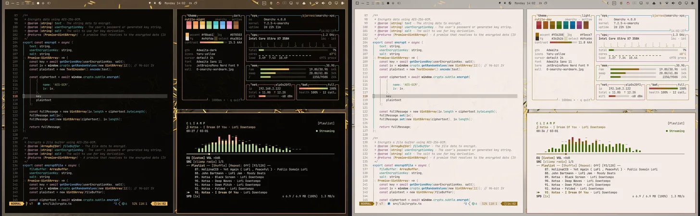](https://bjarneo.github.io/mineral-themes/#rutile)

`025` · Folder: [`rutile/`](rutile/) · [Open on the site](https://bjarneo.github.io/mineral-themes/#rutile)

Golden needles of titanium oxide. Here they grow as stars on a plate of hematite. The close-up shows the crystals up close.

| Formula | System | Hardness | Luster | Streak | Density | Locality |
| --- | --- | --- | --- | --- | --- | --- |
| TiO₂ | Tetragonal | 6 to 6.5 | Adamantine to submetallic | Light brown | 4.2 g/cm³ | Bahia, Brazil |

| Variant | Theme name | `background` | `foreground` | `accent` | Icons |
| --- | --- | --- | --- | --- | --- |
| Night | [`rutile-night`](rutile/night/) | `#070503` | `#e9dfda` | `#f8ba61` | `Yaru-yellow` |
| Day | [`rutile-day`](rutile/day/) | `#f5ece7` | `#362b26` | `#936208` | `Yaru-yellow` |

<details>
<summary>All 16 ANSI colors of each variant</summary>

| Variant | Normal, 0 to 7 | Bright, 8 to 15 |
| --- | --- | --- |
| Night | `#16110e` `#ec817e` `#98c070` `#f5bc5a` `#66b3eb` `#df8bc2` `#4bcece` `#d3c8c2` | `#7b6f68` `#f99f9b` `#b3d493` `#fed79b` `#8ac9f7` `#eea8d4` `#80e1e1` `#fdf5f1` |
| Day | `#e6d9d2` `#ac3f41` `#50761d` `#8e640c` `#06699f` `#99467f` `#0c7878` `#564a45` | `#81756f` `#9a292f` `#3e6300` `#755209` `#075784` `#87326e` `#076364` `#1c1410` |

</details>

```bash
curl -fsSL https://bjarneo.github.io/mineral-themes/install.sh | bash -s -- rutile --set
```

### Cassiterite

[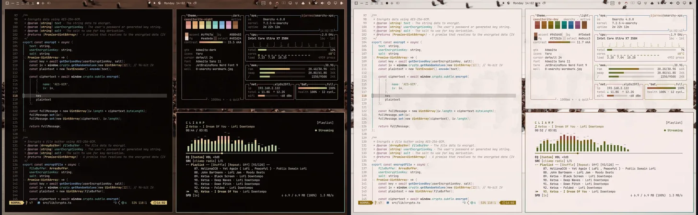](https://bjarneo.github.io/mineral-themes/#cassiterite)

`026` · Folder: [`cassiterite/`](cassiterite/) · [Open on the site](https://bjarneo.github.io/mineral-themes/#cassiterite)

Heavy, dark brown crystals with a bright shine. It is the main ore of tin. The close-up shows the crystals up close.

| Formula | System | Hardness | Luster | Streak | Density | Locality |
| --- | --- | --- | --- | --- | --- | --- |
| SnO₂ | Tetragonal | 6 to 7 | Adamantine to submetallic | White to light brown | 6.9 g/cm³ | Viloco, Bolivia |

| Variant | Theme name | `background` | `foreground` | `accent` | Icons |
| --- | --- | --- | --- | --- | --- |
| Night | [`cassiterite-night`](cassiterite/night/) | `#080403` | `#eadeda` | `#cf967a` | `Yaru` |
| Day | [`cassiterite-day`](cassiterite/day/) | `#f5ebe8` | `#372b26` | `#965d40` | `Yaru` |

<details>
<summary>All 16 ANSI colors of each variant</summary>

| Variant | Normal, 0 to 7 | Bright, 8 to 15 |
| --- | --- | --- |
| Night | `#16100e` `#dc8d7d` `#a4bb7f` `#e4c379` `#7bb1dc` `#d494bb` `#75c9c0` `#d4c7c3` | `#7d6e69` `#eaa89a` `#bcd09e` `#f6db9f` `#9ac7ea` `#e4aecf` `#9addd5` `#fdf5f2` |
| Day | `#e6d8d3` `#9d4f40` `#5c7233` `#876601` `#2e6992` `#8f5078` `#037972` `#574a45` | `#82746f` `#8c3c2e` `#4a601c` `#6e5305` `#175882` `#7e3e67` `#03645e` `#1d1310` |

</details>

```bash
curl -fsSL https://bjarneo.github.io/mineral-themes/install.sh | bash -s -- cassiterite --set
```

### Alexandrite

[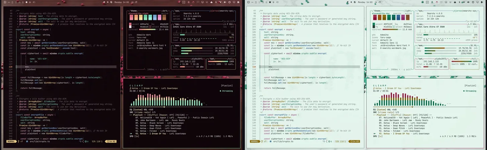](https://bjarneo.github.io/mineral-themes/#alexandrite)

`027` · Variety of chrysoberyl · Signature palette · Folder: [`alexandrite/`](alexandrite/) · [Open on the site](https://bjarneo.github.io/mineral-themes/#alexandrite)

A rare chrysoberyl that changes color. It is green in daylight and red under lamp light. The close-up shows a cut gem on a table.

| Formula | System | Hardness | Luster | Streak | Density | Locality |
| --- | --- | --- | --- | --- | --- | --- |
| BeAl₂O₄ | Orthorhombic | 8.5 | Vitreous | White | 3.7 g/cm³ | Ural Mountains, Russia |

| Variant | Theme name | `background` | `foreground` | `accent` | Icons |
| --- | --- | --- | --- | --- | --- |
| Night | [`alexandrite-night`](alexandrite/night/) | `#0e0409` | `#eddce5` | `#d96a7e` | `Yaru-red` |
| Day | [`alexandrite-day`](alexandrite/day/) | `#e3f4ec` | `#1d332a` | `#097c59` | `Yaru-sage` |

<details>
<summary>All 16 ANSI colors of each variant</summary>

| Variant | Normal, 0 to 7 | Bright, 8 to 15 |
| --- | --- | --- |
| Night | `#1d1018` `#e07081` `#67cfa0` `#efcc83` `#79a9db` `#e885bf` `#7ce0ca` `#d7c5ce` | `#816a76` `#ed8e9a` `#90e2ba` `#fee5b1` `#97bfe9` `#f6a3d2` `#a4f4e1` `#fcf4f8` |
| Day | `#cce4d8` `#9b2742` `#007c54` `#8a6807` `#306395` `#9b3777` `#056758` `#3d5349` | `#677d73` `#890732` `#006745` `#735500` `#1b5284` `#892066` `#055448` `#081a13` |

</details>

```bash
curl -fsSL https://bjarneo.github.io/mineral-themes/install.sh | bash -s -- alexandrite --set
```

### Cuprite

[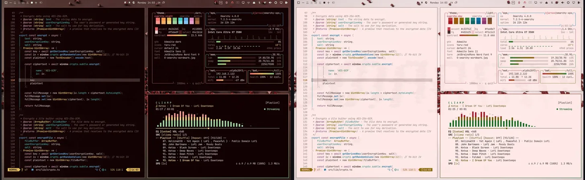](https://bjarneo.github.io/mineral-themes/#cuprite)

`028` · Folder: [`cuprite/`](cuprite/) · [Open on the site](https://bjarneo.github.io/mineral-themes/#cuprite)

Deep red octahedrons of copper oxide. Thin edges glow red when light shines through. The close-up shows the crystals up close.

| Formula | System | Hardness | Luster | Streak | Density | Locality |
| --- | --- | --- | --- | --- | --- | --- |
| Cu₂O | Cubic | 3.5 to 4 | Adamantine to submetallic | Brownish red | 6.1 g/cm³ | Onganja, Namibia |

| Variant | Theme name | `background` | `foreground` | `accent` | Icons |
| --- | --- | --- | --- | --- | --- |
| Night | [`cuprite-night`](cuprite/night/) | `#110001` | `#f5dad9` | `#e26265` | `Yaru-red` |
| Day | [`cuprite-day`](cuprite/day/) | `#fee8e7` | `#402625` | `#c33742` | `Yaru-red` |

<details>
<summary>All 16 ANSI colors of each variant</summary>

| Variant | Normal, 0 to 7 | Bright, 8 to 15 |
| --- | --- | --- |
| Night | `#230709` `#f97770` `#80c580` `#ecc158` `#62b4ed` `#e28abe` `#45cfcb` `#dec3c2` | `#8d6665` `#ff9b93` `#a0d8a0` `#fdd988` `#88c9fa` `#f0a7d1` `#7de2de` `#fef4f4` |
| Day | `#f7d1d0` `#b83032` `#2f7a33` `#876703` `#066a9e` `#9c447b` `#117876` `#5f4645` | `#8b706f` `#a50f1d` `#11661b` `#6f5404` `#085885` `#8a306a` `#086260` `#221010` |

</details>

```bash
curl -fsSL https://bjarneo.github.io/mineral-themes/install.sh | bash -s -- cuprite --set
```

### Goethite

[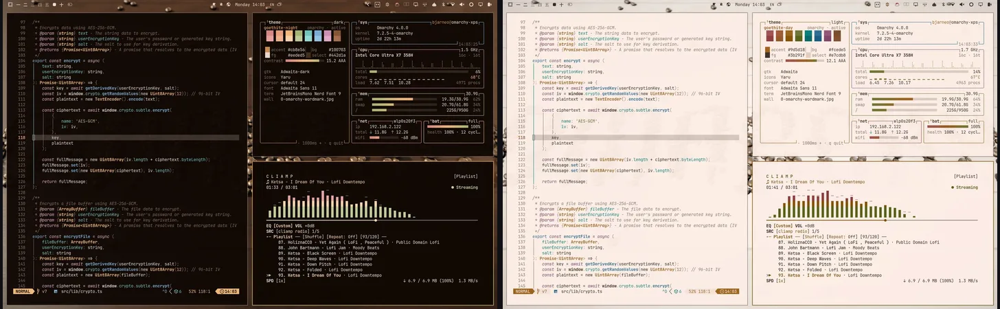](https://bjarneo.github.io/mineral-themes/#goethite)

`029` · Folder: [`goethite/`](goethite/) · [Open on the site](https://bjarneo.github.io/mineral-themes/#goethite)

Iron hydroxide in dark, velvety bubbles. It colors rust, ochre and many brown soils. The close-up shows the crystals up close.

| Formula | System | Hardness | Luster | Streak | Density | Locality |
| --- | --- | --- | --- | --- | --- | --- |
| FeO(OH) | Orthorhombic | 5 to 5.5 | Adamantine to silky | Yellowish brown | 4.3 g/cm³ | Siegerland, Germany |

| Variant | Theme name | `background` | `foreground` | `accent` | Icons |
| --- | --- | --- | --- | --- | --- |
| Night | [`goethite-night`](goethite/night/) | `#100703` | `#eeded5` | `#cb8e56` | `Yaru` |
| Day | [`goethite-day`](goethite/day/) | `#fcede5` | `#3b291f` | `#9d5d18` | `Yaru` |

<details>
<summary>All 16 ANSI colors of each variant</summary>

| Variant | Normal, 0 to 7 | Bright, 8 to 15 |
| --- | --- | --- |
| Night | `#20140d` `#dc8b87` `#acb979` `#f6ba7d` `#7ab2db` `#d593b8` `#73c9c5` `#d8c7bd` | `#826d61` `#eba6a1` `#c3ce9a` `#ffd6ad` `#99c7ea` `#e5aecc` `#99ddd9` `#fdf5f1` |
| Day | `#eedace` `#9e4d4a` `#68732f` `#9a5f15` `#2c6992` `#915076` `#007a77` `#5b493f` | `#887469` `#8c3a39` `#545f14` `#834e00` `#125881` `#7f3e65` `#016563` `#20120b` |

</details>

```bash
curl -fsSL https://bjarneo.github.io/mineral-themes/install.sh | bash -s -- goethite --set
```

## Halides

### Fluorite

[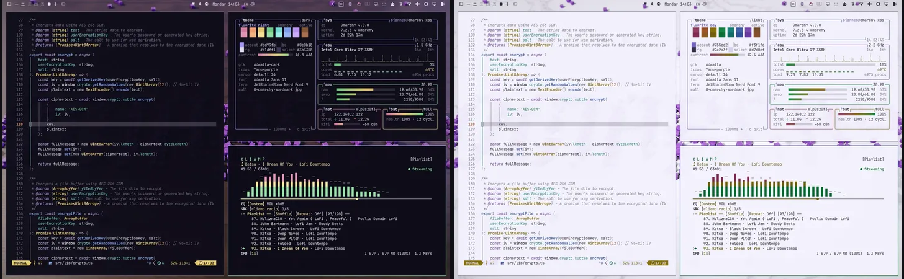](https://bjarneo.github.io/mineral-themes/#fluorite)

`030` · Signature palette · Folder: [`fluorite/`](fluorite/) · [Open on the site](https://bjarneo.github.io/mineral-themes/#fluorite)

Cubes of calcium fluoride in purple, green and yellow. It gave its name to fluorescence. The close-up shows a polished slab of the stone.

| Formula | System | Hardness | Luster | Streak | Density | Locality |
| --- | --- | --- | --- | --- | --- | --- |
| CaF₂ | Cubic | 4 | Vitreous | White | 3.18 g/cm³ | Illinois, USA |

| Variant | Theme name | `background` | `foreground` | `accent` | Icons |
| --- | --- | --- | --- | --- | --- |
| Night | [`fluorite-night`](fluorite/night/) | `#0e0b18` | `#e1dff1` | `#ad99fb` | `Yaru-purple` |
| Day | [`fluorite-day`](fluorite/day/) | `#f3f1fc` | `#2e2a3f` | `#755cc2` | `Yaru-purple` |

<details>
<summary>All 16 ANSI colors of each variant</summary>

| Variant | Normal, 0 to 7 | Bright, 8 to 15 |
| --- | --- | --- |
| Night | `#1c1929` `#d87da2` `#6fd087` `#ead070` `#80a3f0` `#bd92f9` `#74e0d9` `#cac8db` | `#726e86` `#e699b7` `#95e3a6` `#fce89b` `#9cbafb` `#ceb0fe` `#a0f4ed` `#f7f6fd` |
| Day | `#e1ddf6` `#923760` `#0a803a` `#826c02` `#3b5ba9` `#7645ae` `#107c77` `#4d4a5f` | `#7c788f` `#802350` `#00692d` `#6c5a06` `#2a4998` `#65319d` `#0a6662` `#161323` |

</details>

```bash
curl -fsSL https://bjarneo.github.io/mineral-themes/install.sh | bash -s -- fluorite --set
```

### Halite

[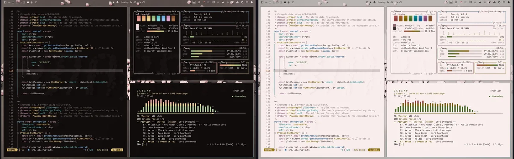](https://bjarneo.github.io/mineral-themes/#halite)

`031` · Folder: [`halite/`](halite/) · [Open on the site](https://bjarneo.github.io/mineral-themes/#halite)

Rock salt. Microbes in salt lakes color the cubes pink. The close-up shows the crystals up close.

| Formula | System | Hardness | Luster | Streak | Density | Locality |
| --- | --- | --- | --- | --- | --- | --- |
| NaCl | Cubic | 2 to 2.5 | Vitreous | White | 2.17 g/cm³ | Searles Lake, California, USA |

| Variant | Theme name | `background` | `foreground` | `accent` | Icons |
| --- | --- | --- | --- | --- | --- |
| Night | [`halite-night`](halite/night/) | `#0f0a0a` | `#eadede` | `#fddbde` | `Yaru-red` |
| Day | [`halite-day`](halite/day/) | `#faefef` | `#362a2a` | `#906267` | `Yaru-red` |

<details>
<summary>All 16 ANSI colors of each variant</summary>

| Variant | Normal, 0 to 7 | Bright, 8 to 15 |
| --- | --- | --- |
| Night | `#1e1918` `#dc8c84` `#9bbe80` `#e3c479` `#7ab1e2` `#d493be` `#67cace` `#d4c7c7` | `#7c6e6d` `#eba79f` `#b5d39f` `#f5dc9f` `#9ac7f0` `#e5add1` `#91dee1` `#fef4f4` |
| Day | `#ebdcdb` `#9e4d47` `#557837` `#896a08` `#2c6799` `#904f7b` `#017b80` `#564a49` | `#847776` `#8c3b36` `#41641f` `#725700` `#145688` `#7e3d6a` `#006569` `#1d1313` |

</details>

```bash
curl -fsSL https://bjarneo.github.io/mineral-themes/install.sh | bash -s -- halite --set
```

### Atacamite

[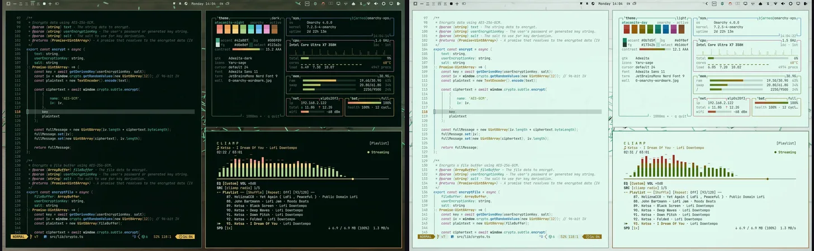](https://bjarneo.github.io/mineral-themes/#atacamite)

`032` · Folder: [`atacamite/`](atacamite/) · [Open on the site](https://bjarneo.github.io/mineral-themes/#atacamite)

Dark green crystals of copper chloride. It forms where copper ore meets salty desert water. The close-up shows the crystals up close.

| Formula | System | Hardness | Luster | Streak | Density | Locality |
| --- | --- | --- | --- | --- | --- | --- |
| Cu₂Cl(OH)₃ | Orthorhombic | 3 to 3.5 | Adamantine to vitreous | Apple green | 3.75 g/cm³ | Atacama Desert, Chile |

| Variant | Theme name | `background` | `foreground` | `accent` | Icons |
| --- | --- | --- | --- | --- | --- |
| Night | [`atacamite-night`](atacamite/night/) | `#000f09` | `#d0e8df` | `#42a887` | `Yaru-sage` |
| Day | [`atacamite-day`](atacamite/day/) | `#e0f8ef` | `#17342b` | `#0b7d5f` | `Yaru-sage` |

<details>
<summary>All 16 ANSI colors of each variant</summary>

| Variant | Normal, 0 to 7 | Bright, 8 to 15 |
| --- | --- | --- |
| Night | `#051e17` `#eb836f` `#92c26d` `#ebc258` `#5eb3f3` `#e08ac4` `#45d1b9` `#b9d1c8` | `#597a6e` `#f8a08e` `#aed690` `#fcda88` `#86c9fe` `#efa6d7` `#7de4cf` `#f1f9f6` |
| Day | `#c6e8dc` `#ab4230` `#4b7b1a` `#886a09` `#0969a1` `#9b4482` `#0e7d6d` `#39534a` | `#658076` `#992c1a` `#3a6700` `#735800` `#00578a` `#893071` `#04685a` `#061a14` |

</details>

```bash
curl -fsSL https://bjarneo.github.io/mineral-themes/install.sh | bash -s -- atacamite --set
```

## Carbonates

### Calcite

[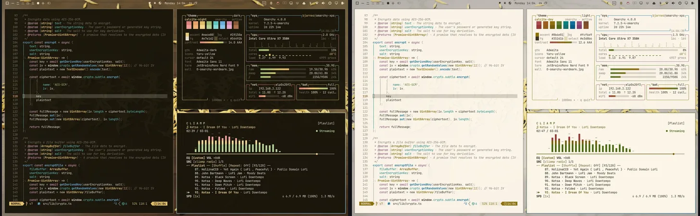](https://bjarneo.github.io/mineral-themes/#calcite)

`033` · Folder: [`calcite/`](calcite/) · [Open on the site](https://bjarneo.github.io/mineral-themes/#calcite)

Calcium carbonate in many shapes, here as golden pointed crystals. A clear piece shows a double image. The close-up shows the crystals up close.

| Formula | System | Hardness | Luster | Streak | Density | Locality |
| --- | --- | --- | --- | --- | --- | --- |
| CaCO₃ | Trigonal | 3 | Vitreous | White | 2.71 g/cm³ | Elmwood Mine, Tennessee, USA |

| Variant | Theme name | `background` | `foreground` | `accent` | Icons |
| --- | --- | --- | --- | --- | --- |
| Night | [`calcite-night`](calcite/night/) | `#19150a` | `#e7e1d2` | `#eace80` | `Yaru-yellow` |
| Day | [`calcite-day`](calcite/day/) | `#fcf6e9` | `#352d1b` | `#8b6e01` | `Yaru-yellow` |

<details>
<summary>All 16 ANSI colors of each variant</summary>

| Variant | Normal, 0 to 7 | Bright, 8 to 15 |
| --- | --- | --- |
| Night | `#292417` `#e48780` `#9ebe76` `#e7c36a` `#6ab4e3` `#dc8fbb` `#5fccc7` `#d1caba` | `#7b725e` `#f2a39c` `#b7d397` `#f9db94` `#8ec9f0` `#ebaacf` `#8bdfdb` `#faf6ef` |
| Day | `#ece4d1` `#a54743` `#5b7b2d` `#8c6d07` `#066b99` `#974a78` `#007f7c` `#544c3b` | `#857c6a` `#933331` `#486710` `#745a09` `#005982` `#853767` `#106967` `#1b1508` |

</details>

```bash
curl -fsSL https://bjarneo.github.io/mineral-themes/install.sh | bash -s -- calcite --set
```

### Aragonite

[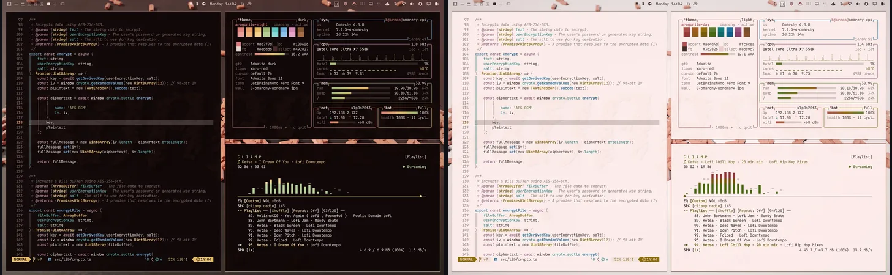](https://bjarneo.github.io/mineral-themes/#aragonite)

`034` · Folder: [`aragonite/`](aragonite/) · [Open on the site](https://bjarneo.github.io/mineral-themes/#aragonite)

The same chemistry as calcite in another structure. Its twins form six-sided columns. The close-up shows the crystals up close.

| Formula | System | Hardness | Luster | Streak | Density | Locality |
| --- | --- | --- | --- | --- | --- | --- |
| CaCO₃ | Orthorhombic | 3.5 to 4 | Vitreous | White | 2.95 g/cm³ | Molina de Aragón, Spain |

| Variant | Theme name | `background` | `foreground` | `accent` | Icons |
| --- | --- | --- | --- | --- | --- |
| Night | [`aragonite-night`](aragonite/night/) | `#100606` | `#eedddb` | `#dd7f7d` | `Yaru-red` |
| Day | [`aragonite-day`](aragonite/day/) | `#fcecea` | `#3b2826` | `#ae4d4d` | `Yaru-red` |

<details>
<summary>All 16 ANSI colors of each variant</summary>

| Variant | Normal, 0 to 7 | Bright, 8 to 15 |
| --- | --- | --- |
| Night | `#201312` `#e4877e` `#9ebe77` `#ebc16a` `#6fb3e3` `#db8fbb` `#60cbcb` `#d8c6c3` | `#826b69` `#f2a39b` `#b8d298` `#fcd994` `#91c8f1` `#ebaace` `#8cdfde` `#fef4f3` |
| Day | `#eed9d6` `#a54742` `#58762a` `#8b6700` `#186a9a` `#964b78` `#0b7878` `#5b4845` | `#887371` `#933330` `#45630d` `#725402` `#055885` `#853867` `#086364` `#201210` |

</details>

```bash
curl -fsSL https://bjarneo.github.io/mineral-themes/install.sh | bash -s -- aragonite --set
```

### Malachite

[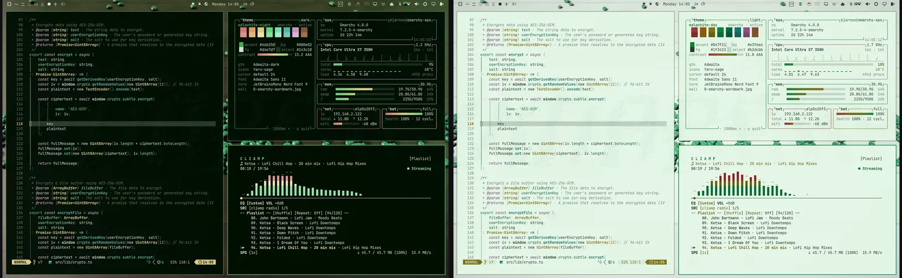](https://bjarneo.github.io/mineral-themes/#malachite)

`035` · Signature palette · Folder: [`malachite/`](malachite/) · [Open on the site](https://bjarneo.github.io/mineral-themes/#malachite)

Green copper carbonate in rounded masses. A cut face shows bands in many shades of green. The close-up shows a polished slab of the stone.

| Formula | System | Hardness | Luster | Streak | Density | Locality |
| --- | --- | --- | --- | --- | --- | --- |
| Cu₂CO₃(OH)₂ | Monoclinic | 3.5 to 4 | Silky to dull | Light green | 4.0 g/cm³ | Katanga, DR Congo |

| Variant | Theme name | `background` | `foreground` | `accent` | Icons |
| --- | --- | --- | --- | --- | --- |
| Night | [`malachite-night`](malachite/night/) | `#000e02` | `#d4e7d7` | `#46b250` | `Yaru-sage` |
| Day | [`malachite-day`](malachite/day/) | `#e3f6e6` | `#1f3423` | `#047f21` | `Yaru-sage` |

<details>
<summary>All 16 ANSI colors of each variant</summary>

| Variant | Normal, 0 to 7 | Bright, 8 to 15 |
| --- | --- | --- |
| Night | `#041d0b` `#d87972` `#67d283` `#e0d385` `#4eb9ad` `#d29ccc` `#77e3b7` `#bdd0c0` | `#5d7a62` `#e6958e` `#91e5a3` `#f4eaaa` `#7accc1` `#e3b6de` `#a1f6d1` `#f2f9f3` |
| Day | `#cbe7d0` `#943432` `#037e38` `#7d6e0c` `#0c6f66` `#865181` `#025f43` `#405343` | `#6b7f6e` `#821f20` `#04682e` `#675a00` `#0b5c54` `#753f70` `#004d35` `#0c1a0f` |

</details>

```bash
curl -fsSL https://bjarneo.github.io/mineral-themes/install.sh | bash -s -- malachite --set
```

### Azurite

[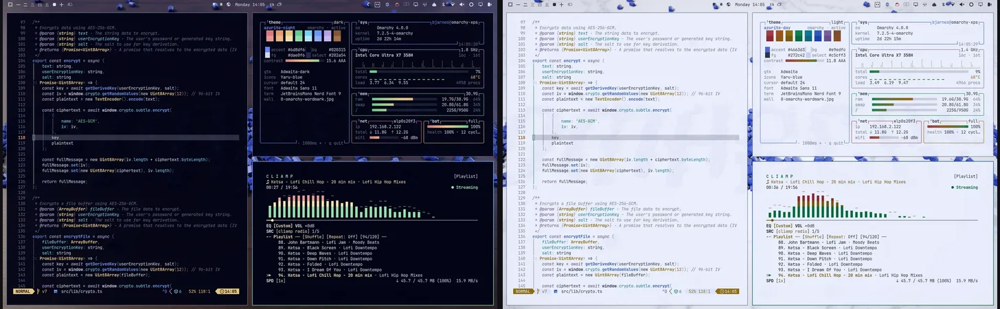](https://bjarneo.github.io/mineral-themes/#azurite)

`036` · Signature palette · Folder: [`azurite/`](azurite/) · [Open on the site](https://bjarneo.github.io/mineral-themes/#azurite)

Deep blue copper carbonate. Over time, it can change into green malachite. The close-up shows the crystals up close.

| Formula | System | Hardness | Luster | Streak | Density | Locality |
| --- | --- | --- | --- | --- | --- | --- |
| Cu₃(CO₃)₂(OH)₂ | Monoclinic | 3.5 to 4 | Vitreous | Light blue | 3.77 g/cm³ | Chessy, France |

| Variant | Theme name | `background` | `foreground` | `accent` | Icons |
| --- | --- | --- | --- | --- | --- |
| Night | [`azurite-night`](azurite/night/) | `#020315` | `#dae0f6` | `#6d8df6` | `Yaru-blue` |
| Day | [`azurite-day`](azurite/day/) | `#e9edfc` | `#272c42` | `#4663d3` | `Yaru-blue` |

<details>
<summary>All 16 ANSI colors of each variant</summary>

| Variant | Normal, 0 to 7 | Bright, 8 to 15 |
| --- | --- | --- |
| Night | `#0b0f27` `#df7e7f` `#6cd092` `#efcc83` `#6c9bfe` `#bba3e8` `#78d9fe` `#c4cadf` | `#68708f` `#ec9b9a` `#94e3af` `#fee5b1` `#8fb3ff` `#cfbcf6` `#bbeafd` `#f4f6fe` |
| Day | `#d2dbf8` `#98373d` `#067b46` `#896603` `#2753bc` `#71579b` `#007493` `#474c61` | `#70768d` `#86222c` `#006638` `#705406` `#153fab` `#60458a` `#0a6079` `#111524` |

</details>

```bash
curl -fsSL https://bjarneo.github.io/mineral-themes/install.sh | bash -s -- azurite --set
```

### Rhodochrosite

[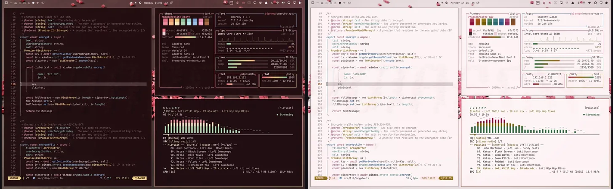](https://bjarneo.github.io/mineral-themes/#rhodochrosite)

`037` · Signature palette · Folder: [`rhodochrosite/`](rhodochrosite/) · [Open on the site](https://bjarneo.github.io/mineral-themes/#rhodochrosite)

Manganese carbonate in raspberry-red rhombs. Stalactites from Argentina show pink bands. The close-up shows a polished slab of the stone.

| Formula | System | Hardness | Luster | Streak | Density | Locality |
| --- | --- | --- | --- | --- | --- | --- |
| MnCO₃ | Trigonal | 3.5 to 4 | Vitreous | White | 3.7 g/cm³ | Sweet Home Mine, Colorado, USA |

| Variant | Theme name | `background` | `foreground` | `accent` | Icons |
| --- | --- | --- | --- | --- | --- |
| Night | [`rhodochrosite-night`](rhodochrosite/night/) | `#200c10` | `#f4dadd` | `#fe8595` | `Yaru-red` |
| Day | [`rhodochrosite-day`](rhodochrosite/day/) | `#fdf3f5` | `#3f252a` | `#bc3e56` | `Yaru-red` |

<details>
<summary>All 16 ANSI colors of each variant</summary>

| Variant | Normal, 0 to 7 | Bright, 8 to 15 |
| --- | --- | --- |
| Night | `#311a1e` `#e07084` `#93c69d` `#f6d389` `#84afdc` `#f18db5` `#a3dde0` `#ddc3c6` | `#8b696d` `#ec8f9d` `#b0dab7` `#ffedc8` `#a1c5ea` `#ffaacb` `#c2f2f4` `#fdf4f5` |
| Day | `#fed9de` `#9a2745` `#43784f` `#8e6b0f` `#3a6693` `#a13d6b` `#3a797d` `#5e4549` | `#917579` `#880735` `#2f673d` `#765803` `#275582` `#8f285a` `#22666a` `#221013` |

</details>

```bash
curl -fsSL https://bjarneo.github.io/mineral-themes/install.sh | bash -s -- rhodochrosite --set
```

### Smithsonite

[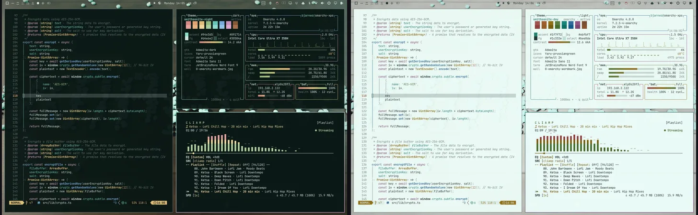](https://bjarneo.github.io/mineral-themes/#smithsonite)

`038` · Folder: [`smithsonite/`](smithsonite/) · [Open on the site](https://bjarneo.github.io/mineral-themes/#smithsonite)

Zinc carbonate in soft, rounded masses with a pearly shine. Its name honors James Smithson. The close-up shows the crystals up close.

| Formula | System | Hardness | Luster | Streak | Density | Locality |
| --- | --- | --- | --- | --- | --- | --- |
| ZnCO₃ | Trigonal | 4 to 4.5 | Vitreous to pearly | White | 4.4 g/cm³ | Kelly Mine, New Mexico, USA |

| Variant | Theme name | `background` | `foreground` | `accent` | Icons |
| --- | --- | --- | --- | --- | --- |
| Night | [`smithsonite-night`](smithsonite/night/) | `#091714` | `#d4e6e2` | `#94e3d5` | `Yaru-prussiangreen` |
| Day | [`smithsonite-day`](smithsonite/day/) | `#ebfbf7` | `#1c332e` | `#1f7f72` | `Yaru-prussiangreen` |

<details>
<summary>All 16 ANSI colors of each variant</summary>

| Variant | Normal, 0 to 7 | Bright, 8 to 15 |
| --- | --- | --- |
| Night | `#172623` `#dc8b86` `#96bf81` `#e5c379` `#78b1e4` `#d293c4` `#68cbbf` `#bccfcb` | `#5f7872` `#eaa6a1` `#b1d3a0` `#f7dba0` `#98c7f1` `#e3add6` `#91dfd4` `#f0f9f7` |
| Day | `#d4eae5` `#9e4d4a` `#537c3b` `#8e6c0f` `#29689a` `#8e4f82` `#0b8076` `#3d524e` | `#6b817c` `#8c3a38` `#406926` `#785a07` `#0f568a` `#7d3d71` `#046a61` `#081a16` |

</details>

```bash
curl -fsSL https://bjarneo.github.io/mineral-themes/install.sh | bash -s -- smithsonite --set
```

### Cerussite

[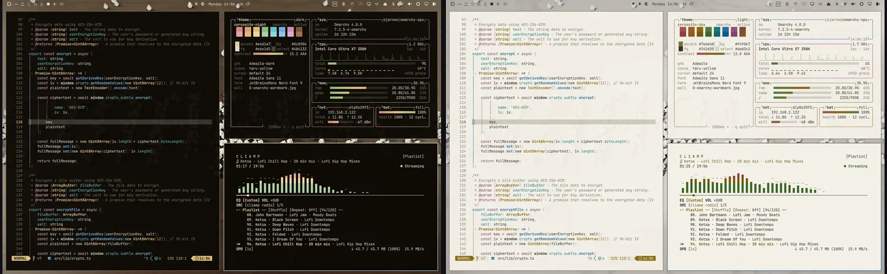](https://bjarneo.github.io/mineral-themes/#cerussite)

`039` · Folder: [`cerussite/`](cerussite/) · [Open on the site](https://bjarneo.github.io/mineral-themes/#cerussite)

Heavy lead carbonate with a diamond-like shine. Its crystals twin into star-shaped clusters. The close-up shows the crystals up close.

| Formula | System | Hardness | Luster | Streak | Density | Locality |
| --- | --- | --- | --- | --- | --- | --- |
| PbCO₃ | Orthorhombic | 3 to 3.5 | Adamantine | White | 6.55 g/cm³ | Tsumeb, Namibia |

| Variant | Theme name | `background` | `foreground` | `accent` | Icons |
| --- | --- | --- | --- | --- | --- |
| Night | [`cerussite-night`](cerussite/night/) | `#0c0904` | `#e6e1d5` | `#e4d1a7` | `Yaru-yellow` |
| Day | [`cerussite-day`](cerussite/day/) | `#f4f0e7` | `#342d20` | `#7e6b40` | `Yaru-yellow` |

<details>
<summary>All 16 ANSI colors of each variant</summary>

| Variant | Normal, 0 to 7 | Bright, 8 to 15 |
| --- | --- | --- |
| Night | `#1b170f` `#dc8b86` `#94c084` `#e5c379` `#74b2e1` `#d792ba` `#66cacc` `#d0cabd` | `#787162` `#eaa6a1` `#b0d4a3` `#f7dba0` `#95c7ef` `#e7adce` `#8fdedf` `#faf6ef` |
| Day | `#e4ded2` `#9e4d4a` `#4c783b` `#8a6705` `#226998` `#924e78` `#0e797b` `#534c3f` | `#7f786a` `#8c3a39` `#386526` `#745500` `#005887` `#803c67` `#0b6466` `#1a150b` |

</details>

```bash
curl -fsSL https://bjarneo.github.io/mineral-themes/install.sh | bash -s -- cerussite --set
```

## Sulfates and related minerals

### Selenite

[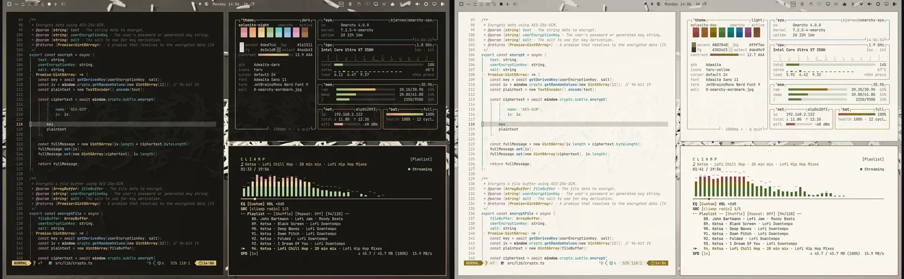](https://bjarneo.github.io/mineral-themes/#selenite)

`040` · Variety of gypsum · Folder: [`selenite/`](selenite/) · [Open on the site](https://bjarneo.github.io/mineral-themes/#selenite)

Clear, soft blades of gypsum. Selenite crystals in the Naica cave in Mexico are more than 10 meters long. The close-up shows the crystals up close.

| Formula | System | Hardness | Luster | Streak | Density | Locality |
| --- | --- | --- | --- | --- | --- | --- |
| CaSO₄·2H₂O | Monoclinic | 2 | Vitreous to pearly | White | 2.3 g/cm³ | Naica, Chihuahua, Mexico |

| Variant | Theme name | `background` | `foreground` | `accent` | Icons |
| --- | --- | --- | --- | --- | --- |
| Night | [`selenite-night`](selenite/night/) | `#161511` | `#e3e1d8` | `#ded7c4` | `Yaru` |
| Day | [`selenite-day`](selenite/day/) | `#f9f7ee` | `#302e23` | `#807048` | `Yaru-yellow` |

<details>
<summary>All 16 ANSI colors of each variant</summary>

| Variant | Normal, 0 to 7 | Bright, 8 to 15 |
| --- | --- | --- |
| Night | `#25241f` `#dc8b87` `#9bbe81` `#e5c379` `#78b2df` `#d693b9` `#6ccac7` `#cdcbc0` | `#767367` `#eba6a2` `#b5d2a0` `#f7dba0` `#98c7ed` `#e6adcd` `#94dedb` `#f8f7ef` |
| Day | `#e7e5d8` `#9e4d4b` `#587b3c` `#8e6c10` `#296996` `#924f76` `#057f7d` `#504d42` | `#807d72` `#8c3a3a` `#446725` `#775804` `#0e5885` `#803d66` `#016967` `#18160d` |

</details>

```bash
curl -fsSL https://bjarneo.github.io/mineral-themes/install.sh | bash -s -- selenite --set
```

### Barite

[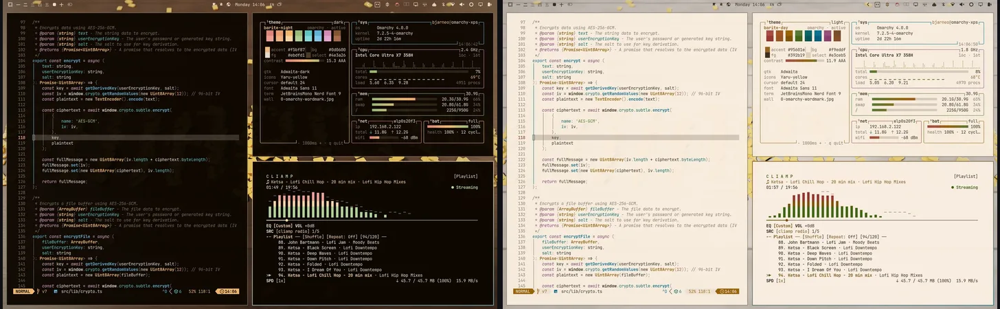](https://bjarneo.github.io/mineral-themes/#barite)

`041` · Folder: [`barite/`](barite/) · [Open on the site](https://bjarneo.github.io/mineral-themes/#barite)

Heavy barium sulfate in golden plates. A small crystal feels very heavy in the hand. The close-up shows the crystals up close.

| Formula | System | Hardness | Luster | Streak | Density | Locality |
| --- | --- | --- | --- | --- | --- | --- |
| BaSO₄ | Orthorhombic | 3 to 3.5 | Vitreous to pearly | White | 4.5 g/cm³ | Elk Creek, South Dakota, USA |

| Variant | Theme name | `background` | `foreground` | `accent` | Icons |
| --- | --- | --- | --- | --- | --- |
| Night | [`barite-night`](barite/night/) | `#0d0600` | `#ebdfd1` | `#f5bf87` | `Yaru-yellow` |
| Day | [`barite-day`](barite/day/) | `#f9eddf` | `#392b19` | `#95601e` | `Yaru-yellow` |

<details>
<summary>All 16 ANSI colors of each variant</summary>

| Variant | Normal, 0 to 7 | Bright, 8 to 15 |
| --- | --- | --- |
| Night | `#1d1306` `#e4877d` `#99bf7a` `#f7ba70` `#61b7de` `#da8fbe` `#5ecccb` `#d5c8b9` | `#7f6f5b` `#f2a399` `#b3d39a` `#ffd6a8` `#88cced` `#e9aad1` `#8bdfdf` `#fbf6f0` |
| Day | `#eadac7` `#a54740` `#52772d` `#975f01` `#066d90` `#954b7c` `#006565` `#584b3a` | `#857664` `#93332d` `#3e6311` `#7e4f04` `#025b7a` `#84386b` `#025252` `#1e1407` |

</details>

```bash
curl -fsSL https://bjarneo.github.io/mineral-themes/install.sh | bash -s -- barite --set
```

### Celestine

[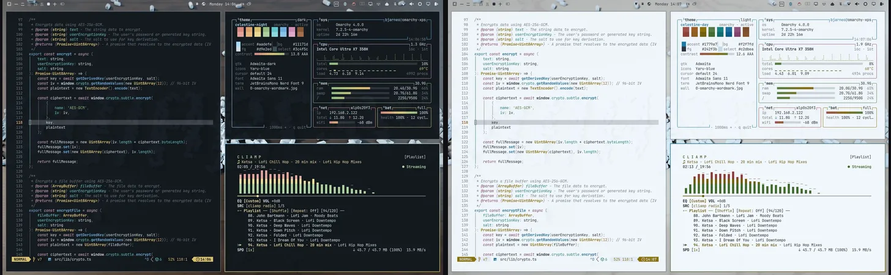](https://bjarneo.github.io/mineral-themes/#celestine)

`042` · Folder: [`celestine/`](celestine/) · [Open on the site](https://bjarneo.github.io/mineral-themes/#celestine)

Sky-blue strontium sulfate that lines geodes. Strontium makes the red color of fireworks. The close-up shows the crystals up close.

| Formula | System | Hardness | Luster | Streak | Density | Locality |
| --- | --- | --- | --- | --- | --- | --- |
| SrSO₄ | Orthorhombic | 3 to 3.5 | Vitreous to pearly | White | 3.95 g/cm³ | Sakoany, Madagascar |

| Variant | Theme name | `background` | `foreground` | `accent` | Icons |
| --- | --- | --- | --- | --- | --- |
| Night | [`celestine-night`](celestine/night/) | `#11171d` | `#d9e2ed` | `#aadefe` | `Yaru-blue` |
| Day | [`celestine-day`](celestine/day/) | `#f2f7fd` | `#242f3b` | `#1779a7` | `Yaru-blue` |

<details>
<summary>All 16 ANSI colors of each variant</summary>

| Variant | Normal, 0 to 7 | Bright, 8 to 15 |
| --- | --- | --- |
| Night | `#1f262e` `#dc8c82` `#94c083` `#e0c673` `#6eb3e4` `#d592bf` `#64cacf` `#c1ccd7` | `#6a7684` `#eba79e` `#b0d4a2` `#f3dd9b` `#90c8f1` `#e5add1` `#8edee1` `#f2f7fd` |
| Day | `#dbe6f1` `#9e4e46` `#507c3e` `#876d03` `#156a9a` `#904f7c` `#127e82` `#444e5a` | `#727d8a` `#8c3b34` `#3c6928` `#715b09` `#015885` `#7f3d6b` `#0c686b` `#0e1720` |

</details>

```bash
curl -fsSL https://bjarneo.github.io/mineral-themes/install.sh | bash -s -- celestine --set
```

### Chalcanthite

[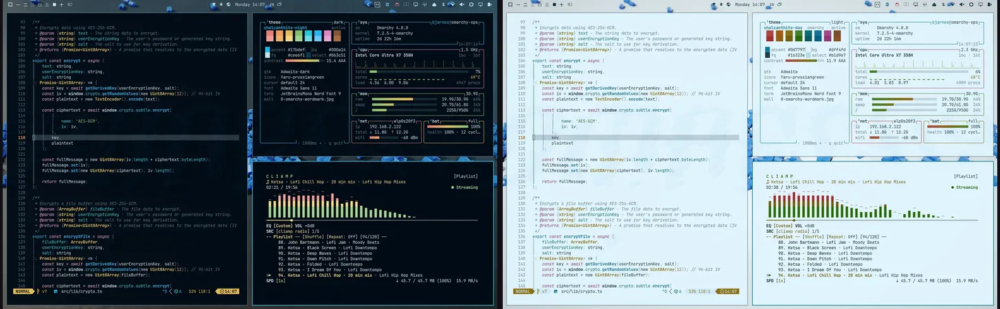](https://bjarneo.github.io/mineral-themes/#chalcanthite)

`043` · Folder: [`chalcanthite/`](chalcanthite/) · [Open on the site](https://bjarneo.github.io/mineral-themes/#chalcanthite)

Vivid blue copper sulfate. It dissolves in water, so collectors keep it dry. The close-up shows the crystals up close.

| Formula | System | Hardness | Luster | Streak | Density | Locality |
| --- | --- | --- | --- | --- | --- | --- |
| CuSO₄·5H₂O | Triclinic | 2.5 | Vitreous | White | 2.28 g/cm³ | Chuquicamata, Chile |

| Variant | Theme name | `background` | `foreground` | `accent` | Icons |
| --- | --- | --- | --- | --- | --- |
| Night | [`chalcanthite-night`](chalcanthite/night/) | `#000a14` | `#cee6f1` | `#17bdef` | `Yaru-prussiangreen` |
| Day | [`chalcanthite-day`](chalcanthite/day/) | `#dff4fd` | `#16323e` | `#0d7797` | `Yaru-prussiangreen` |

<details>
<summary>All 16 ANSI colors of each variant</summary>

| Variant | Normal, 0 to 7 | Bright, 8 to 15 |
| --- | --- | --- |
| Night | `#001924` `#ec817b` `#86c573` `#e9c358` `#29b9f7` `#e089c5` `#22cfdd` `#b7cfda` | `#547787` `#f89f98` `#a5d895` `#fbdb88` `#70ceff` `#efa6d7` `#70e2ed` `#f0f8fc` |
| Day | `#c2e4f4` `#ac403e` `#3b7c23` `#866906` `#0b6c93` `#9b4383` `#04666d` `#39515c` | `#647d89` `#9a2a2c` `#266705` `#6f5708` `#005a7d` `#892f72` `#02545a` `#061921` |

</details>

```bash
curl -fsSL https://bjarneo.github.io/mineral-themes/install.sh | bash -s -- chalcanthite --set
```

### Wulfenite

[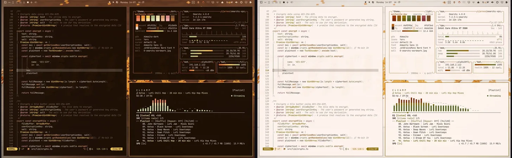](https://bjarneo.github.io/mineral-themes/#wulfenite)

`044` · Signature palette · Folder: [`wulfenite/`](wulfenite/) · [Open on the site](https://bjarneo.github.io/mineral-themes/#wulfenite)

Thin, square orange plates of lead molybdate. Some plates are as thin as paper. The close-up shows the crystals up close.

| Formula | System | Hardness | Luster | Streak | Density | Locality |
| --- | --- | --- | --- | --- | --- | --- |
| PbMoO₄ | Tetragonal | 2.75 to 3 | Adamantine to resinous | White | 6.8 g/cm³ | Red Cloud Mine, Arizona, USA |

| Variant | Theme name | `background` | `foreground` | `accent` | Icons |
| --- | --- | --- | --- | --- | --- |
| Night | [`wulfenite-night`](wulfenite/night/) | `#1c0e04` | `#f0ddd0` | `#fc933c` | `Yaru` |
| Day | [`wulfenite-day`](wulfenite/day/) | `#fdf3ed` | `#3d2919` | `#a9590a` | `Yaru` |

<details>
<summary>All 16 ANSI colors of each variant</summary>

| Variant | Normal, 0 to 7 | Bright, 8 to 15 |
| --- | --- | --- |
| Night | `#2d1c0f` `#e16a3e` `#b0bf85` `#f7cb58` `#d99c68` `#e39191` `#ecdeaa` `#dac6b8` | `#856c5a` `#ed8966` `#c7d4a4` `#fee5aa` `#e9b58b` `#f2acab` `#faefc4` `#fcf5f0` |
| Day | `#f8ddca` `#933000` `#647135` `#8c6c02` `#8f5214` `#974749` `#63561f` `#5c493a` | `#8c7768` `#792500` `#536020` `#745902` `#7a4202` `#853438` `#534505` `#201208` |

</details>

```bash
curl -fsSL https://bjarneo.github.io/mineral-themes/install.sh | bash -s -- wulfenite --set
```

### Crocoite

[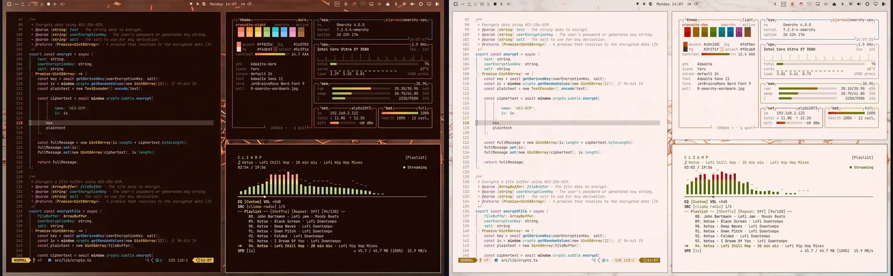](https://bjarneo.github.io/mineral-themes/#crocoite)

`045` · Folder: [`crocoite/`](crocoite/) · [Open on the site](https://bjarneo.github.io/mineral-themes/#crocoite)

Bright orange-red needles of lead chromate. Chemists found the element chromium in it. The close-up shows the crystals up close.

| Formula | System | Hardness | Luster | Streak | Density | Locality |
| --- | --- | --- | --- | --- | --- | --- |
| PbCrO₄ | Monoclinic | 2.5 to 3 | Adamantine | Orange-yellow | 6.0 g/cm³ | Dundas, Tasmania, Australia |

| Variant | Theme name | `background` | `foreground` | `accent` | Icons |
| --- | --- | --- | --- | --- | --- |
| Night | [`crocoite-night`](crocoite/night/) | `#1c0703` | `#f4dbd3` | `#ff8256` | `Yaru` |
| Day | [`crocoite-day`](crocoite/day/) | `#fdf0ec` | `#3f271f` | `#c04100` | `Yaru` |

<details>
<summary>All 16 ANSI colors of each variant</summary>

| Variant | Normal, 0 to 7 | Bright, 8 to 15 |
| --- | --- | --- |
| Night | `#2e150d` `#fe7461` `#9ac062` `#f2c042` `#57b4f2` `#e586c2` `#2acedb` `#ddc4bd` | `#8c685d` `#fd9d8e` `#b4d488` `#ffda85` `#81c9fd` `#f3a3d5` `#71e1ec` `#fdf5f2` |
| Day | `#fcd8ce` `#c40f02` `#567907` `#8b6902` `#006a9e` `#9f3f80` `#007b83` `#5e4740` | `#8f756d` `#a70700` `#466501` `#745804` `#025884` `#8d2a6f` `#0d666d` `#22110c` |

</details>

```bash
curl -fsSL https://bjarneo.github.io/mineral-themes/install.sh | bash -s -- crocoite --set
```

### Scheelite

[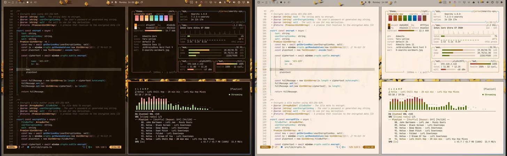](https://bjarneo.github.io/mineral-themes/#scheelite)

`046` · Folder: [`scheelite/`](scheelite/) · [Open on the site](https://bjarneo.github.io/mineral-themes/#scheelite)

Golden calcium tungstate. It glows bright blue under short-wave ultraviolet light. The close-up shows the crystals up close.

| Formula | System | Hardness | Luster | Streak | Density | Locality |
| --- | --- | --- | --- | --- | --- | --- |
| CaWO₄ | Tetragonal | 4.5 to 5 | Vitreous to adamantine | White | 6.1 g/cm³ | Sichuan, China |

| Variant | Theme name | `background` | `foreground` | `accent` | Icons |
| --- | --- | --- | --- | --- | --- |
| Night | [`scheelite-night`](scheelite/night/) | `#160c04` | `#edded2` | `#fca237` | `Yaru-yellow` |
| Day | [`scheelite-day`](scheelite/day/) | `#fff1e4` | `#3a2a1b` | `#a06003` | `Yaru-yellow` |

<details>
<summary>All 16 ANSI colors of each variant</summary>

| Variant | Normal, 0 to 7 | Bright, 8 to 15 |
| --- | --- | --- |
| Night | `#261a0f` `#ec817a` `#98c06d` `#ffb762` `#62b0fe` `#e28abd` `#43ced0` `#d7c7ba` | `#816e5c` `#f89f97` `#b2d491` `#ffd6aa` `#91c6fd` `#f1a7d1` `#7ce1e3` `#fcf6f0` |
| Day | `#f1ddcc` `#ac403d` `#527a1c` `#9e6205` `#0865af` `#9c447b` `#007c7d` `#5a4a3b` | `#8a7868` `#9a2a2a` `#426605` `#835100` `#005494` `#8a306a` `#006769` `#1f1307` |

</details>

```bash
curl -fsSL https://bjarneo.github.io/mineral-themes/install.sh | bash -s -- scheelite --set
```

## Phosphates, arsenates and vanadates

### Apatite

[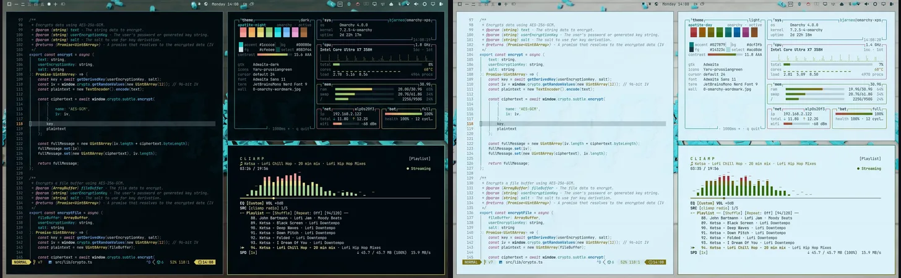](https://bjarneo.github.io/mineral-themes/#apatite)

`047` · Folder: [`apatite/`](apatite/) · [Open on the site](https://bjarneo.github.io/mineral-themes/#apatite)

Hexagonal crystals of calcium phosphate. Bones and teeth are made of a form of apatite. The close-up shows a cut gem on a table.

| Formula | System | Hardness | Luster | Streak | Density | Locality |
| --- | --- | --- | --- | --- | --- | --- |
| Ca₅(PO₄)₃(F,Cl,OH) | Hexagonal | 5 | Vitreous | White | 3.2 g/cm³ | Madagascar |

| Variant | Theme name | `background` | `foreground` | `accent` | Icons |
| --- | --- | --- | --- | --- | --- |
| Night | [`apatite-night`](apatite/night/) | `#00080e` | `#cfe6ee` | `#1cccce` | `Yaru-prussiangreen` |
| Day | [`apatite-day`](apatite/day/) | `#dcf3fb` | `#14323c` | `#027879` | `Yaru-prussiangreen` |

<details>
<summary>All 16 ANSI colors of each variant</summary>

| Variant | Normal, 0 to 7 | Bright, 8 to 15 |
| --- | --- | --- |
| Night | `#01171e` `#ec817f` `#89c471` `#d9ca5c` `#64b1f7` `#e089c7` `#07d0d6` `#b7cfd8` | `#577782` `#f99f9c` `#a7d894` `#ece18b` `#8cc7ff` `#efa6d8` `#3ce7ed` `#f0f8fc` |
| Day | `#c2e2ee` `#ac3f42` `#3e7a1e` `#796d0b` `#0467ab` `#9a4384` `#13797c` `#37525b` | `#617d86` `#9a2930` `#2a6700` `#635908` `#015690` `#882f73` `#036366` `#041920` |

</details>

```bash
curl -fsSL https://bjarneo.github.io/mineral-themes/install.sh | bash -s -- apatite --set
```

### Turquoise

[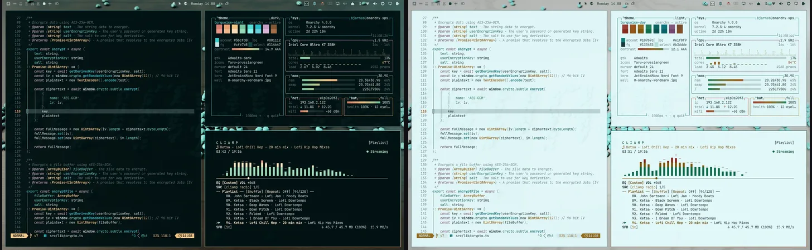](https://bjarneo.github.io/mineral-themes/#turquoise)

`048` · Signature palette · Folder: [`turquoise/`](turquoise/) · [Open on the site](https://bjarneo.github.io/mineral-themes/#turquoise)

Sky-blue copper aluminum phosphate. Dark veins of the host rock make a spiderweb pattern. The close-up shows a polished slab of the stone.

| Formula | System | Hardness | Luster | Streak | Density | Locality |
| --- | --- | --- | --- | --- | --- | --- |
| CuAl₆(PO₄)₄(OH)₈·4H₂O | Triclinic | 5 to 6 | Waxy | Bluish white | 2.7 g/cm³ | Nishapur, Iran |

| Variant | Theme name | `background` | `foreground` | `accent` | Icons |
| --- | --- | --- | --- | --- | --- |
| Night | [`turquoise-night`](turquoise/night/) | `#001112` | `#cfe7e8` | `#3bcfd0` | `Yaru-prussiangreen` |
| Day | [`turquoise-day`](turquoise/day/) | `#e1f8f9` | `#133435` | `#107b7c` | `Yaru-prussiangreen` |

<details>
<summary>All 16 ANSI colors of each variant</summary>

| Variant | Normal, 0 to 7 | Bright, 8 to 15 |
| --- | --- | --- |
| Night | `#072021` `#df8071` `#7bcba1` `#f8c885` `#26c0cf` `#cf9fc9` `#58e3dc` `#b7d0d1` | `#57797a` `#ec9c8f` `#9edebb` `#ffe3be` `#6ad3df` `#e1b9dc` `#8ef6ef` `#f0f9f9` |
| Day | `#c7e8ea` `#98392d` `#1d7d54` `#956615` `#04717a` `#82547e` `#055f5c` `#365354` | `#638182` `#862419` `#0a6a45` `#7c5309` `#035e66` `#71426d` `#034d4a` `#031a1b` |

</details>

```bash
curl -fsSL https://bjarneo.github.io/mineral-themes/install.sh | bash -s -- turquoise --set
```

### Vanadinite

[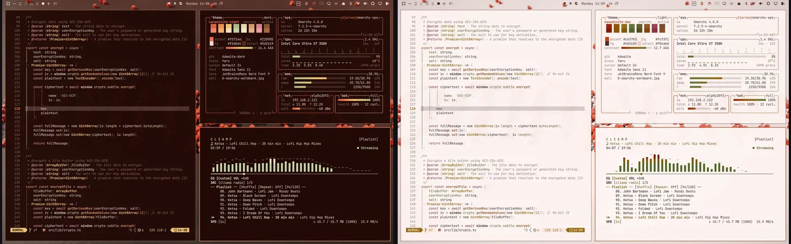](https://bjarneo.github.io/mineral-themes/#vanadinite)

`049` · Signature palette · Folder: [`vanadinite/`](vanadinite/) · [Open on the site](https://bjarneo.github.io/mineral-themes/#vanadinite)

Red hexagonal barrels of lead vanadate. It is a source of vanadium for steel. The close-up shows the crystals up close.

| Formula | System | Hardness | Luster | Streak | Density | Locality |
| --- | --- | --- | --- | --- | --- | --- |
| Pb₅(VO₄)₃Cl | Hexagonal | 3 to 4 | Resinous to adamantine | Pale yellow | 6.9 g/cm³ | Mibladen, Morocco |

| Variant | Theme name | `background` | `foreground` | `accent` | Icons |
| --- | --- | --- | --- | --- | --- |
| Night | [`vanadinite-night`](vanadinite/night/) | `#220905` | `#f5dbd4` | `#f5714e` | `Yaru` |
| Day | [`vanadinite-day`](vanadinite/day/) | `#fcf3f1` | `#402620` | `#c63703` | `Yaru` |

<details>
<summary>All 16 ANSI colors of each variant</summary>

| Variant | Normal, 0 to 7 | Bright, 8 to 15 |
| --- | --- | --- |
| Night | `#341710` `#e56147` `#acc188` `#fac871` `#dc9a6c` `#e1878e` `#eadeb2` `#ddc4be` | `#8c675e` `#f4866e` `#c4d6a7` `#fee4b8` `#ebb48e` `#efa3a8` `#f9efca` `#fdf5f2` |
| Day | `#fedad1` `#981b00` `#5f7339` `#92680c` `#91501c` `#973f4a` `#62562a` `#5f4641` | `#917670` `#7c1500` `#4e6225` `#7a5500` `#7e3f03` `#852b39` `#524616` `#22110d` |

</details>

```bash
curl -fsSL https://bjarneo.github.io/mineral-themes/install.sh | bash -s -- vanadinite --set
```

### Pyromorphite

[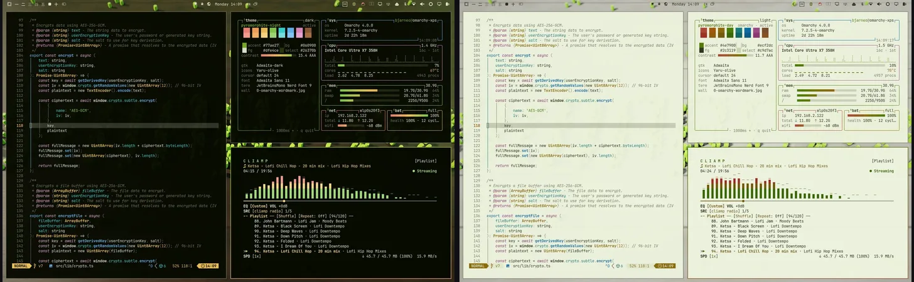](https://bjarneo.github.io/mineral-themes/#pyromorphite)

`050` · Folder: [`pyromorphite/`](pyromorphite/) · [Open on the site](https://bjarneo.github.io/mineral-themes/#pyromorphite)

Bright green barrels of lead phosphate. A melted bead turns back into crystals as it cools. The close-up shows the crystals up close.

| Formula | System | Hardness | Luster | Streak | Density | Locality |
| --- | --- | --- | --- | --- | --- | --- |
| Pb₅(PO₄)₃Cl | Hexagonal | 3.5 to 4 | Resinous | White | 7.0 g/cm³ | Bunker Hill Mine, Idaho, USA |

| Variant | Theme name | `background` | `foreground` | `accent` | Icons |
| --- | --- | --- | --- | --- | --- |
| Night | [`pyromorphite-night`](pyromorphite/night/) | `#060900` | `#dfe4ce` | `#77ae27` | `Yaru-olive` |
| Day | [`pyromorphite-day`](pyromorphite/day/) | `#ecf2dc` | `#2c3119` | `#4e7900` | `Yaru-olive` |

<details>
<summary>All 16 ANSI colors of each variant</summary>

| Variant | Normal, 0 to 7 | Bright, 8 to 15 |
| --- | --- | --- |
| Night | `#131702` `#eb8371` `#82c84e` `#edc158` `#61b3f0` `#df8ac4` `#3acfd0` `#c8ceb8` | `#6e7656` `#f8a090` `#a2db7b` `#fed988` `#87c9fc` `#eea7d6` `#78e2e3` `#f6f8f0` |
| Day | `#d9e1c3` `#ac4132` `#427a01` `#896806` `#0469a1` `#9a4582` `#117879` `#4b503a` | `#757b64` `#992c1d` `#356500` `#715506` `#055787` `#883171` `#0c6364` `#141808` |

</details>

```bash
curl -fsSL https://bjarneo.github.io/mineral-themes/install.sh | bash -s -- pyromorphite --set
```

### Variscite

[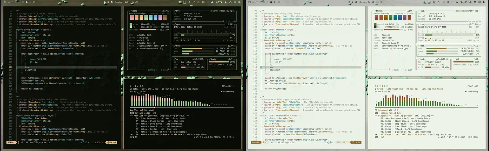](https://bjarneo.github.io/mineral-themes/#variscite)

`051` · Folder: [`variscite/`](variscite/) · [Open on the site](https://bjarneo.github.io/mineral-themes/#variscite)

Apple-green aluminum phosphate. Nodules from Utah show a web of dark veins. The close-up shows a polished slab of the stone.

| Formula | System | Hardness | Luster | Streak | Density | Locality |
| --- | --- | --- | --- | --- | --- | --- |
| AlPO₄·2H₂O | Orthorhombic | 3.5 to 4.5 | Waxy | White | 2.5 g/cm³ | Utah, USA |

| Variant | Theme name | `background` | `foreground` | `accent` | Icons |
| --- | --- | --- | --- | --- | --- |
| Night | [`variscite-night`](variscite/night/) | `#080c05` | `#dce4d7` | `#9ac688` | `Yaru-sage` |
| Day | [`variscite-day`](variscite/day/) | `#edf4e8` | `#283122` | `#4c7a38` | `Yaru-sage` |

<details>
<summary>All 16 ANSI colors of each variant</summary>

| Variant | Normal, 0 to 7 | Bright, 8 to 15 |
| --- | --- | --- |
| Night | `#151b11` `#dc8b85` `#92c083` `#f1bd7d` `#7bb0e3` `#d593bd` `#68cacb` `#c5cec0` | `#6b7564` `#eaa6a0` `#aed4a1` `#fdd7ab` `#9ac6f0` `#e5aed0` `#91dede` `#f4f8f1` |
| Day | `#d9e3d3` `#9e4d49` `#4b7a3b` `#976418` `#2e6799` `#904f7b` `#007a7b` `#475041` | `#737d6c` `#8c3a37` `#366624` `#805101` `#185688` `#7f3d6a` `#006566` `#12180d` |

</details>

```bash
curl -fsSL https://bjarneo.github.io/mineral-themes/install.sh | bash -s -- variscite --set
```

### Adamite

[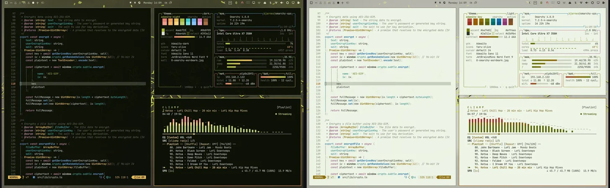](https://bjarneo.github.io/mineral-themes/#adamite)

`052` · Folder: [`adamite/`](adamite/) · [Open on the site](https://bjarneo.github.io/mineral-themes/#adamite)

Lime-green fans of zinc arsenate. It glows bright green under ultraviolet light. The close-up shows the crystals up close.

| Formula | System | Hardness | Luster | Streak | Density | Locality |
| --- | --- | --- | --- | --- | --- | --- |
| Zn₂(AsO₄)(OH) | Orthorhombic | 3.5 | Vitreous | White | 4.4 g/cm³ | Mapimí, Durango, Mexico |

| Variant | Theme name | `background` | `foreground` | `accent` | Icons |
| --- | --- | --- | --- | --- | --- |
| Night | [`adamite-night`](adamite/night/) | `#0b0f05` | `#dee4d4` | `#aeb733` | `Yaru-olive` |
| Day | [`adamite-day`](adamite/day/) | `#eff6e6` | `#2a311e` | `#6e7401` | `Yaru-olive` |

<details>
<summary>All 16 ANSI colors of each variant</summary>

| Variant | Normal, 0 to 7 | Bright, 8 to 15 |
| --- | --- | --- |
| Night | `#191e10` `#eb8370` `#a9bd41` `#eec158` `#69b1f3` `#e18ac1` `#3bcfd0` `#c7cebd` | `#6d7560` `#f8a090` `#c0d273` `#ffd988` `#8dc7fe` `#f0a7d4` `#78e2e2` `#f5f8f1` |
| Day | `#dce4d0` `#ac4231` `#67760b` `#8d6a00` `#0967a8` `#9b447f` `#037c7c` `#49503e` | `#767e6a` `#9a2c1d` `#566206` `#755700` `#05568e` `#89306e` `#006768` `#13180a` |

</details>

```bash
curl -fsSL https://bjarneo.github.io/mineral-themes/install.sh | bash -s -- adamite --set
```

### Vivianite

[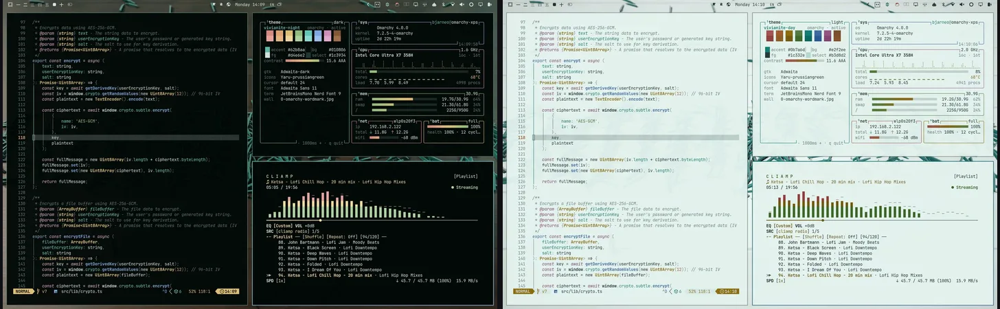](https://bjarneo.github.io/mineral-themes/#vivianite)

`053` · Folder: [`vivianite/`](vivianite/) · [Open on the site](https://bjarneo.github.io/mineral-themes/#vivianite)

Clear blue-green blades of iron phosphate. Light slowly darkens the crystals. The close-up shows the crystals up close.

| Formula | System | Hardness | Luster | Streak | Density | Locality |
| --- | --- | --- | --- | --- | --- | --- |
| Fe₃(PO₄)₂·8H₂O | Monoclinic | 1.5 to 2 | Vitreous to pearly | White, turns blue | 2.7 g/cm³ | Bolivia |

| Variant | Theme name | `background` | `foreground` | `accent` | Icons |
| --- | --- | --- | --- | --- | --- |
| Night | [`vivianite-night`](vivianite/night/) | `#010806` | `#d4e6e2` | `#62b8aa` | `Yaru-prussiangreen` |
| Day | [`vivianite-day`](vivianite/day/) | `#e2f2ee` | `#1c332e` | `#0b7a6d` | `Yaru-prussiangreen` |

<details>
<summary>All 16 ANSI colors of each variant</summary>

| Variant | Normal, 0 to 7 | Bright, 8 to 15 |
| --- | --- | --- |
| Night | `#071714` `#dc8b85` `#94c082` `#e3c479` `#81aee7` `#d592bf` `#67ccbf` `#bccfcb` | `#5f7872` `#eaa6a0` `#afd4a1` `#f5dc9f` `#9fc4f4` `#e5add2` `#90dfd4` `#f0f9f7` |
| Day | `#cce2dd` `#9e4d49` `#4a7737` `#886805` `#37649e` `#904f7d` `#0a796f` `#3d524e` | `#667d78` `#8c3a37` `#376422` `#6f5508` `#24538d` `#7f3c6c` `#06645c` `#081a16` |

</details>

```bash
curl -fsSL https://bjarneo.github.io/mineral-themes/install.sh | bash -s -- vivianite --set
```

### Wavellite

[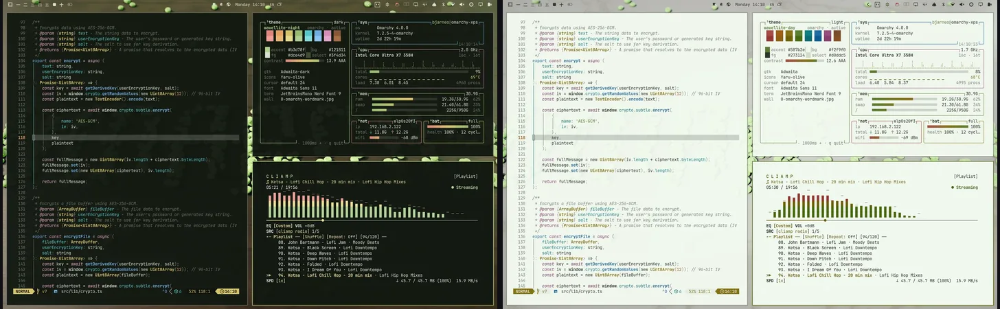](https://bjarneo.github.io/mineral-themes/#wavellite)

`054` · Folder: [`wavellite/`](wavellite/) · [Open on the site](https://bjarneo.github.io/mineral-themes/#wavellite)

Green balls of radiating needles. A broken ball shows a star on each face. The close-up shows a polished slab of the stone.

| Formula | System | Hardness | Luster | Streak | Density | Locality |
| --- | --- | --- | --- | --- | --- | --- |
| Al₃(PO₄)₂(OH,F)₃·5H₂O | Orthorhombic | 3.5 to 4 | Vitreous to pearly | White | 2.36 g/cm³ | Arkansas, USA |

| Variant | Theme name | `background` | `foreground` | `accent` | Icons |
| --- | --- | --- | --- | --- | --- |
| Night | [`wavellite-night`](wavellite/night/) | `#121811` | `#dce4d9` | `#b3d78f` | `Yaru-olive` |
| Day | [`wavellite-day`](wavellite/day/) | `#f2f9f0` | `#273124` | `#587b2e` | `Yaru-olive` |

<details>
<summary>All 16 ANSI colors of each variant</summary>

| Variant | Normal, 0 to 7 | Bright, 8 to 15 |
| --- | --- | --- |
| Night | `#21271f` `#e4877e` `#9abf75` `#dbc86b` `#6fb1ea` `#db8ebe` `#53ccd1` `#c4cec1` | `#6c7768` `#f2a39b` `#b4d396` `#eedf95` `#91c7f6` `#eba9d1` `#84e0e3` `#f4f8f2` |
| Day | `#dee8db` `#a54741` `#577c2b` `#83710c` `#1a68a1` `#964a7c` `#057e82` `#475044` | `#757f72` `#93332f` `#43680b` `#6d5d00` `#06578b` `#85376b` `#02696d` `#11180f` |

</details>

```bash
curl -fsSL https://bjarneo.github.io/mineral-themes/install.sh | bash -s -- wavellite --set
```

### Erythrite

[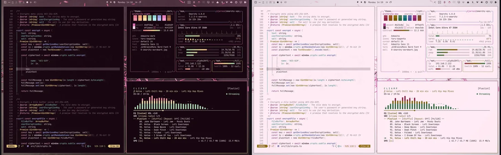](https://bjarneo.github.io/mineral-themes/#erythrite)

`055` · Signature palette · Folder: [`erythrite/`](erythrite/) · [Open on the site](https://bjarneo.github.io/mineral-themes/#erythrite)

Crimson-pink sprays of cobalt arsenate. Miners called it cobalt bloom. The close-up shows the crystals up close.

| Formula | System | Hardness | Luster | Streak | Density | Locality |
| --- | --- | --- | --- | --- | --- | --- |
| Co₃(AsO₄)₂·8H₂O | Monoclinic | 1.5 to 2.5 | Adamantine to pearly | Pale red | 3.06 g/cm³ | Bou Azzer, Morocco |

| Variant | Theme name | `background` | `foreground` | `accent` | Icons |
| --- | --- | --- | --- | --- | --- |
| Night | [`erythrite-night`](erythrite/night/) | `#16040f` | `#f1dae6` | `#e072ba` | `Yaru-magenta` |
| Day | [`erythrite-day`](erythrite/day/) | `#ffebf5` | `#3c2632` | `#b23c8e` | `Yaru-magenta` |

<details>
<summary>All 16 ANSI colors of each variant</summary>

| Variant | Normal, 0 to 7 | Bright, 8 to 15 |
| --- | --- | --- |
| Night | `#27101e` `#e27a8c` `#93c69d` `#efcc83` `#9ea4e9` `#ec81c0` `#93d9dc` `#dac3cf` | `#876678` `#ef97a5` `#b0dab7` `#fee5b1` `#b6bcf6` `#f9a0d3` `#b5eef0` `#fcf4f8` |
| Day | `#f5d5e6` `#9a314a` `#43784f` `#8a6807` `#585b9f` `#9f3278` `#28777c` `#5b4651` | `#8a727f` `#881939` `#2c643b` `#745600` `#48498f` `#8d1967` `#006569` `#201019` |

</details>

```bash
curl -fsSL https://bjarneo.github.io/mineral-themes/install.sh | bash -s -- erythrite --set
```

## Island and group silicates

### Peridot

[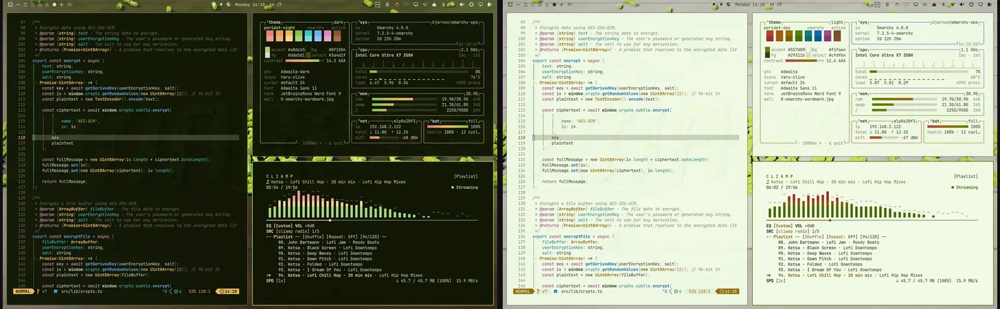](https://bjarneo.github.io/mineral-themes/#peridot)

`056` · Variety of forsterite · Folder: [`peridot/`](peridot/) · [Open on the site](https://bjarneo.github.io/mineral-themes/#peridot)

The gem variety of olivine. It forms deep in the mantle, and lava brings it up. The close-up shows a cut gem on a table.

| Formula | System | Hardness | Luster | Streak | Density | Locality |
| --- | --- | --- | --- | --- | --- | --- |
| (Mg,Fe)₂SiO₄ | Orthorhombic | 6.5 to 7 | Vitreous | White | 3.3 g/cm³ | Zabargad Island, Egypt |

| Variant | Theme name | `background` | `foreground` | `accent` | Icons |
| --- | --- | --- | --- | --- | --- |
| Night | [`peridot-night`](peridot/night/) | `#0f1504` | `#dde5d1` | `#a8dc65` | `Yaru-olive` |
| Day | [`peridot-day`](peridot/day/) | `#f1fae4` | `#29311b` | `#557d09` | `Yaru-olive` |

<details>
<summary>All 16 ANSI colors of each variant</summary>

| Variant | Normal, 0 to 7 | Bright, 8 to 15 |
| --- | --- | --- |
| Night | `#1d2410` `#ec8277` `#8ec550` `#f4bd59` `#68b1f2` `#e08ac3` `#3bcfcf` `#c6ceb9` | `#6c765b` `#f99f95` `#aad97c` `#fed896` `#8cc7fd` `#efa7d6` `#78e2e2` `#f5f8f1` |
| Day | `#dde9cb` `#ac4039` `#507e00` `#936904` `#0667a8` `#9a4481` `#087d7d` `#49513c` | `#778069` `#9a2a26` `#426901` `#7b5806` `#03568e` `#883070` `#026868` `#131809` |

</details>

```bash
curl -fsSL https://bjarneo.github.io/mineral-themes/install.sh | bash -s -- peridot --set
```

### Almandine

[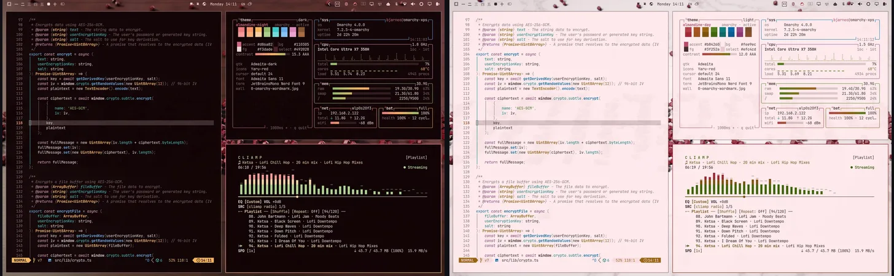](https://bjarneo.github.io/mineral-themes/#almandine)

`057` · Folder: [`almandine/`](almandine/) · [Open on the site](https://bjarneo.github.io/mineral-themes/#almandine)

The common deep red garnet. It forms twelve-sided crystals in schist. The close-up shows a cut gem on a table.

| Formula | System | Hardness | Luster | Streak | Density | Locality |
| --- | --- | --- | --- | --- | --- | --- |
| Fe₃Al₂(SiO₄)₃ | Cubic | 7 to 7.5 | Vitreous | White | 4.3 g/cm³ | Wrangell, Alaska, USA |

| Variant | Theme name | `background` | `foreground` | `accent` | Icons |
| --- | --- | --- | --- | --- | --- |
| Night | [`almandine-night`](almandine/night/) | `#110305` | `#f3dade` | `#d86a82` | `Yaru-red` |
| Day | [`almandine-day`](almandine/day/) | `#fee9ec` | `#3f252a` | `#b84260` | `Yaru-red` |

<details>
<summary>All 16 ANSI colors of each variant</summary>

| Variant | Normal, 0 to 7 | Bright, 8 to 15 |
| --- | --- | --- |
| Night | `#220e12` `#ef7e7f` `#95c16d` `#fdb85f` `#66b2f2` `#e18ac2` `#3ccfcc` `#ddc3c7` | `#88686d` `#fc9c9b` `#b0d591` `#fed7a9` `#8bc8fd` `#f0a7d4` `#78e2df` `#fdf4f5` |
| Day | `#f5d3d8` `#af3b42` `#4c7817` `#966009` `#0067a8` `#9b447f` `#007977` `#5e4549` | `#8c7175` `#9d2331` `#3b6205` `#7b4e06` `#00568d` `#89306e` `#0a6261` `#221013` |

</details>

```bash
curl -fsSL https://bjarneo.github.io/mineral-themes/install.sh | bash -s -- almandine --set
```

### Spessartine

[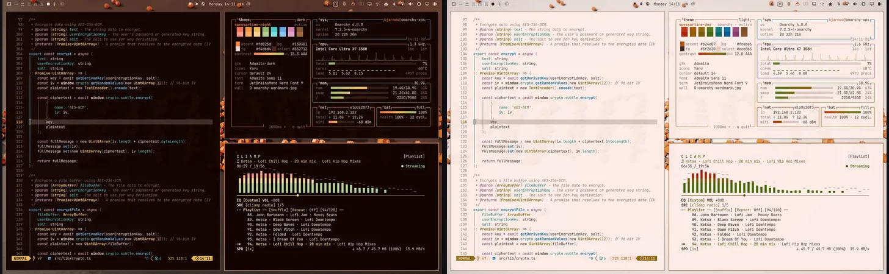](https://bjarneo.github.io/mineral-themes/#spessartine)

`058` · Folder: [`spessartine/`](spessartine/) · [Open on the site](https://bjarneo.github.io/mineral-themes/#spessartine)

Manganese garnet in bright mandarin orange. The best crystals grow on smoky quartz. The close-up shows a cut gem on a table.

| Formula | System | Hardness | Luster | Streak | Density | Locality |
| --- | --- | --- | --- | --- | --- | --- |
| Mn₃Al₂(SiO₄)₃ | Cubic | 6.5 to 7.5 | Vitreous | White | 4.2 g/cm³ | Fujian, China |

| Variant | Theme name | `background` | `foreground` | `accent` | Icons |
| --- | --- | --- | --- | --- | --- |
| Night | [`spessartine-night`](spessartine/night/) | `#130301` | `#f4dbd4` | `#fd823d` | `Yaru` |
| Day | [`spessartine-day`](spessartine/day/) | `#fcebe6` | `#3f2620` | `#b24e07` | `Yaru` |

<details>
<summary>All 16 ANSI colors of each variant</summary>

| Variant | Normal, 0 to 7 | Bright, 8 to 15 |
| --- | --- | --- |
| Night | `#240d08` `#fd755a` `#99c070` `#f2bf59` `#66b3eb` `#e08bbf` `#4ccecb` `#ddc4bd` | `#8b685f` `#fe9d88` `#b3d493` `#ffd992` `#8bc8f7` `#efa7d2` `#80e1df` `#fdf5f2` |
| Day | `#f7d4ca` `#bc2b0b` `#50761c` `#8c6608` `#07699f` `#9a457d` `#0d7877` `#5f4740` | `#8c726b` `#a21c00` `#3f6306` `#735307` `#005787` `#88316c` `#086362` `#22110c` |

</details>

```bash
curl -fsSL https://bjarneo.github.io/mineral-themes/install.sh | bash -s -- spessartine --set
```

### Uvarovite

[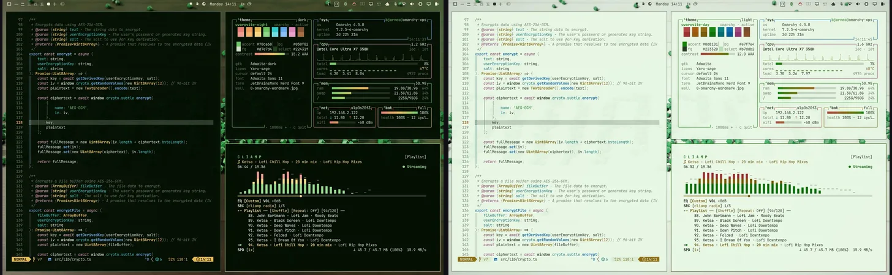](https://bjarneo.github.io/mineral-themes/#uvarovite)

`059` · Folder: [`uvarovite/`](uvarovite/) · [Open on the site](https://bjarneo.github.io/mineral-themes/#uvarovite)

Chromium garnet in tiny emerald-green crystals. It covers rock as a sparkly crust. The close-up shows the crystals up close.

| Formula | System | Hardness | Luster | Streak | Density | Locality |
| --- | --- | --- | --- | --- | --- | --- |
| Ca₃Cr₂(SiO₄)₃ | Cubic | 6.5 to 7 | Vitreous | White | 3.6 g/cm³ | Ural Mountains, Russia |

| Variant | Theme name | `background` | `foreground` | `accent` | Icons |
| --- | --- | --- | --- | --- | --- |
| Night | [`uvarovite-night`](uvarovite/night/) | `#030f02` | `#d7e7d4` | `#70ca68` | `Yaru-sage` |
| Day | [`uvarovite-day`](uvarovite/day/) | `#e7f7e4` | `#223320` | `#0d8101` | `Yaru-sage` |

<details>
<summary>All 16 ANSI colors of each variant</summary>

| Variant | Normal, 0 to 7 | Bright, 8 to 15 |
| --- | --- | --- |
| Night | `#0d1e0b` `#ec8278` `#6fca68` `#eec158` `#67b1f5` `#e389c0` `#2fcfd3` `#c0d0be` | `#62795f` `#f99f96` `#94dd8d` `#ffda88` `#8fc7fd` `#f1a6d3` `#73e2e5` `#f3f9f2` |
| Day | `#d0e7cd` `#ac403b` `#0f810b` `#8b690a` `#0366ab` `#9d437d` `#067b7e` `#425240` | `#6d7e6b` `#9a2a28` `#056b03` `#755700` `#005590` `#8b2f6c` `#006669` `#0e190d` |

</details>

```bash
curl -fsSL https://bjarneo.github.io/mineral-themes/install.sh | bash -s -- uvarovite --set
```

### Topaz

[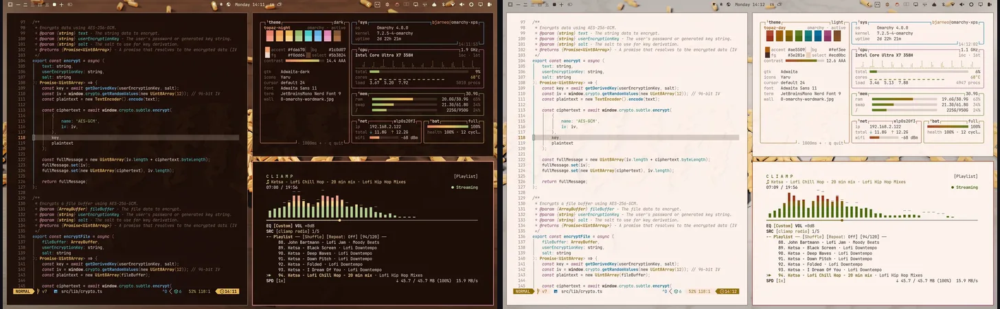](https://bjarneo.github.io/mineral-themes/#topaz)

`060` · Folder: [`topaz/`](topaz/) · [Open on the site](https://bjarneo.github.io/mineral-themes/#topaz)

A hard aluminum silicate. Imperial topaz from Brazil is golden orange with a pink hint. The close-up shows a cut gem on a table.

| Formula | System | Hardness | Luster | Streak | Density | Locality |
| --- | --- | --- | --- | --- | --- | --- |
| Al₂SiO₄(F,OH)₂ | Orthorhombic | 8 | Vitreous | White | 3.5 g/cm³ | Ouro Preto, Brazil |

| Variant | Theme name | `background` | `foreground` | `accent` | Icons |
| --- | --- | --- | --- | --- | --- |
| Night | [`topaz-night`](topaz/night/) | `#1c0d07` | `#f0ddd4` | `#fda670` | `Yaru` |
| Day | [`topaz-day`](topaz/day/) | `#fef3ee` | `#3e281e` | `#ae5509` | `Yaru` |

<details>
<summary>All 16 ANSI colors of each variant</summary>

| Variant | Normal, 0 to 7 | Bright, 8 to 15 |
| --- | --- | --- |
| Night | `#2d1c14` `#eb846b` `#9ac06d` `#f0bf58` `#60b4eb` `#e489b7` `#47cecf` `#dac6bc` | `#856b5f` `#f8a18c` `#b5d491` `#fed88d` `#87c9f7` `#f2a6cb` `#7ee1e2` `#fdf5f1` |
| Day | `#f8ddd1` `#ab432a` `#567b1d` `#8f6900` `#006a9c` `#9e4475` `#0e7d7e` `#5e473e` | `#90776d` `#992d13` `#466707` `#785802` `#045882` `#8c3064` `#096869` `#21110a` |

</details>

```bash
curl -fsSL https://bjarneo.github.io/mineral-themes/install.sh | bash -s -- topaz --set
```

### Zircon

[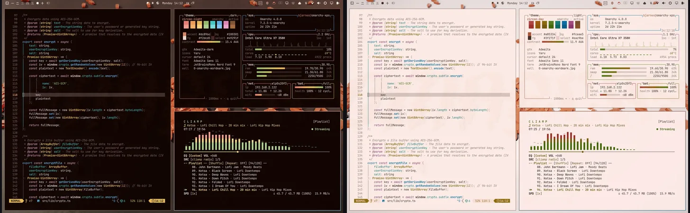](https://bjarneo.github.io/mineral-themes/#zircon)

`061` · Folder: [`zircon/`](zircon/) · [Open on the site](https://bjarneo.github.io/mineral-themes/#zircon)

One of the oldest minerals on Earth, up to 4.4 billion years old. It has a bright, diamond-like shine. The close-up shows a cut gem on a table.

| Formula | System | Hardness | Luster | Streak | Density | Locality |
| --- | --- | --- | --- | --- | --- | --- |
| ZrSiO₄ | Tetragonal | 7.5 | Adamantine | White | 4.7 g/cm³ | Ratanakiri, Cambodia |

| Variant | Theme name | `background` | `foreground` | `accent` | Icons |
| --- | --- | --- | --- | --- | --- |
| Night | [`zircon-night`](zircon/night/) | `#100301` | `#f2dcd5` | `#dc896c` | `Yaru` |
| Day | [`zircon-day`](zircon/day/) | `#fceae5` | `#3f271f` | `#a85334` | `Yaru` |

<details>
<summary>All 16 ANSI colors of each variant</summary>

| Variant | Normal, 0 to 7 | Bright, 8 to 15 |
| --- | --- | --- |
| Night | `#200e09` `#ec8274` `#97c06e` `#eec058` `#5fb4ed` `#e28abd` `#44cfcc` `#dcc5be` | `#876a61` `#f8a092` `#b2d491` `#ffd988` `#86c9f8` `#f1a7d0` `#7de2e0` `#fdf5f2` |
| Day | `#f3d5cc` `#ac4136` `#4f7718` `#896707` `#006a9e` `#9c447b` `#107877` `#5e4740` | `#8c726a` `#9a2b22` `#3e6300` `#715405` `#025884` `#8a306a` `#0a6362` `#22110c` |

</details>

```bash
curl -fsSL https://bjarneo.github.io/mineral-themes/install.sh | bash -s -- zircon --set
```

### Kyanite

[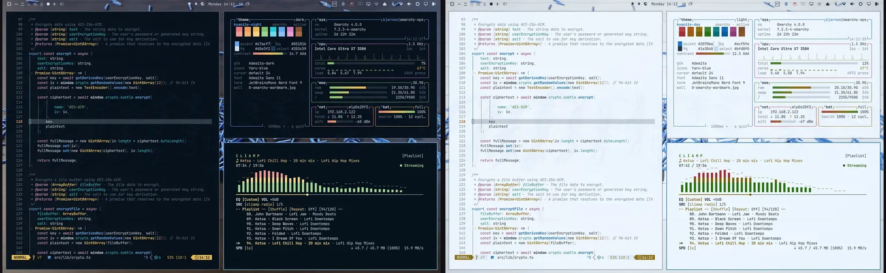](https://bjarneo.github.io/mineral-themes/#kyanite)

`062` · Folder: [`kyanite/`](kyanite/) · [Open on the site](https://bjarneo.github.io/mineral-themes/#kyanite)

Blue blades of aluminum silicate. It is soft along the blade and hard across it. The close-up shows the crystals up close.

| Formula | System | Hardness | Luster | Streak | Density | Locality |
| --- | --- | --- | --- | --- | --- | --- |
| Al₂SiO₅ | Triclinic | 4.5 to 7 | Vitreous to pearly | White | 3.6 g/cm³ | Minas Gerais, Brazil |

| Variant | Theme name | `background` | `foreground` | `accent` | Icons |
| --- | --- | --- | --- | --- | --- |
| Night | [`kyanite-night`](kyanite/night/) | `#05101b` | `#d5e3f2` | `#67acf7` | `Yaru-blue` |
| Day | [`kyanite-day`](kyanite/day/) | `#ecf5fe` | `#1e3040` | `#2070be` | `Yaru-blue` |

<details>
<summary>All 16 ANSI colors of each variant</summary>

| Variant | Normal, 0 to 7 | Bright, 8 to 15 |
| --- | --- | --- |
| Night | `#111f2c` `#ec817d` `#84c575` `#edc158` `#65b0f9` `#e089c7` `#21cfda` `#bdcddc` | `#607488` `#f99f9a` `#a3d997` `#fed988` `#8fc6fd` `#efa6d8` `#6fe2eb` `#f2f8fd` |
| Day | `#d0e4f9` `#ac3f40` `#397e28` `#8c6b0d` `#0666ac` `#9a4384` `#0e7c83` `#3e4f60` | `#6a7d8f` `#9a292e` `#226b08` `#755800` `#015591` `#882f73` `#03666c` `#0a1723` |

</details>

```bash
curl -fsSL https://bjarneo.github.io/mineral-themes/install.sh | bash -s -- kyanite --set
```

### Staurolite

[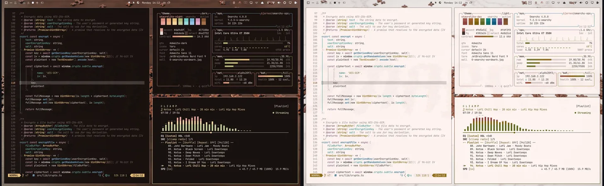](https://bjarneo.github.io/mineral-themes/#staurolite)

`063` · Folder: [`staurolite/`](staurolite/) · [Open on the site](https://bjarneo.github.io/mineral-themes/#staurolite)

Brown crystals that twin into crosses. People call them fairy crosses. The close-up shows the crystals up close.

| Formula | System | Hardness | Luster | Streak | Density | Locality |
| --- | --- | --- | --- | --- | --- | --- |
| Fe₂Al₉Si₄O₂₃(OH) | Monoclinic | 7 to 7.5 | Vitreous to resinous | Gray-white | 3.7 g/cm³ | Georgia, USA |

| Variant | Theme name | `background` | `foreground` | `accent` | Icons |
| --- | --- | --- | --- | --- | --- |
| Night | [`staurolite-night`](staurolite/night/) | `#17100e` | `#ebdeda` | `#da9c8f` | `Yaru` |
| Day | [`staurolite-day`](staurolite/day/) | `#fdf3f0` | `#382a26` | `#9d5e51` | `Yaru` |

<details>
<summary>All 16 ANSI colors of each variant</summary>

| Variant | Normal, 0 to 7 | Bright, 8 to 15 |
| --- | --- | --- |
| Night | `#271e1c` `#dc8c82` `#adb979` `#e9c17a` `#77b3d9` `#d594b9` `#73c9c6` `#d6c7c3` | `#7e6d69` `#eba79e` `#c4ce9a` `#fad9a0` `#97c8e8` `#e5aecd` `#99ddda` `#fdf5f2` |
| Day | `#eee0dc` `#9e4e45` `#6b7631` `#90680f` `#276a90` `#905077` `#087d7b` `#584945` | `#897975` `#8c3b34` `#586217` `#795705` `#09597f` `#7f3e66` `#076866` `#1e1310` |

</details>

```bash
curl -fsSL https://bjarneo.github.io/mineral-themes/install.sh | bash -s -- staurolite --set
```

### Titanite

[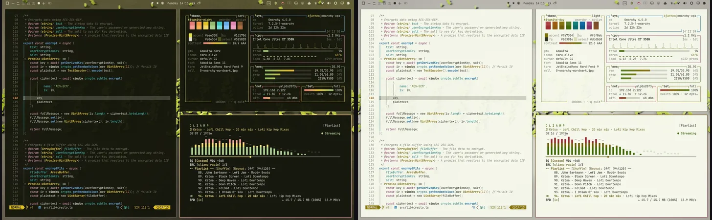](https://bjarneo.github.io/mineral-themes/#titanite)

`064` · Folder: [`titanite/`](titanite/) · [Open on the site](https://bjarneo.github.io/mineral-themes/#titanite)

Yellow-green wedges of calcium titanium silicate. Its fire is stronger than that of diamond. The close-up shows a cut gem on a table.

| Formula | System | Hardness | Luster | Streak | Density | Locality |
| --- | --- | --- | --- | --- | --- | --- |
| CaTiSiO₅ | Monoclinic | 5 to 5.5 | Adamantine | White | 3.5 g/cm³ | Pakistan |

| Variant | Theme name | `background` | `foreground` | `accent` | Icons |
| --- | --- | --- | --- | --- | --- |
| Night | [`titanite-night`](titanite/night/) | `#16170d` | `#e0e3d4` | `#eee350` | `Yaru-olive` |
| Day | [`titanite-day`](titanite/day/) | `#f6f8eb` | `#2d301e` | `#7a7304` | `Yaru-olive` |

<details>
<summary>All 16 ANSI colors of each variant</summary>

| Variant | Normal, 0 to 7 | Bright, 8 to 15 |
| --- | --- | --- |
| Night | `#25271a` `#ec817d` `#94c16e` `#e6c626` `#65b2f2` `#e589b8` `#3ccfcc` `#caccbc` | `#727561` `#f99f9a` `#afd591` `#f7de6f` `#8ac8fd` `#f4a6cc` `#78e2df` `#f6f8f0` |
| Day | `#e3e7d4` `#ac3f40` `#4f7c1e` `#836f04` `#0668a5` `#9f4375` `#0a7d7b` `#4c4f3e` | `#7c7f6d` `#9a292d` `#3d6900` `#6e5d03` `#05578b` `#8d2e65` `#036867` `#16170a` |

</details>

```bash
curl -fsSL https://bjarneo.github.io/mineral-themes/install.sh | bash -s -- titanite --set
```

### Epidote

[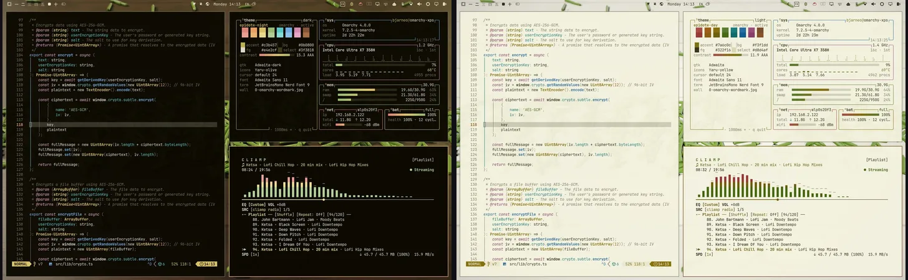](https://bjarneo.github.io/mineral-themes/#epidote)

`065` · Folder: [`epidote/`](epidote/) · [Open on the site](https://bjarneo.github.io/mineral-themes/#epidote)

Pistachio-green striated prisms. It forms when heat and water change rock. The close-up shows the crystals up close.

| Formula | System | Hardness | Luster | Streak | Density | Locality |
| --- | --- | --- | --- | --- | --- | --- |
| Ca₂(Al₂Fe)(SiO₄)(Si₂O₇)O(OH) | Monoclinic | 6 to 7 | Vitreous | Grayish white | 3.4 g/cm³ | Knappenwand, Austria |

| Variant | Theme name | `background` | `foreground` | `accent` | Icons |
| --- | --- | --- | --- | --- | --- |
| Night | [`epidote-night`](epidote/night/) | `#0b0800` | `#e4e2cf` | `#c3b457` | `Yaru-olive` |
| Day | [`epidote-day`](epidote/day/) | `#f3f1dd` | `#322f16` | `#7a6c0c` | `Yaru-yellow` |

<details>
<summary>All 16 ANSI colors of each variant</summary>

| Variant | Normal, 0 to 7 | Bright, 8 to 15 |
| --- | --- | --- |
| Night | `#191604` `#e4877e` `#9bbf76` `#dfc76a` `#72b1e9` `#dc8ebb` `#59cccb` `#ceccb7` | `#767357` `#f2a39a` `#b5d398` `#f2de95` `#93c7f5` `#ebaace` `#87e0de` `#f8f7f0` |
| Day | `#e2dfc3` `#a54741` `#547729` `#826b00` `#20689f` `#974a79` `#0d7a79` `#514e38` | `#7d7a62` `#93332f` `#41640b` `#6c5904` `#06568c` `#863768` `#096565` `#191606` |

</details>

```bash
curl -fsSL https://bjarneo.github.io/mineral-themes/install.sh | bash -s -- epidote --set
```

### Tanzanite

[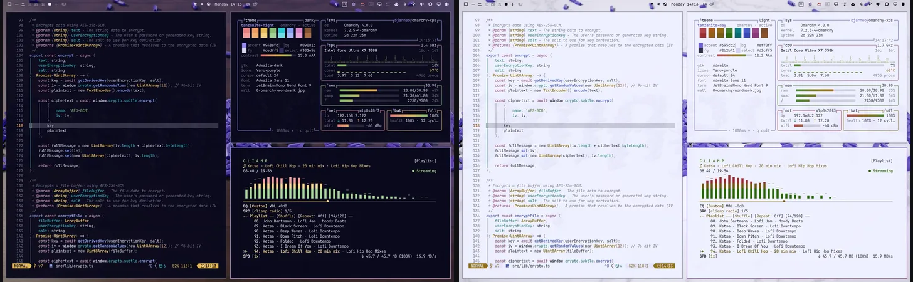](https://bjarneo.github.io/mineral-themes/#tanzanite)

`066` · Variety of zoisite · Folder: [`tanzanite/`](tanzanite/) · [Open on the site](https://bjarneo.github.io/mineral-themes/#tanzanite)

The violet-blue variety of zoisite. It comes from only one place: the Merelani Hills of Tanzania. The close-up shows a cut gem on a table.

| Formula | System | Hardness | Luster | Streak | Density | Locality |
| --- | --- | --- | --- | --- | --- | --- |
| Ca₂Al₃(SiO₄)(Si₂O₇)O(OH) | Orthorhombic | 6 to 7 | Vitreous | White | 3.35 g/cm³ | Merelani Hills, Tanzania |

| Variant | Theme name | `background` | `foreground` | `accent` | Icons |
| --- | --- | --- | --- | --- | --- |
| Night | [`tanzanite-night`](tanzanite/night/) | `#09081b` | `#dedff5` | `#948efd` | `Yaru-purple` |
| Day | [`tanzanite-day`](tanzanite/day/) | `#eff0ff` | `#2b2b41` | `#695cd2` | `Yaru-purple` |

<details>
<summary>All 16 ANSI colors of each variant</summary>

| Variant | Normal, 0 to 7 | Bright, 8 to 15 |
| --- | --- | --- |
| Night | `#17162d` `#ec817f` `#86c473` `#eec058` `#8ca5fd` `#de8aca` `#21cfd9` `#c8c8de` | `#6e6e8e` `#f99f9c` `#a4d895` `#fed988` `#aabefc` `#eda7db` `#6fe2ea` `#f6f6fe` |
| Day | `#dbdcfb` `#ac3f42` `#3c7c23` `#8b690a` `#4156c4` `#994487` `#057980` `#4a4b60` | `#77788f` `#9a2930` `#266704` `#725609` `#3242b3` `#873076` `#00656a` `#141423` |

</details>

```bash
curl -fsSL https://bjarneo.github.io/mineral-themes/install.sh | bash -s -- tanzanite --set
```

## Ring silicates

### Emerald

[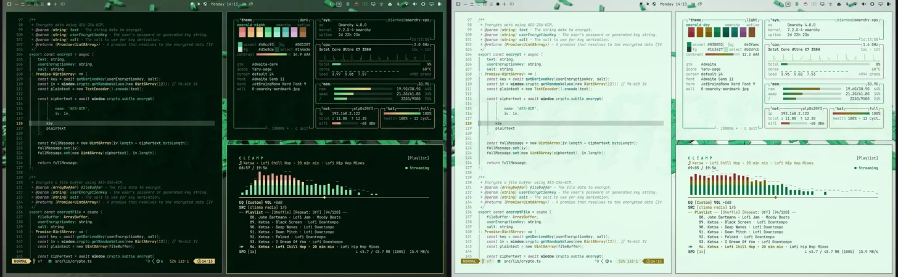](https://bjarneo.github.io/mineral-themes/#emerald)

`067` · Variety of beryl · Signature palette · Folder: [`emerald/`](emerald/) · [Open on the site](https://bjarneo.github.io/mineral-themes/#emerald)

The green variety of beryl. Chromium and vanadium give the color. The close-up shows a cut gem on a table.

| Formula | System | Hardness | Luster | Streak | Density | Locality |
| --- | --- | --- | --- | --- | --- | --- |
| Be₃Al₂Si₆O₁₈ | Hexagonal | 7.5 to 8 | Vitreous | White | 2.7 g/cm³ | Muzo, Colombia |

| Variant | Theme name | `background` | `foreground` | `accent` | Icons |
| --- | --- | --- | --- | --- | --- |
| Night | [`emerald-night`](emerald/night/) | `#001207` | `#d1e8da` | `#48cc93` | `Yaru-sage` |
| Day | [`emerald-day`](emerald/day/) | `#e3faec` | `#1b3427` | `#038055` | `Yaru-sage` |

<details>
<summary>All 16 ANSI colors of each variant</summary>

| Variant | Normal, 0 to 7 | Bright, 8 to 15 |
| --- | --- | --- |
| Night | `#042214` `#df7f78` `#4ed589` `#e5d183` `#4eb9ad` `#d29ccc` `#6fe4bf` `#bbd1c4` | `#587b68` `#ec9b94` `#82e7a8` `#f9e8a9` `#7accc1` `#e3b6de` `#9cf7d7` `#f1f9f4` |
| Day | `#caead7` `#983835` `#067f48` `#836e0b` `#0c6f66` `#865181` `#045844` `#3c5346` | `#698173` `#862323` `#026b3c` `#6d5a00` `#0b5c54` `#753f70` `#004635` `#091a11` |

</details>

```bash
curl -fsSL https://bjarneo.github.io/mineral-themes/install.sh | bash -s -- emerald --set
```

### Aquamarine

[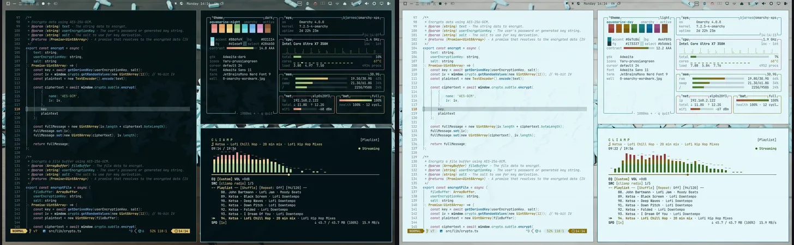](https://bjarneo.github.io/mineral-themes/#aquamarine)

`068` · Variety of beryl · Folder: [`aquamarine/`](aquamarine/) · [Open on the site](https://bjarneo.github.io/mineral-themes/#aquamarine)

The sea-blue variety of beryl. Iron gives the color. The close-up shows a cut gem on a table.

| Formula | System | Hardness | Luster | Streak | Density | Locality |
| --- | --- | --- | --- | --- | --- | --- |
| Be₃Al₂Si₆O₁₈ | Hexagonal | 7.5 to 8 | Vitreous | White | 2.7 g/cm³ | Shigar Valley, Pakistan |

| Variant | Theme name | `background` | `foreground` | `accent` | Icons |
| --- | --- | --- | --- | --- | --- |
| Night | [`aquamarine-night`](aquamarine/night/) | `#021114` | `#d1e6e9` | `#88dfe9` | `Yaru-prussiangreen` |
| Day | [`aquamarine-day`](aquamarine/day/) | `#e4f8fb` | `#173337` | `#0e7c86` | `Yaru-prussiangreen` |

<details>
<summary>All 16 ANSI colors of each variant</summary>

| Variant | Normal, 0 to 7 | Bright, 8 to 15 |
| --- | --- | --- |
| Night | `#0b2023` `#e4877f` `#8dc27b` `#e4c46a` `#67b3ec` `#da8ec4` `#4acdd5` `#b9cfd3` | `#5a787c` `#f2a39b` `#aad69b` `#f6dc94` `#8bc9f8` `#eaaad6` `#7fe0e7` `#f0f9fa` |
| Day | `#cbe7ec` `#a54742` `#477d32` `#896c04` `#0b69a0` `#954a81` `#117a81` `#385256` | `#658084` `#933330` `#306918` `#725a08` `#005888` `#843770` `#0e676c` `#041a1d` |

</details>

```bash
curl -fsSL https://bjarneo.github.io/mineral-themes/install.sh | bash -s -- aquamarine --set
```

### Morganite

[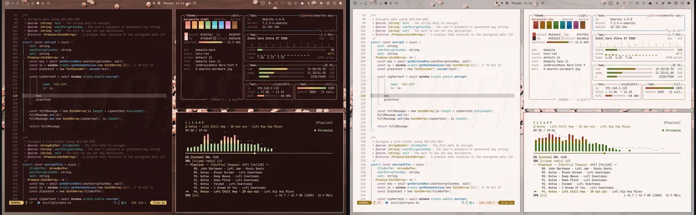](https://bjarneo.github.io/mineral-themes/#morganite)

`069` · Variety of beryl · Folder: [`morganite/`](morganite/) · [Open on the site](https://bjarneo.github.io/mineral-themes/#morganite)

The peach-pink variety of beryl. Manganese gives the color. The close-up shows a cut gem on a table.

| Formula | System | Hardness | Luster | Streak | Density | Locality |
| --- | --- | --- | --- | --- | --- | --- |
| Be₃Al₂Si₆O₁₈ | Hexagonal | 7.5 to 8 | Vitreous | White | 2.8 g/cm³ | Pala, California, USA |

| Variant | Theme name | `background` | `foreground` | `accent` | Icons |
| --- | --- | --- | --- | --- | --- |
| Night | [`morganite-night`](morganite/night/) | `#220f0f` | `#f3dbd9` | `#feb7ac` | `Yaru-red` |
| Day | [`morganite-day`](morganite/day/) | `#fcf5f4` | `#402625` | `#b24e44` | `Yaru-red` |

<details>
<summary>All 16 ANSI colors of each variant</summary>

| Variant | Normal, 0 to 7 | Bright, 8 to 15 |
| --- | --- | --- |
| Night | `#341d1d` `#e68678` `#94c07b` `#eac16a` `#71b1e8` `#db8fbe` `#58cccd` `#ddc4c2` | `#8c6b6a` `#f3a296` `#afd49b` `#fbd994` `#92c7f5` `#ebaad1` `#87dfe0` `#fef4f4` |
| Day | `#fedbd9` `#a6463a` `#517d34` `#8f6b09` `#1d689f` `#964a7b` `#137d7e` `#5f4645` | `#917574` `#943227` `#3c691b` `#795900` `#01578b` `#84376a` `#0f6869` `#221010` |

</details>

```bash
curl -fsSL https://bjarneo.github.io/mineral-themes/install.sh | bash -s -- morganite --set
```

### Watermelon Tourmaline

[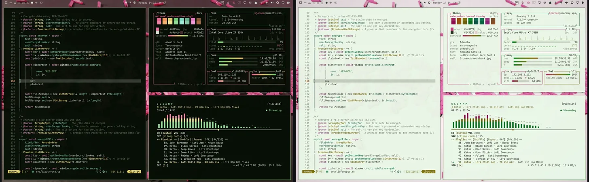](https://bjarneo.github.io/mineral-themes/#watermelon-tourmaline)

`070` · Variety of elbaite · Signature palette · Folder: [`watermelon-tourmaline/`](watermelon-tourmaline/) · [Open on the site](https://bjarneo.github.io/mineral-themes/#watermelon-tourmaline)

Elbaite with a pink core and a green rim. A cut slice looks like a watermelon. The close-up shows a polished slab of the stone.

| Formula | System | Hardness | Luster | Streak | Density | Locality |
| --- | --- | --- | --- | --- | --- | --- |
| Na(Li₁.₅Al₁.₅)Al₆(Si₆O₁₈)(BO₃)₃(OH)₄ | Trigonal | 7 to 7.5 | Vitreous | White | 3.05 g/cm³ | Minas Gerais, Brazil |

| Variant | Theme name | `background` | `foreground` | `accent` | Icons |
| --- | --- | --- | --- | --- | --- |
| Night | [`watermelon-tourmaline-night`](watermelon-tourmaline/night/) | `#050e04` | `#d9e6d6` | `#f075aa` | `Yaru-magenta` |
| Day | [`watermelon-tourmaline-day`](watermelon-tourmaline/day/) | `#e9f6e6` | `#243320` | `#ba3877` | `Yaru-magenta` |

<details>
<summary>All 16 ANSI colors of each variant</summary>

| Variant | Normal, 0 to 7 | Bright, 8 to 15 |
| --- | --- | --- |
| Night | `#121d0f` `#e46894` `#75d079` `#e3d372` `#68b88f` `#e882c8` `#7fe0c7` `#c2cfbf` | `#667762` `#f089aa` `#99e39b` `#f7ea9c` `#8bcba8` `#f6a1da` `#a6f4de` `#f3f9f2` |
| Day | `#d4e5d0` `#9e1755` `#088122` `#7d6e07` `#08724a` `#9b3480` `#0b5e4e` `#435240` | `#6e7e6b` `#870045` `#046b1b` `#685c09` `#005f3c` `#891b6f` `#074c3e` `#0f190c` |

</details>

```bash
curl -fsSL https://bjarneo.github.io/mineral-themes/install.sh | bash -s -- watermelon-tourmaline --set
```

### Schorl

[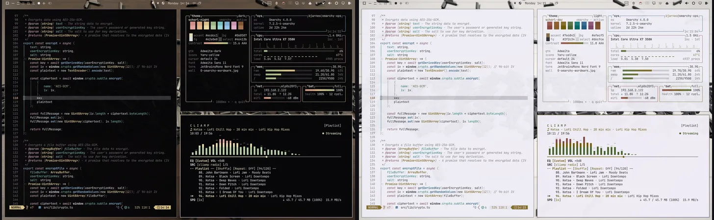](https://bjarneo.github.io/mineral-themes/#schorl)

`071` · Folder: [`schorl/`](schorl/) · [Open on the site](https://bjarneo.github.io/mineral-themes/#schorl)

Black tourmaline in long striated prisms. It is the most common tourmaline. The close-up shows the crystals up close.

| Formula | System | Hardness | Luster | Streak | Density | Locality |
| --- | --- | --- | --- | --- | --- | --- |
| NaFe₃Al₆(Si₆O₁₈)(BO₃)₃(OH)₄ | Trigonal | 7 to 7.5 | Vitreous | Gray-white | 3.2 g/cm³ | Erongo, Namibia |

| Variant | Theme name | `background` | `foreground` | `accent` | Icons |
| --- | --- | --- | --- | --- | --- |
| Night | [`schorl-night`](schorl/night/) | `#060507` | `#e2e0e8` | `#ecdcc1` | `Yaru-yellow` |
| Day | [`schorl-day`](schorl/day/) | `#efecf5` | `#2f2c34` | `#7e6843` | `Yaru-yellow` |

<details>
<summary>All 16 ANSI colors of each variant</summary>

| Variant | Normal, 0 to 7 | Bright, 8 to 15 |
| --- | --- | --- |
| Night | `#131215` `#d49088` `#9fbc88` `#dec588` `#7fb1d8` `#d097b7` `#79c7c7` `#ccc9d2` | `#737079` `#e3aaa3` `#b8d1a6` `#f1ddaa` `#9dc6e7` `#e1b1cb` `#9cdbda` `#f8f5fd` |
| Day | `#ddd9e5` `#96534c` `#56733e` `#816925` `#33688f` `#8c5475` `#147878` `#4e4b54` | `#78767f` `#84413b` `#44602a` `#6e5500` `#1e577e` `#7b4264` `#006263` `#17151b` |

</details>

```bash
curl -fsSL https://bjarneo.github.io/mineral-themes/install.sh | bash -s -- schorl --set
```

### Dioptase

[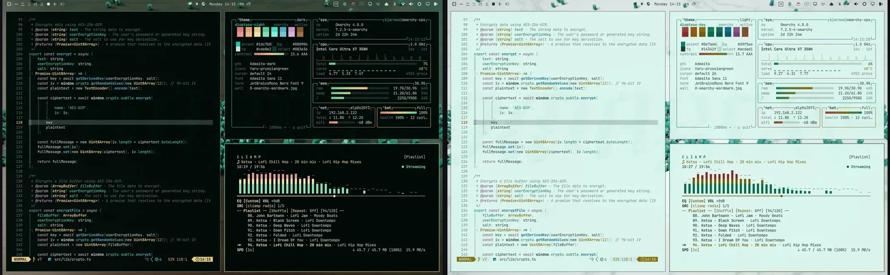](https://bjarneo.github.io/mineral-themes/#dioptase)

`072` · Signature palette · Folder: [`dioptase/`](dioptase/) · [Open on the site](https://bjarneo.github.io/mineral-themes/#dioptase)

Intense blue-green copper silicate. Early miners thought it was emerald. The close-up shows the crystals up close.

| Formula | System | Hardness | Luster | Streak | Density | Locality |
| --- | --- | --- | --- | --- | --- | --- |
| CuSiO₃·H₂O | Trigonal | 5 | Vitreous | Pale greenish blue | 3.3 g/cm³ | Altyn-Tyube, Kazakhstan |

| Variant | Theme name | `background` | `foreground` | `accent` | Icons |
| --- | --- | --- | --- | --- | --- |
| Night | [`dioptase-night`](dioptase/night/) | `#000906` | `#cde8e2` | `#1dc7b0` | `Yaru-prussiangreen` |
| Day | [`dioptase-day`](dioptase/day/) | `#d9f5ee` | `#14342f` | `#0e7a6b` | `Yaru-prussiangreen` |

<details>
<summary>All 16 ANSI colors of each variant</summary>

| Variant | Normal, 0 to 7 | Bright, 8 to 15 |
| --- | --- | --- |
| Night | `#001813` `#df7f78` `#56d298` `#eacf83` `#51b3d0` `#d29ccc` `#41e8ca` `#b6d1cb` | `#537b72` `#ec9b94` `#86e5b4` `#fde6a9` `#7cc7df` `#e3b6de` `#83fbe1` `#f0f9f7` |
| Day | `#bfe5dd` `#983835` `#047c51` `#856902` `#036b82` `#865181` `#0d6758` `#38544e` | `#617e78` `#862323` `#026742` `#6f5700` `#03596c` `#753f70` `#065448` `#041a16` |

</details>

```bash
curl -fsSL https://bjarneo.github.io/mineral-themes/install.sh | bash -s -- dioptase --set
```

### Sugilite

[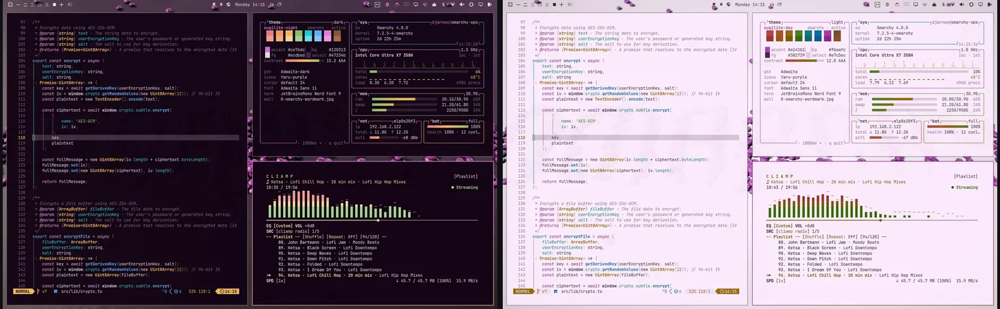](https://bjarneo.github.io/mineral-themes/#sugilite)

`073` · Folder: [`sugilite/`](sugilite/) · [Open on the site](https://bjarneo.github.io/mineral-themes/#sugilite)

Opaque purple silicate, rich in manganese. Geologists first found it in Japan in 1944. The close-up shows a polished slab of the stone.

| Formula | System | Hardness | Luster | Streak | Density | Locality |
| --- | --- | --- | --- | --- | --- | --- |
| KNa₂(Fe,Mn,Al)₂Li₃Si₁₂O₃₀ | Hexagonal | 5.5 to 6.5 | Vitreous to waxy | White | 2.75 g/cm³ | Wessels Mine, South Africa |

| Variant | Theme name | `background` | `foreground` | `accent` | Icons |
| --- | --- | --- | --- | --- | --- |
| Night | [`sugilite-night`](sugilite/night/) | `#120313` | `#ecdbed` | `#ce76dc` | `Yaru-purple` |
| Day | [`sugilite-day`](sugilite/day/) | `#fbeafc` | `#382739` | `#a141b1` | `Yaru-purple` |

<details>
<summary>All 16 ANSI colors of each variant</summary>

| Variant | Normal, 0 to 7 | Bright, 8 to 15 |
| --- | --- | --- |
| Night | `#220e23` `#ec817a` `#8cc36e` `#f8bb5b` `#61b2f7` `#e480df` `#21cfd8` `#d5c4d6` | `#816882` `#f89f98` `#a9d791` `#fed7a0` `#8bc8fe` `#f39fed` `#6fe2e9` `#faf5fb` |
| Day | `#edd5ee` `#ac403d` `#417a19` `#916300` `#0367a7` `#9e359b` `#05797f` `#574758` | `#847284` `#9a2a2b` `#316600` `#795201` `#00568c` `#8c1a8a` `#0e6267` `#1d111e` |

</details>

```bash
curl -fsSL https://bjarneo.github.io/mineral-themes/install.sh | bash -s -- sugilite --set
```

## Chain silicates

### Jadeite

[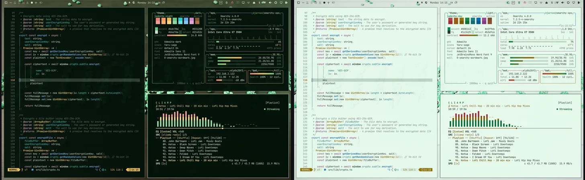](https://bjarneo.github.io/mineral-themes/#jadeite)

`074` · Folder: [`jadeite/`](jadeite/) · [Open on the site](https://bjarneo.github.io/mineral-themes/#jadeite)

The rarer and harder of the two jades. The bright green kind is called imperial jade. The close-up shows a polished slab of the stone.

| Formula | System | Hardness | Luster | Streak | Density | Locality |
| --- | --- | --- | --- | --- | --- | --- |
| NaAlSi₂O₆ | Monoclinic | 6.5 to 7 | Vitreous to greasy | White | 3.3 g/cm³ | Hpakant, Myanmar |

| Variant | Theme name | `background` | `foreground` | `accent` | Icons |
| --- | --- | --- | --- | --- | --- |
| Night | [`jadeite-night`](jadeite/night/) | `#031208` | `#d4e7da` | `#6dc78a` | `Yaru-sage` |
| Day | [`jadeite-day`](jadeite/day/) | `#e5f9eb` | `#1c3425` | `#008143` | `Yaru-sage` |

<details>
<summary>All 16 ANSI colors of each variant</summary>

| Variant | Normal, 0 to 7 | Bright, 8 to 15 |
| --- | --- | --- |
| Night | `#0d2115` `#ec817f` `#6fc887` `#efc058` `#65b1f6` `#d98cd1` `#29cfd5` `#bcd1c3` | `#5e7967` `#f99f9c` `#94dba5` `#fed98d` `#8dc7fe` `#e9a8e1` `#71e2e7` `#f2f9f4` |
| Day | `#cde9d6` `#ac3f42` `#108140` `#8e6a00` `#0767a9` `#94468e` `#127b7e` `#3e5345` | `#6a8172` `#9a2930` `#036a32` `#765700` `#04568f` `#82327d` `#0c666a` `#0a1a10` |

</details>

```bash
curl -fsSL https://bjarneo.github.io/mineral-themes/install.sh | bash -s -- jadeite --set
```

### Rhodonite

[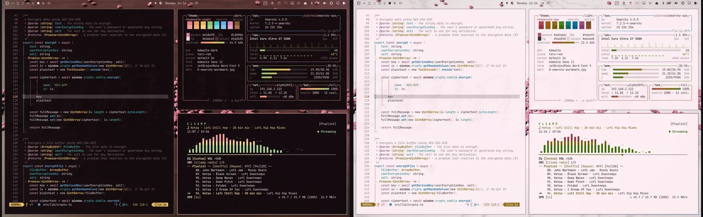](https://bjarneo.github.io/mineral-themes/#rhodonite)

`075` · Folder: [`rhodonite/`](rhodonite/) · [Open on the site](https://bjarneo.github.io/mineral-themes/#rhodonite)

Rose-pink manganese silicate with black veins. It is the state gem of Massachusetts. The close-up shows a polished slab of the stone.

| Formula | System | Hardness | Luster | Streak | Density | Locality |
| --- | --- | --- | --- | --- | --- | --- |
| MnSiO₃ | Triclinic | 5.5 to 6.5 | Vitreous | White | 3.6 g/cm³ | Broken Hill, Australia |

| Variant | Theme name | `background` | `foreground` | `accent` | Icons |
| --- | --- | --- | --- | --- | --- |
| Night | [`rhodonite-night`](rhodonite/night/) | `#13090e` | `#eddce3` | `#e18499` | `Yaru-red` |
| Day | [`rhodonite-day`](rhodonite/day/) | `#fdeef4` | `#3a2830` | `#ad4d66` | `Yaru-red` |

<details>
<summary>All 16 ANSI colors of each variant</summary>

| Variant | Normal, 0 to 7 | Bright, 8 to 15 |
| --- | --- | --- |
| Night | `#23171d` `#ec8082` `#8fc272` `#efc058` `#62b3f1` `#e18ac1` `#3acfd0` `#d7c5cd` | `#806b74` `#f89e9e` `#abd694` `#fed98d` `#88c9fc` `#f0a7d4` `#78e2e3` `#fcf4f8` |
| Day | `#eedae3` `#ac3f45` `#477a21` `#8c680b` `#0869a2` `#9c447e` `#037b7d` `#59474f` | `#89757e` `#9a2934` `#346704` `#765600` `#085788` `#8a306d` `#0e6465` `#1f1118` |

</details>

```bash
curl -fsSL https://bjarneo.github.io/mineral-themes/install.sh | bash -s -- rhodonite --set
```

### Kunzite

[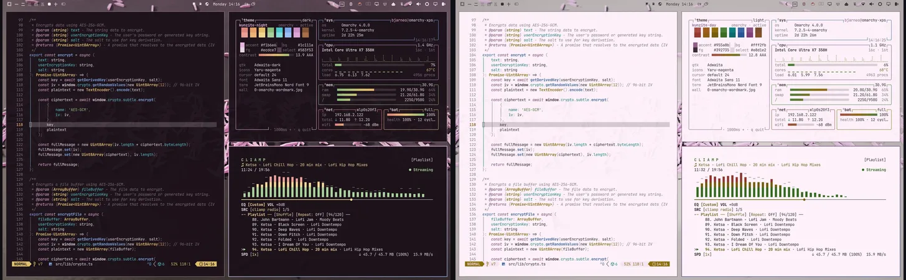](https://bjarneo.github.io/mineral-themes/#kunzite)

`076` · Variety of spodumene · Folder: [`kunzite/`](kunzite/) · [Open on the site](https://bjarneo.github.io/mineral-themes/#kunzite)

The lilac-pink variety of spodumene. Strong light can fade its color. The close-up shows a cut gem on a table.

| Formula | System | Hardness | Luster | Streak | Density | Locality |
| --- | --- | --- | --- | --- | --- | --- |
| LiAlSi₂O₆ | Monoclinic | 6.5 to 7 | Vitreous | White | 3.2 g/cm³ | Nuristan, Afghanistan |

| Variant | Theme name | `background` | `foreground` | `accent` | Icons |
| --- | --- | --- | --- | --- | --- |
| Night | [`kunzite-night`](kunzite/night/) | `#1c111a` | `#ecdce7` | `#f1b6e6` | `Yaru-magenta` |
| Day | [`kunzite-day`](kunzite/day/) | `#fff2fb` | `#392735` | `#955a8b` | `Yaru-magenta` |

<details>
<summary>All 16 ANSI colors of each variant</summary>

| Variant | Normal, 0 to 7 | Bright, 8 to 15 |
| --- | --- | --- |
| Night | `#2d1f2a` `#e4877d` `#8dc27c` `#e7c36a` `#7facf0` `#d58fca` `#4dcdd0` `#d6c5d1` | `#826d7d` `#f2a39a` `#aad69c` `#f9db94` `#9dc3fc` `#e5aadb` `#81e0e2` `#fbf4f9` |
| Day | `#f3dded` `#a54740` `#477d34` `#8b6b04` `#3662a6` `#914b87` `#077d7f` `#594754` | `#8a7685` `#93332d` `#326a1c` `#745908` `#225095` `#803876` `#04686a` `#1e111b` |

</details>

```bash
curl -fsSL https://bjarneo.github.io/mineral-themes/install.sh | bash -s -- kunzite --set
```

### Charoite

[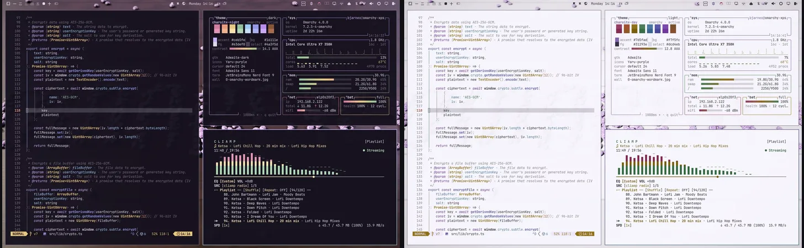](https://bjarneo.github.io/mineral-themes/#charoite)

`077` · Signature palette · Folder: [`charoite/`](charoite/) · [Open on the site](https://bjarneo.github.io/mineral-themes/#charoite)

Lilac silicate with silky swirls. It is known from only one place, the Chara River in Siberia. The close-up shows a polished slab of the stone.

| Formula | System | Hardness | Luster | Streak | Density | Locality |
| --- | --- | --- | --- | --- | --- | --- |
| K(Ca,Na)₂Si₄O₁₀(OH,F)·H₂O | Monoclinic | 5 to 6 | Vitreous to silky | White | 2.6 g/cm³ | Chara River, Siberia, Russia |

| Variant | Theme name | `background` | `foreground` | `accent` | Icons |
| --- | --- | --- | --- | --- | --- |
| Night | [`charoite-night`](charoite/night/) | `#16111e` | `#e3def0` | `#ceb5fe` | `Yaru-purple` |
| Day | [`charoite-day`](charoite/day/) | `#f7f5fc` | `#31293e` | `#7d5fad` | `Yaru-purple` |

<details>
<summary>All 16 ANSI colors of each variant</summary>

| Variant | Normal, 0 to 7 | Bright, 8 to 15 |
| --- | --- | --- |
| Night | `#251f30` `#d87da2` `#93c69d` `#efcc83` `#969cee` `#c190f6` `#a3cffd` `#cdc7da` | `#766e86` `#e699b7` `#b0dab7` `#fee5b1` `#aeb4f9` `#d2adfe` `#cbe4ff` `#f8f5fd` |
| Day | `#e8e0f9` `#923760` `#43784f` `#8d6b0e` `#5354a7` `#7944ac` `#4774a1` `#50495d` | `#80798f` `#802350` `#2f673d` `#775905` `#434296` `#692f9b` `#325f8d` `#181322` |

</details>

```bash
curl -fsSL https://bjarneo.github.io/mineral-themes/install.sh | bash -s -- charoite --set
```

### Larimar

[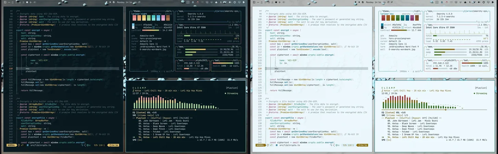](https://bjarneo.github.io/mineral-themes/#larimar)

`078` · Variety of pectolite · Folder: [`larimar/`](larimar/) · [Open on the site](https://bjarneo.github.io/mineral-themes/#larimar)

A sea-blue variety of pectolite. It is known from only one place, in the Dominican Republic. The close-up shows a polished slab of the stone.

| Formula | System | Hardness | Luster | Streak | Density | Locality |
| --- | --- | --- | --- | --- | --- | --- |
| NaCa₂Si₃O₈(OH) | Triclinic | 4.5 to 5 | Silky to vitreous | White | 2.9 g/cm³ | Barahona, Dominican Republic |

| Variant | Theme name | `background` | `foreground` | `accent` | Icons |
| --- | --- | --- | --- | --- | --- |
| Night | [`larimar-night`](larimar/night/) | `#06161d` | `#d2e5ee` | `#7acbeb` | `Yaru-prussiangreen` |
| Day | [`larimar-day`](larimar/day/) | `#eef9fe` | `#19313c` | `#0a7a9a` | `Yaru-prussiangreen` |

<details>
<summary>All 16 ANSI colors of each variant</summary>

| Variant | Normal, 0 to 7 | Bright, 8 to 15 |
| --- | --- | --- |
| Night | `#13262e` `#e48683` `#8bc37d` `#e6c36a` `#54b8e4` `#dd8dbe` `#4ccec9` `#baced8` | `#5c7683` `#f2a29f` `#a9d79d` `#f8db94` `#7fcdf1` `#eca9d1` `#80e1dc` `#f0f8fc` |
| Day | `#cfe9f6` `#a54747` `#467f36` `#8c6d07` `#0b6d8f` `#98487c` `#077f7b` `#3a515c` | `#69818d` `#933335` `#2f6b1d` `#765b00` `#055b79` `#86356b` `#026a67` `#061921` |

</details>

```bash
curl -fsSL https://bjarneo.github.io/mineral-themes/install.sh | bash -s -- larimar --set
```

## Sheet silicates

### Muscovite

[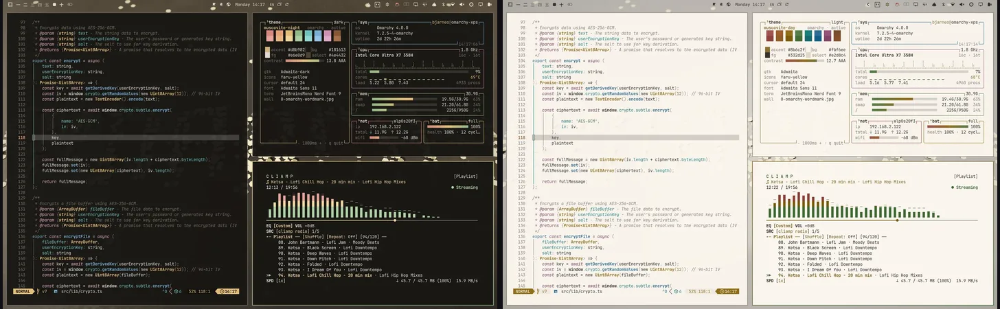](https://bjarneo.github.io/mineral-themes/#muscovite)

`079` · Folder: [`muscovite/`](muscovite/) · [Open on the site](https://bjarneo.github.io/mineral-themes/#muscovite)

Common mica. It splits into clear, flexible sheets that people once used as windows. The close-up shows the crystals up close.

| Formula | System | Hardness | Luster | Streak | Density | Locality |
| --- | --- | --- | --- | --- | --- | --- |
| KAl₂(AlSi₃O₁₀)(OH)₂ | Monoclinic | 2 to 2.5 | Vitreous to pearly | White | 2.8 g/cm³ | Nellore, India |

| Variant | Theme name | `background` | `foreground` | `accent` | Icons |
| --- | --- | --- | --- | --- | --- |
| Night | [`muscovite-night`](muscovite/night/) | `#181613` | `#e6e0d9` | `#d8b982` | `Yaru-yellow` |
| Day | [`muscovite-day`](muscovite/day/) | `#fbf6ee` | `#332d25` | `#8b6c2f` | `Yaru-yellow` |

<details>
<summary>All 16 ANSI colors of each variant</summary>

| Variant | Normal, 0 to 7 | Bright, 8 to 15 |
| --- | --- | --- |
| Night | `#272521` `#dc8c83` `#94bf89` `#e7c27a` `#78b2dc` `#d593b9` `#6fc9c8` `#d0c9c1` | `#797269` `#eba79f` `#afd3a6` `#f9daa0` `#98c7eb` `#e5adcc` `#96dddc` `#fbf6f0` |
| Day | `#ebe3d8` `#9e4e47` `#507c45` `#906b10` `#286993` `#915076` `#127e7e` `#524c44` | `#837c73` `#8c3b36` `#3b682f` `#785805` `#0c5882` `#803e66` `#0f6969` `#1a150f` |

</details>

```bash
curl -fsSL https://bjarneo.github.io/mineral-themes/install.sh | bash -s -- muscovite --set
```

### Lepidolite

[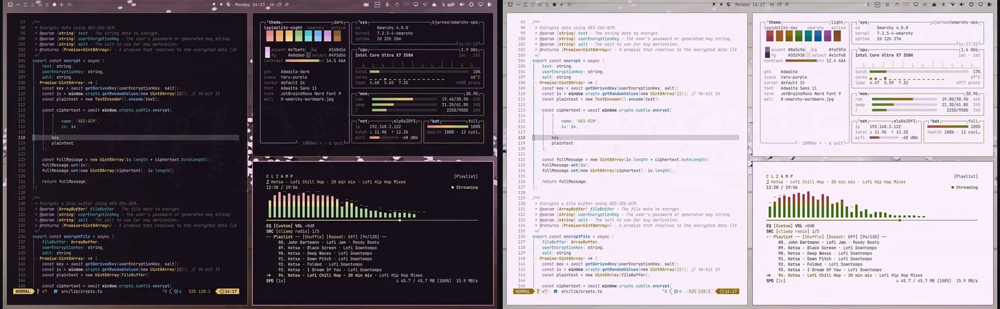](https://bjarneo.github.io/mineral-themes/#lepidolite)

`080` · Folder: [`lepidolite/`](lepidolite/) · [Open on the site](https://bjarneo.github.io/mineral-themes/#lepidolite)

Lilac lithium mica in scaly books. It is an ore of lithium. The close-up shows the crystals up close.

| Formula | System | Hardness | Luster | Streak | Density | Locality |
| --- | --- | --- | --- | --- | --- | --- |
| K(Li,Al)₃(Al,Si,Rb)₄O₁₀(F,OH)₂ | Monoclinic | 2.5 to 3 | Pearly | White | 2.85 g/cm³ | Manitoba, Canada |

| Variant | Theme name | `background` | `foreground` | `accent` | Icons |
| --- | --- | --- | --- | --- | --- |
| Night | [`lepidolite-night`](lepidolite/night/) | `#140d16` | `#e8ddeb` | `#e7bafc` | `Yaru-purple` |
| Day | [`lepidolite-day`](lepidolite/day/) | `#faf0fd` | `#352938` | `#8a5c9e` | `Yaru-purple` |

<details>
<summary>All 16 ANSI colors of each variant</summary>

| Variant | Normal, 0 to 7 | Bright, 8 to 15 |
| --- | --- | --- |
| Night | `#241b26` `#e4858a` `#92c178` `#e9c26a` `#73b0ee` `#cc92d6` `#4dccd4` `#d1c6d4` | `#7a6c7e` `#f1a2a4` `#aed599` `#fbda94` `#94c6fa` `#ddade5` `#80e0e6` `#faf5fb` |
| Day | `#eaddee` `#a4464e` `#4b7b2d` `#8d6a04` `#2366a4` `#894e93` `#027b81` `#544858` | `#847687` `#92323d` `#386812` `#745706` `#025493` `#783c82` `#00666c` `#1b121e` |

</details>

```bash
curl -fsSL https://bjarneo.github.io/mineral-themes/install.sh | bash -s -- lepidolite --set
```

### Chrysocolla

[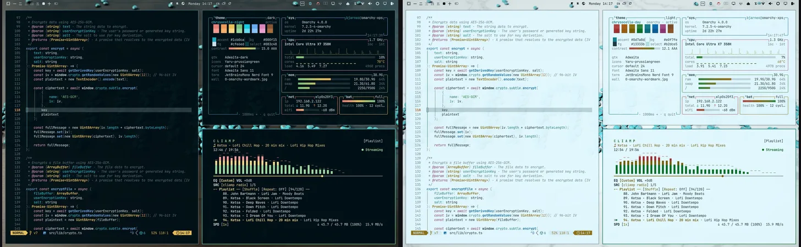](https://bjarneo.github.io/mineral-themes/#chrysocolla)

`081` · Folder: [`chrysocolla/`](chrysocolla/) · [Open on the site](https://bjarneo.github.io/mineral-themes/#chrysocolla)

Blue-green hydrated copper silicate. It forms crusts and masses near copper ores. The close-up shows a polished slab of the stone.

| Formula | System | Hardness | Luster | Streak | Density | Locality |
| --- | --- | --- | --- | --- | --- | --- |
| (Cu,Al)₂H₂Si₂O₅(OH)₄·nH₂O | Orthorhombic | 2.5 to 3.5 | Vitreous to waxy | Pale blue | 2.2 g/cm³ | Ray Mine, Arizona, USA |

| Variant | Theme name | `background` | `foreground` | `accent` | Icons |
| --- | --- | --- | --- | --- | --- |
| Night | [`chrysocolla-night`](chrysocolla/night/) | `#000f15` | `#cfe6ed` | `#1cb0ca` | `Yaru-prussiangreen` |
| Day | [`chrysocolla-day`](chrysocolla/day/) | `#e0f7fe` | `#13333b` | `#0d7a8d` | `Yaru-prussiangreen` |

<details>
<summary>All 16 ANSI colors of each variant</summary>

| Variant | Normal, 0 to 7 | Bright, 8 to 15 |
| --- | --- | --- |
| Night | `#061f25` `#ec817d` `#78c780` `#ebc258` `#66b1f6` `#e289c2` `#13cee6` `#b7cfd7` | `#577881` `#f99f9a` `#9adaa0` `#fcda88` `#8ec7fe` `#f1a6d4` `#6ce1f5` `#f0f9fb` |
| Day | `#c7e7f1` `#ac3f40` `#247e36` `#8a6b0d` `#0066ac` `#9c437f` `#0f7988` `#37525a` | `#638088` `#9a292e` `#006b22` `#735800` `#06558f` `#8a2e6e` `#056572` `#04191f` |

</details>

```bash
curl -fsSL https://bjarneo.github.io/mineral-themes/install.sh | bash -s -- chrysocolla --set
```

### Serpentine

[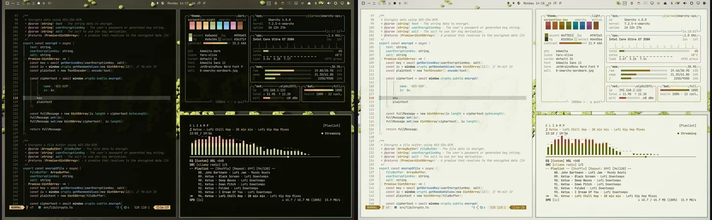](https://bjarneo.github.io/mineral-themes/#serpentine)

`082` · Folder: [`serpentine/`](serpentine/) · [Open on the site](https://bjarneo.github.io/mineral-themes/#serpentine)

Green magnesium silicate with a greasy shine. The name comes from its snake-like pattern. The close-up shows a polished slab of the stone.

| Formula | System | Hardness | Luster | Streak | Density | Locality |
| --- | --- | --- | --- | --- | --- | --- |
| Mg₃Si₂O₅(OH)₄ | Monoclinic | 2.5 to 4 | Greasy to waxy | White | 2.6 g/cm³ | Lizard Peninsula, England |

| Variant | Theme name | `background` | `foreground` | `accent` | Icons |
| --- | --- | --- | --- | --- | --- |
| Night | [`serpentine-night`](serpentine/night/) | `#090a03` | `#e0e3d4` | `#a8aa66` | `Yaru-olive` |
| Day | [`serpentine-day`](serpentine/day/) | `#f0f2e5` | `#2d301e` | `#6f7022` | `Yaru-olive` |

<details>
<summary>All 16 ANSI colors of each variant</summary>

| Variant | Normal, 0 to 7 | Bright, 8 to 15 |
| --- | --- | --- |
| Night | `#17180d` `#dc8c82` `#aeb975` `#e7c27a` `#7ab1e0` `#d693b8` `#6ccac9` `#caccbc` | `#717460` `#eba79d` `#c5ce97` `#f9daa0` `#99c7ee` `#e7adcc` `#94dedd` `#f6f8f0` |
| Day | `#dde0ce` `#9e4e45` `#697328` `#8d680a` `#2c6896` `#924f76` `#0e7a7a` `#4c4f3e` | `#787b69` `#8c3b34` `#57600a` `#755500` `#145786` `#803d65` `#0d6565` `#16170a` |

</details>

```bash
curl -fsSL https://bjarneo.github.io/mineral-themes/install.sh | bash -s -- serpentine --set
```

### Talc

[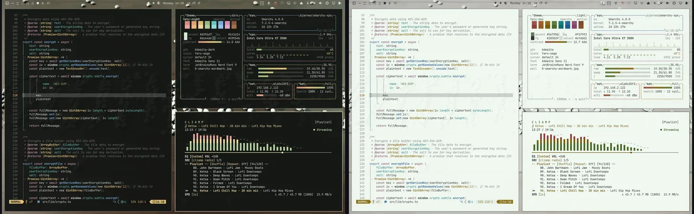](https://bjarneo.github.io/mineral-themes/#talc)

`083` · Folder: [`talc/`](talc/) · [Open on the site](https://bjarneo.github.io/mineral-themes/#talc)

The softest mineral, 1 on the Mohs scale. It feels soapy, and it is the base of talcum powder. The close-up shows a polished slab of the stone.

| Formula | System | Hardness | Luster | Streak | Density | Locality |
| --- | --- | --- | --- | --- | --- | --- |
| Mg₃Si₄O₁₀(OH)₂ | Monoclinic | 1 | Pearly to greasy | White | 2.75 g/cm³ | Vermont, USA |

| Variant | Theme name | `background` | `foreground` | `accent` | Icons |
| --- | --- | --- | --- | --- | --- |
| Night | [`talc-night`](talc/night/) | `#141614` | `#dce4dd` | `#d3f6d7` | `Yaru-sage` |
| Day | [`talc-day`](talc/day/) | `#f1f9f2` | `#283029` | `#56795b` | `Yaru-sage` |

<details>
<summary>All 16 ANSI colors of each variant</summary>

| Variant | Normal, 0 to 7 | Bright, 8 to 15 |
| --- | --- | --- |
| Night | `#222623` `#dc8c83` `#9bbe80` `#e2c479` `#7bb1e1` `#d692ba` `#6acac8` `#c5cdc6` | `#6d766e` `#eba79f` `#b5d29f` `#f4dc9f` `#9ac7ef` `#e6adcd` `#92dedb` `#f2f9f3` |
| Day | `#dde8de` `#9e4e47` `#587b3b` `#8b6d0f` `#2d6798` `#924f77` `#107d7b` `#475048` | `#778078` `#8c3b36` `#446723` `#755b05` `#165687` `#803d67` `#0e6867` `#111812` |

</details>

```bash
curl -fsSL https://bjarneo.github.io/mineral-themes/install.sh | bash -s -- talc --set
```

### Apophyllite

[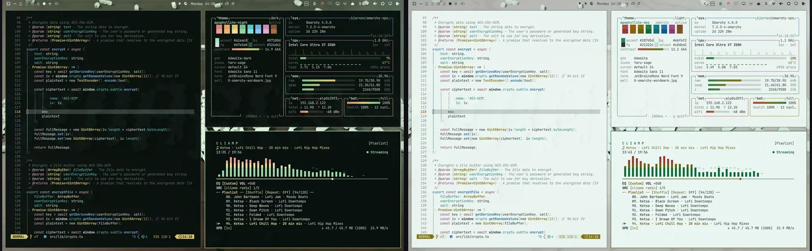](https://bjarneo.github.io/mineral-themes/#apophyllite)

`084` · Folder: [`apophyllite/`](apophyllite/) · [Open on the site](https://bjarneo.github.io/mineral-themes/#apophyllite)

Clear to pale green crystals with a pearly top face. They grow in holes in the lava rock of India. The close-up shows the crystals up close.

| Formula | System | Hardness | Luster | Streak | Density | Locality |
| --- | --- | --- | --- | --- | --- | --- |
| KCa₄Si₈O₂₀(F,OH)·8H₂O | Tetragonal | 4.5 to 5 | Vitreous to pearly | White | 2.35 g/cm³ | Jalgaon, India |

| Variant | Theme name | `background` | `foreground` | `accent` | Icons |
| --- | --- | --- | --- | --- | --- |
| Night | [`apophyllite-night`](apophyllite/night/) | `#07100d` | `#d7e5e0` | `#a1eac8` | `Yaru-sage` |
| Day | [`apophyllite-day`](apophyllite/day/) | `#ebf6f2` | `#21322c` | `#287d5d` | `Yaru-sage` |

<details>
<summary>All 16 ANSI colors of each variant</summary>

| Variant | Normal, 0 to 7 | Bright, 8 to 15 |
| --- | --- | --- |
| Night | `#151e1b` `#e4877e` `#79c58f` `#dac96c` `#72b1eb` `#da8ec1` `#53ccd0` `#bfcfc9` | `#647670` `#f2a39b` `#9bd8ab` `#eee096` `#93c7f8` `#e9aad3` `#84e0e2` `#f1f9f6` |
| Day | `#d6e5df` `#a54741` `#277d47` `#7f6f05` `#1f67a1` `#954a7e` `#137b7e` `#41514b` | `#6e7f78` `#93332f` `#096a35` `#6a5c09` `#05558e` `#84376d` `#0f6669` `#0c1915` |

</details>

```bash
curl -fsSL https://bjarneo.github.io/mineral-themes/install.sh | bash -s -- apophyllite --set
```

### Cavansite

[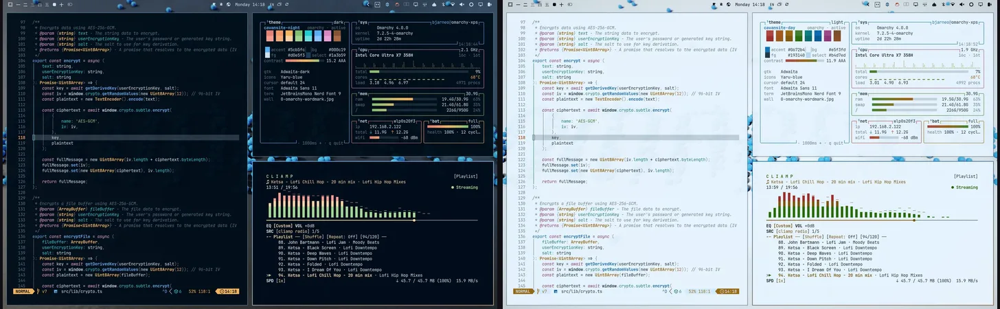](https://bjarneo.github.io/mineral-themes/#cavansite)

`085` · Folder: [`cavansite/`](cavansite/) · [Open on the site](https://bjarneo.github.io/mineral-themes/#cavansite)

Vivid blue balls of radiating crystals. Almost all good specimens come from Pune in India. The close-up shows the crystals up close.

| Formula | System | Hardness | Luster | Streak | Density | Locality |
| --- | --- | --- | --- | --- | --- | --- |
| Ca(VO)Si₄O₁₀·4H₂O | Orthorhombic | 3 to 4 | Vitreous to pearly | Light blue | 2.25 g/cm³ | Pune, India |

| Variant | Theme name | `background` | `foreground` | `accent` | Icons |
| --- | --- | --- | --- | --- | --- |
| Night | [`cavansite-night`](cavansite/night/) | `#000c19` | `#d0e5f3` | `#5cb5fc` | `Yaru-blue` |
| Day | [`cavansite-day`](cavansite/day/) | `#e5f3fd` | `#193140` | `#0672b4` | `Yaru-blue` |

<details>
<summary>All 16 ANSI colors of each variant</summary>

| Variant | Normal, 0 to 7 | Bright, 8 to 15 |
| --- | --- | --- |
| Night | `#011b2b` `#ec8277` `#85c574` `#fbb95e` `#5eb1fe` `#e089c7` `#21d0d7` `#b9cedc` | `#56768c` `#f99f95` `#a4d996` `#fed7a5` `#8ec7ff` `#efa6d9` `#70e3e9` `#f1f8fd` |
| Day | `#c6e4f8` `#ac4039` `#397c25` `#966308` `#0566ac` `#9a4384` `#05797e` `#3b505e` | `#667c8b` `#9a2a26` `#226902` `#7d5209` `#005591` `#882f73` `#006569` `#081822` |

</details>

```bash
curl -fsSL https://bjarneo.github.io/mineral-themes/install.sh | bash -s -- cavansite --set
```

## Framework silicates

### Quartz

[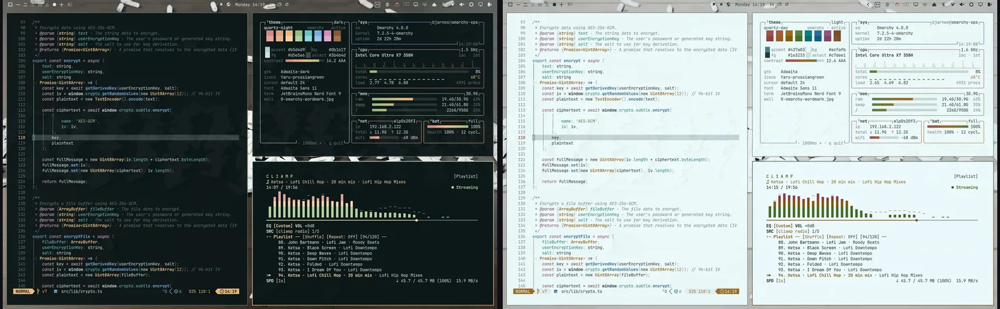](https://bjarneo.github.io/mineral-themes/#quartz)

`086` · Folder: [`quartz/`](quartz/) · [Open on the site](https://bjarneo.github.io/mineral-themes/#quartz)

Clear silicon dioxide. It is one of the most common minerals in the crust of the Earth. The close-up shows the crystals up close.

| Formula | System | Hardness | Luster | Streak | Density | Locality |
| --- | --- | --- | --- | --- | --- | --- |
| SiO₂ | Trigonal | 7 | Vitreous | White | 2.65 g/cm³ | Hot Springs, Arkansas, USA |

| Variant | Theme name | `background` | `foreground` | `accent` | Icons |
| --- | --- | --- | --- | --- | --- |
| Night | [`quartz-night`](quartz/night/) | `#0b1617` | `#d5e5e6` | `#b5d4d9` | `Yaru-prussiangreen` |
| Day | [`quartz-day`](quartz/day/) | `#ecfafb` | `#1e3233` | `#437a83` | `Yaru-prussiangreen` |

<details>
<summary>All 16 ANSI colors of each variant</summary>

| Variant | Normal, 0 to 7 | Bright, 8 to 15 |
| --- | --- | --- |
| Night | `#192526` `#dc8b86` `#98bf81` `#efbd7d` `#77b1e3` `#d592bc` `#66caca` `#bdcfd0` | `#607678` `#eaa6a0` `#b3d3a0` `#fdd7a5` `#97c7f0` `#e5adcf` `#8fdedd` `#eff9fa` |
| Day | `#d6e9ea` `#9e4d49` `#557c3b` `#99681a` `#286899` `#914f7a` `#037f7f` `#3e5153` | `#6c8082` `#8c3a38` `#416824` `#825504` `#0d5788` `#803d69` `#006969` `#09191a` |

</details>

```bash
curl -fsSL https://bjarneo.github.io/mineral-themes/install.sh | bash -s -- quartz --set
```

### Amethyst

[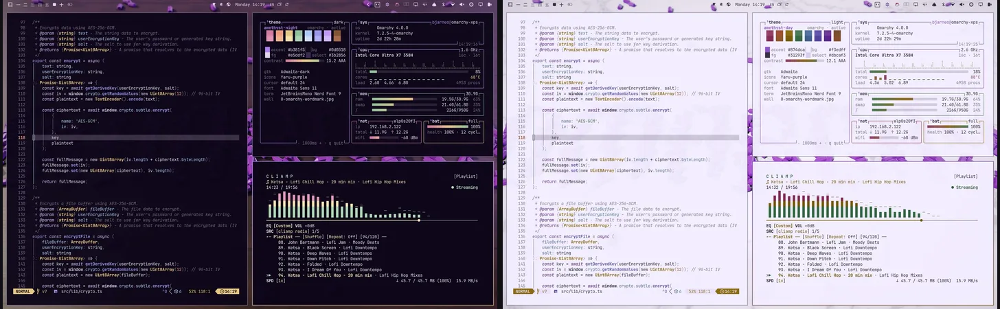](https://bjarneo.github.io/mineral-themes/#amethyst)

`087` · Variety of quartz · Signature palette · Folder: [`amethyst/`](amethyst/) · [Open on the site](https://bjarneo.github.io/mineral-themes/#amethyst)

The purple variety of quartz. Iron and natural radiation give the color. The close-up shows a cut gem on a table.

| Formula | System | Hardness | Luster | Streak | Density | Locality |
| --- | --- | --- | --- | --- | --- | --- |
| SiO₂ | Trigonal | 7 | Vitreous | White | 2.65 g/cm³ | Artigas, Uruguay |

| Variant | Theme name | `background` | `foreground` | `accent` | Icons |
| --- | --- | --- | --- | --- | --- |
| Night | [`amethyst-night`](amethyst/night/) | `#0d0518` | `#e5ddf2` | `#b381f5` | `Yaru-purple` |
| Day | [`amethyst-day`](amethyst/day/) | `#f3edff` | `#31293f` | `#874dca` | `Yaru-purple` |

<details>
<summary>All 16 ANSI colors of each variant</summary>

| Variant | Normal, 0 to 7 | Bright, 8 to 15 |
| --- | --- | --- |
| Night | `#1b1129` `#d87da2` `#93c69d` `#efcc83` `#9d98f2` `#ca9bfe` `#aeccfc` `#cec6db` | `#776b8a` `#e699b7` `#b0dab7` `#fee5b1` `#b3b1fd` `#d9bbfe` `#d2e2fd` `#f8f5fd` |
| Day | `#e3d8f6` `#923760` `#43784f` `#8a6807` `#5a50ab` `#683298` `#4f6e9f` `#50495d` | `#7c748b` `#802350` `#2c643b` `#735500` `#4b3d9a` `#581b88` `#3b598c` `#191321` |

</details>

```bash
curl -fsSL https://bjarneo.github.io/mineral-themes/install.sh | bash -s -- amethyst --set
```

### Citrine

[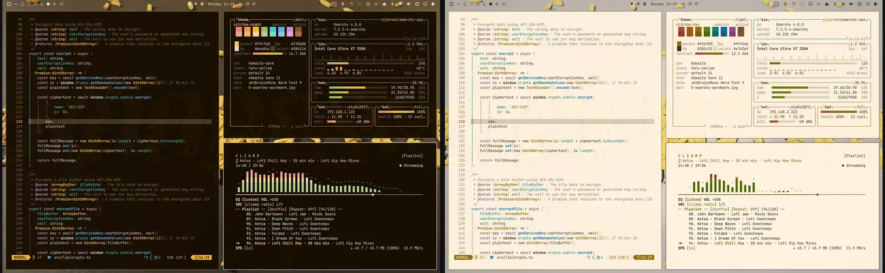](https://bjarneo.github.io/mineral-themes/#citrine)

`088` · Variety of quartz · Folder: [`citrine/`](citrine/) · [Open on the site](https://bjarneo.github.io/mineral-themes/#citrine)

The yellow variety of quartz. Most citrine on the market is heated amethyst. The close-up shows a cut gem on a table.

| Formula | System | Hardness | Luster | Streak | Density | Locality |
| --- | --- | --- | --- | --- | --- | --- |
| SiO₂ | Trigonal | 7 | Vitreous | White | 2.65 g/cm³ | Rio Grande do Sul, Brazil |

| Variant | Theme name | `background` | `foreground` | `accent` | Icons |
| --- | --- | --- | --- | --- | --- |
| Night | [`citrine-night`](citrine/night/) | `#170d00` | `#ece0cc` | `#ffc768` | `Yaru-yellow` |
| Day | [`citrine-day`](citrine/day/) | `#fff2de` | `#382c15` | `#926709` | `Yaru-yellow` |

<details>
<summary>All 16 ANSI colors of each variant</summary>

| Variant | Normal, 0 to 7 | Bright, 8 to 15 |
| --- | --- | --- |
| Night | `#281b05` `#ec8277` `#9fbe6b` `#fabc22` `#61b4ea` `#d98dcb` `#4dcec7` `#d5c9b5` | `#806f52` `#f99f95` `#b7d38f` `#fed990` `#88c9f6` `#e9a9dc` `#81e1db` `#faf6ef` |
| Day | `#f1dfc3` `#ac403a` `#5b7919` `#8f6900` `#056a9b` `#944888` `#027c77` `#574b37` | `#877a65` `#9a2a27` `#486400` `#785700` `#085881` `#833477` `#006763` `#1d1406` |

</details>

```bash
curl -fsSL https://bjarneo.github.io/mineral-themes/install.sh | bash -s -- citrine --set
```

### Smoky Quartz

[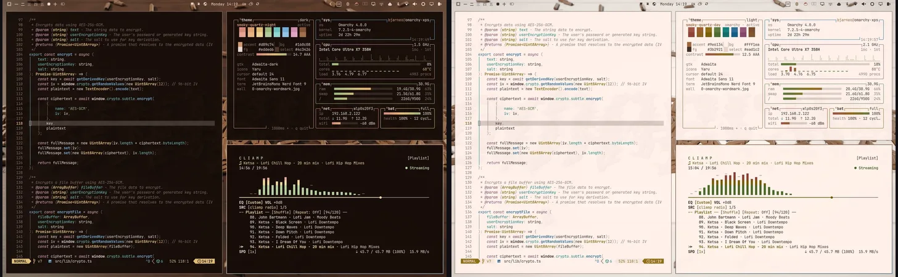](https://bjarneo.github.io/mineral-themes/#smoky-quartz)

`089` · Variety of quartz · Folder: [`smoky-quartz/`](smoky-quartz/) · [Open on the site](https://bjarneo.github.io/mineral-themes/#smoky-quartz)

Brown to gray quartz. Natural radiation darkens it over millions of years. The close-up shows the crystals up close.

| Formula | System | Hardness | Luster | Streak | Density | Locality |
| --- | --- | --- | --- | --- | --- | --- |
| SiO₂ | Trigonal | 7 | Vitreous | White | 2.65 g/cm³ | Gotthard, Swiss Alps |

| Variant | Theme name | `background` | `foreground` | `accent` | Icons |
| --- | --- | --- | --- | --- | --- |
| Night | [`smoky-quartz-night`](smoky-quartz/night/) | `#160c08` | `#edded6` | `#d89c74` | `Yaru` |
| Day | [`smoky-quartz-day`](smoky-quartz/day/) | `#fff1ea` | `#3b2921` | `#9e6134` | `Yaru` |

<details>
<summary>All 16 ANSI colors of each variant</summary>

| Variant | Normal, 0 to 7 | Bright, 8 to 15 |
| --- | --- | --- |
| Night | `#261b15` `#dc8d7e` `#9ebd81` `#e6c27a` `#78b2dd` `#d693b7` `#70c9c5` `#d7c7bf` | `#816d63` `#eba89b` `#b7d2a0` `#f7da9f` `#98c7eb` `#e6adcb` `#96ddd9` `#fdf5f1` |
| Day | `#f0ddd4` `#9d4e41` `#5a783a` `#8d6a0d` `#286993` `#924f75` `#0d7c79` `#5a4940` | `#8a776e` `#8b3b2e` `#476524` `#755701` `#0c5882` `#803d64` `#0c6765` `#1f120c` |

</details>

```bash
curl -fsSL https://bjarneo.github.io/mineral-themes/install.sh | bash -s -- smoky-quartz --set
```

### Rose Quartz

[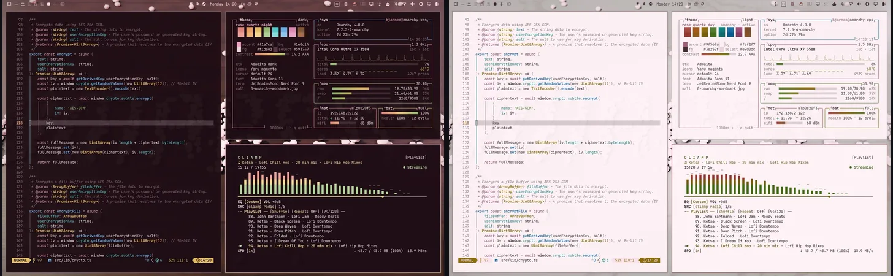](https://bjarneo.github.io/mineral-themes/#rose-quartz)

`090` · Variety of quartz · Folder: [`rose-quartz/`](rose-quartz/) · [Open on the site](https://bjarneo.github.io/mineral-themes/#rose-quartz)

Pink quartz that rarely forms crystals. Fine fibers in it give a soft, milky glow. The close-up shows a polished slab of the stone.

| Formula | System | Hardness | Luster | Streak | Density | Locality |
| --- | --- | --- | --- | --- | --- | --- |
| SiO₂ | Trigonal | 7 | Vitreous | White | 2.65 g/cm³ | Madagascar |

| Variant | Theme name | `background` | `foreground` | `accent` | Icons |
| --- | --- | --- | --- | --- | --- |
| Night | [`rose-quartz-night`](rose-quartz/night/) | `#1e0c14` | `#f1dae3` | `#f1a7ca` | `Yaru-magenta` |
| Day | [`rose-quartz-day`](rose-quartz/day/) | `#fef2f7` | `#3e252f` | `#9f567a` | `Yaru-magenta` |

<details>
<summary>All 16 ANSI colors of each variant</summary>

| Variant | Normal, 0 to 7 | Bright, 8 to 15 |
| --- | --- | --- |
| Night | `#2f1a23` `#e4877d` `#97c077` `#e8c26a` `#6db2e9` `#de8db7` `#56cccd` `#dbc3cc` | `#886975` `#f2a39a` `#b2d499` `#f9da94` `#90c8f5` `#eda9cb` `#86e0df` `#fdf4f7` |
| Day | `#fbd9e6` `#a54740` `#537b2e` `#8c6b04` `#15699f` `#994975` `#0b7d7e` `#5d454f` | `#8f757f` `#93332d` `#406813` `#755909` `#005789` `#873664` `#086869` `#211017` |

</details>

```bash
curl -fsSL https://bjarneo.github.io/mineral-themes/install.sh | bash -s -- rose-quartz --set
```

### Agate

[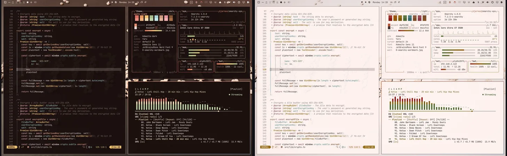](https://bjarneo.github.io/mineral-themes/#agate)

`091` · Variety of chalcedony · Signature palette · Folder: [`agate/`](agate/) · [Open on the site](https://bjarneo.github.io/mineral-themes/#agate)

Banded chalcedony that fills holes in lava. Each band is a layer of microscopic quartz. The close-up shows a polished slab of the stone.

| Formula | System | Hardness | Luster | Streak | Density | Locality |
| --- | --- | --- | --- | --- | --- | --- |
| SiO₂ | Trigonal | 6.5 to 7 | Waxy to vitreous | White | 2.6 g/cm³ | Lake Superior, USA |

| Variant | Theme name | `background` | `foreground` | `accent` | Icons |
| --- | --- | --- | --- | --- | --- |
| Night | [`agate-night`](agate/night/) | `#190e0c` | `#eeddd9` | `#f29677` | `Yaru` |
| Day | [`agate-day`](agate/day/) | `#fdf2f0` | `#3b2825` | `#af5230` | `Yaru` |

<details>
<summary>All 16 ANSI colors of each variant</summary>

| Variant | Normal, 0 to 7 | Bright, 8 to 15 |
| --- | --- | --- |
| Night | `#291c19` `#e17363` `#a7c28c` `#fac871` `#d59c7d` `#ed9aa0` `#abdbde` `#d8c6c2` | `#826c67` `#ed9182` `#c0d7aa` `#fee4b8` `#e5b59b` `#fcb5ba` `#c9f0f2` `#fdf4f3` |
| Day | `#f2ded9` `#9c2b1f` `#59743d` `#92680c` `#8a5434` `#97464f` `#46787a` `#5b4844` | `#8b7672` `#8a0e05` `#486329` `#7a5500` `#794220` `#85333e` `#2f6467` `#20120f` |

</details>

```bash
curl -fsSL https://bjarneo.github.io/mineral-themes/install.sh | bash -s -- agate --set
```

### Chrysoprase

[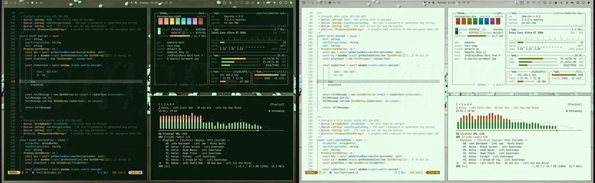](https://bjarneo.github.io/mineral-themes/#chrysoprase)

`092` · Variety of chalcedony · Folder: [`chrysoprase/`](chrysoprase/) · [Open on the site](https://bjarneo.github.io/mineral-themes/#chrysoprase)

Apple-green chalcedony. Nickel gives the color. The close-up shows a polished slab of the stone.

| Formula | System | Hardness | Luster | Streak | Density | Locality |
| --- | --- | --- | --- | --- | --- | --- |
| SiO₂ | Trigonal | 6.5 to 7 | Waxy to vitreous | White | 2.6 g/cm³ | Queensland, Australia |

| Variant | Theme name | `background` | `foreground` | `accent` | Icons |
| --- | --- | --- | --- | --- | --- |
| Night | [`chrysoprase-night`](chrysoprase/night/) | `#08180b` | `#d5e7d7` | `#93dca2` | `Yaru-sage` |
| Day | [`chrysoprase-day`](chrysoprase/day/) | `#eafdec` | `#1f3323` | `#2e8046` | `Yaru-sage` |

<details>
<summary>All 16 ANSI colors of each variant</summary>

| Variant | Normal, 0 to 7 | Bright, 8 to 15 |
| --- | --- | --- |
| Night | `#162819` `#e48681` `#83c485` `#e8c36a` `#6bb2eb` `#dd8dbc` `#50cdcd` `#bed0c0` | `#607964` `#f1a29d` `#a3d7a3` `#fadb94` `#8ec8f7` `#eca9cf` `#83e0e0` `#f2f9f3` |
| Day | `#d2edd6` `#a54744` `#3c8040` `#8d6c08` `#0f69a1` `#98497a` `#007f7f` `#405343` | `#6f8372` `#933333` `#226c2a` `#775a00` `#045789` `#863669` `#0f696a` `#0c1a0e` |

</details>

```bash
curl -fsSL https://bjarneo.github.io/mineral-themes/install.sh | bash -s -- chrysoprase --set
```

### Tiger’s Eye

[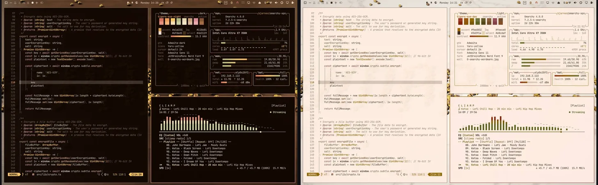](https://bjarneo.github.io/mineral-themes/#tigers-eye)

`093` · Variety of quartz · Signature palette · Folder: [`tigers-eye/`](tigers-eye/) · [Open on the site](https://bjarneo.github.io/mineral-themes/#tigers-eye)

Quartz with fine fibers of iron oxide. The fibers make a band of light that moves as you turn the stone. The close-up shows a polished slab of the stone.

| Formula | System | Hardness | Luster | Streak | Density | Locality |
| --- | --- | --- | --- | --- | --- | --- |
| SiO₂ | Trigonal | 6.5 to 7 | Silky | White to pale brown | 2.65 g/cm³ | Northern Cape, South Africa |

| Variant | Theme name | `background` | `foreground` | `accent` | Icons |
| --- | --- | --- | --- | --- | --- |
| Night | [`tigers-eye-night`](tigers-eye/night/) | `#110601` | `#efded1` | `#e1a155` | `Yaru-yellow` |
| Day | [`tigers-eye-day`](tigers-eye/day/) | `#feece0` | `#3d291a` | `#9a6002` | `Yaru-yellow` |

<details>
<summary>All 16 ANSI colors of each variant</summary>

| Variant | Normal, 0 to 7 | Bright, 8 to 15 |
| --- | --- | --- |
| Night | `#211307` `#dc785f` `#b5be82` `#fec766` `#cca17e` `#de9398` `#edddb1` `#d9c7ba` | `#836c5b` `#e9957f` `#ccd3a2` `#ffe4b8` `#ddb99c` `#edaeb1` `#fbeeca` `#fcf5f0` |
| Day | `#f1d9c8` `#973219` `#687031` `#8f6500` `#835835` `#924a51` `#615126` `#5c493a` | `#897465` `#831e01` `#565d1a` `#765300` `#724721` `#803840` `#514111` `#201208` |

</details>

```bash
curl -fsSL https://bjarneo.github.io/mineral-themes/install.sh | bash -s -- tigers-eye --set
```

### Opal

[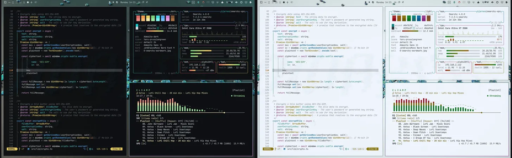](https://bjarneo.github.io/mineral-themes/#opal)

`094` · Mineraloid · Signature palette · Folder: [`opal/`](opal/) · [Open on the site](https://bjarneo.github.io/mineral-themes/#opal)

Hydrated silica, a mineraloid with no crystals. Tiny spheres in it split light into flashes of color. The close-up shows a polished slab of the stone.

| Formula | System | Hardness | Luster | Streak | Density | Locality |
| --- | --- | --- | --- | --- | --- | --- |
| SiO₂·nH₂O | Amorphous | 5.5 to 6.5 | Vitreous to waxy | White | 2.1 g/cm³ | Lightning Ridge, Australia |

| Variant | Theme name | `background` | `foreground` | `accent` | Icons |
| --- | --- | --- | --- | --- | --- |
| Night | [`opal-night`](opal/night/) | `#0c0e11` | `#dce2ea` | `#16d2d4` | `Yaru-prussiangreen` |
| Day | [`opal-day`](opal/day/) | `#eff4fc` | `#292e37` | `#047b7d` | `Yaru-prussiangreen` |

<details>
<summary>All 16 ANSI colors of each variant</summary>

| Variant | Normal, 0 to 7 | Bright, 8 to 15 |
| --- | --- | --- |
| Night | `#1a1d21` `#e66e68` `#7bd77f` `#f4d660` `#4dacf6` `#df86d7` `#40e5e5` `#c5cbd4` | `#6b727c` `#f28d86` `#a0eaa2` `#ffeeb1` `#7cc2fc` `#eea4e7` `#83f8f8` `#f3f7fe` |
| Day | `#dbe2ed` `#a02226` `#098123` `#846e02` `#04659f` `#93388e` `#007c7c` `#484d57` | `#767c86` `#8c0113` `#046b1b` `#6d5a01` `#025386` `#82217d` `#0f6767` `#12161d` |

</details>

```bash
curl -fsSL https://bjarneo.github.io/mineral-themes/install.sh | bash -s -- opal --set
```

### Obsidian

[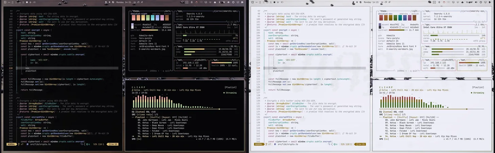](https://bjarneo.github.io/mineral-themes/#obsidian)

`095` · Mineraloid · Folder: [`obsidian/`](obsidian/) · [Open on the site](https://bjarneo.github.io/mineral-themes/#obsidian)

Volcanic glass, a mineraloid. The lava cooled so fast that no crystals could form. The close-up shows a polished slab of the stone.

| Formula | System | Hardness | Luster | Streak | Density | Locality |
| --- | --- | --- | --- | --- | --- | --- |
| SiO₂ (glass) | Amorphous | 5 to 5.5 | Vitreous | White | 2.4 g/cm³ | Glass Buttes, Oregon, USA |

| Variant | Theme name | `background` | `foreground` | `accent` | Icons |
| --- | --- | --- | --- | --- | --- |
| Night | [`obsidian-night`](obsidian/night/) | `#050507` | `#e1e0e9` | `#bab5e2` | `Yaru-purple` |
| Day | [`obsidian-day`](obsidian/day/) | `#ededf6` | `#2d2d35` | `#6c6793` | `Yaru-purple` |

<details>
<summary>All 16 ANSI colors of each variant</summary>

| Variant | Normal, 0 to 7 | Bright, 8 to 15 |
| --- | --- | --- |
| Night | `#111114` `#dc8c84` `#9abe7e` `#e4c379` `#92a8e8` `#d692bb` `#64cad0` `#cac9d3` | `#71707a` `#eba7a0` `#b4d39e` `#f6db9f` `#acbff4` `#e6adcf` `#8edee3` `#f6f6fd` |
| Day | `#dbdae6` `#9e4d48` `#517532` `#886602` `#4c5f9e` `#924e79` `#01787d` `#4d4c55` | `#777680` `#8c3b36` `#3e621b` `#705508` `#3b4e8d` `#803c68` `#026368` `#16151c` |

</details>

```bash
curl -fsSL https://bjarneo.github.io/mineral-themes/install.sh | bash -s -- obsidian --set
```

### Moonstone

[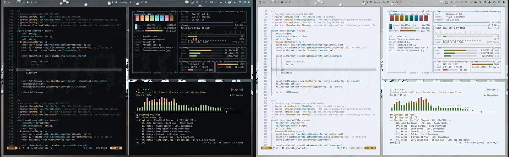](https://bjarneo.github.io/mineral-themes/#moonstone)

`096` · Variety of orthoclase · Folder: [`moonstone/`](moonstone/) · [Open on the site](https://bjarneo.github.io/mineral-themes/#moonstone)

Feldspar with a blue glow that floats under the surface. Thin layers in it scatter the light. The close-up shows a polished slab of the stone.

| Formula | System | Hardness | Luster | Streak | Density | Locality |
| --- | --- | --- | --- | --- | --- | --- |
| KAlSi₃O₈ | Monoclinic | 6 to 6.5 | Vitreous | White | 2.57 g/cm³ | Meetiyagoda, Sri Lanka |

| Variant | Theme name | `background` | `foreground` | `accent` | Icons |
| --- | --- | --- | --- | --- | --- |
| Night | [`moonstone-night`](moonstone/night/) | `#090b0f` | `#dce2eb` | `#7bd9fd` | `Yaru-prussiangreen` |
| Day | [`moonstone-day`](moonstone/day/) | `#edf2fa` | `#282e38` | `#0e7796` | `Yaru-prussiangreen` |

<details>
<summary>All 16 ANSI colors of each variant</summary>

| Variant | Normal, 0 to 7 | Bright, 8 to 15 |
| --- | --- | --- |
| Night | `#16191e` `#dc8c84` `#93c084` `#edbe7c` `#5eb7de` `#d792ba` `#64cacf` `#c5cbd5` | `#6b727d` `#eba7a0` `#afd4a2` `#fed7a1` `#86ccec` `#e7adce` `#8edee2` `#f3f7fe` |
| Day | `#d9e0eb` `#9e4d48` `#4b783a` `#936411` `#0c6d8e` `#934e78` `#025d60` `#474d57` | `#737984` `#8c3b36` `#376525` `#7b5308` `#075b77` `#813c67` `#044b4e` `#12161e` |

</details>

```bash
curl -fsSL https://bjarneo.github.io/mineral-themes/install.sh | bash -s -- moonstone --set
```

### Amazonite

[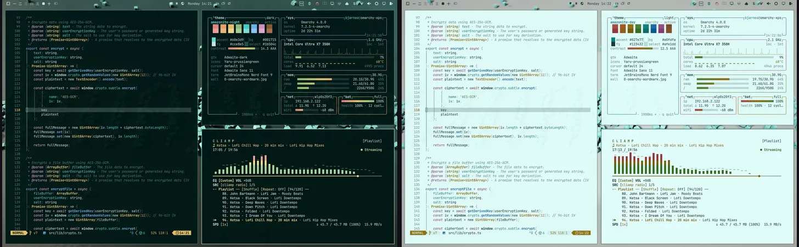](https://bjarneo.github.io/mineral-themes/#amazonite)

`097` · Variety of microcline · Folder: [`amazonite/`](amazonite/) · [Open on the site](https://bjarneo.github.io/mineral-themes/#amazonite)

Blue-green microcline feldspar with white streaks. Lead and water in the crystal give the color. The close-up shows a polished slab of the stone.

| Formula | System | Hardness | Luster | Streak | Density | Locality |
| --- | --- | --- | --- | --- | --- | --- |
| KAlSi₃O₈ | Triclinic | 6 to 6.5 | Vitreous | White | 2.56 g/cm³ | Pikes Peak, Colorado, USA |

| Variant | Theme name | `background` | `foreground` | `accent` | Icons |
| --- | --- | --- | --- | --- | --- |
| Night | [`amazonite-night`](amazonite/night/) | `#001715` | `#cce8e5` | `#60e3d9` | `Yaru-prussiangreen` |
| Day | [`amazonite-day`](amazonite/day/) | `#e0fdfa` | `#123432` | `#027e77` | `Yaru-prussiangreen` |

<details>
<summary>All 16 ANSI colors of each variant</summary>

| Variant | Normal, 0 to 7 | Bright, 8 to 15 |
| --- | --- | --- |
| Night | `#032725` `#e48681` `#8ec27c` `#e6c36a` `#6eb1ed` `#da8ec3` `#46cfc9` `#b5d1cf` | `#517a77` `#f1a29c` `#aad69c` `#f8db94` `#90c7f9` `#e9aad6` `#7ee2dc` `#f0f9f8` |
| Day | `#c5ede9` `#a54744` `#477d33` `#8c6d07` `#1767a3` `#954a81` `#0e7f7b` `#365351` | `#648380` `#933332` `#336a1b` `#745a09` `#01568d` `#833770` `#046965` `#031a19` |

</details>

```bash
curl -fsSL https://bjarneo.github.io/mineral-themes/install.sh | bash -s -- amazonite --set
```

### Labradorite

[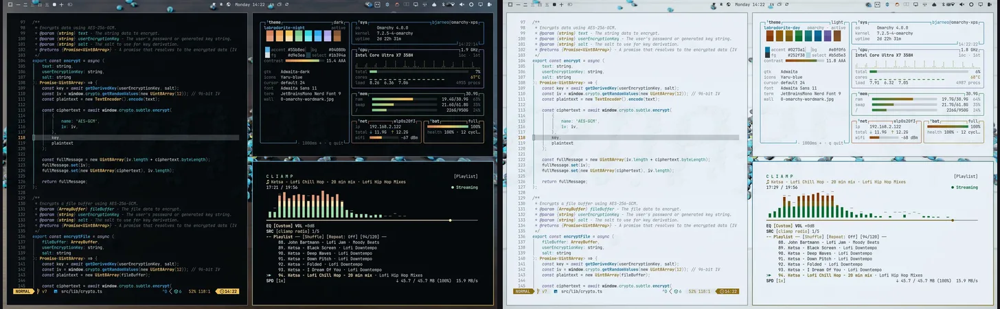](https://bjarneo.github.io/mineral-themes/#labradorite)

`098` · Signature palette · Folder: [`labradorite/`](labradorite/) · [Open on the site](https://bjarneo.github.io/mineral-themes/#labradorite)

Gray feldspar that flashes blue and gold. Thin layers in the crystal make the colors. The close-up shows a polished slab of the stone.

| Formula | System | Hardness | Luster | Streak | Density | Locality |
| --- | --- | --- | --- | --- | --- | --- |
| (Ca,Na)(Al,Si)₄O₈ | Triclinic | 6 to 6.5 | Vitreous | White | 2.7 g/cm³ | Labrador, Canada |

| Variant | Theme name | `background` | `foreground` | `accent` | Icons |
| --- | --- | --- | --- | --- | --- |
| Night | [`labradorite-night`](labradorite/night/) | `#04080b` | `#d9e3ea` | `#55b8ec` | `Yaru-blue` |
| Day | [`labradorite-day`](labradorite/day/) | `#e8f0f6` | `#252f38` | `#0273a1` | `Yaru-blue` |

<details>
<summary>All 16 ANSI colors of each variant</summary>

| Variant | Normal, 0 to 7 | Bright, 8 to 15 |
| --- | --- | --- |
| Night | `#10151a` `#dc855d` `#7ccd8e` `#fbc959` `#30aff8` `#b0a6ed` `#34dde5` `#c1ccd5` | `#67737d` `#e9a080` `#9fe0ac` `#ffe5af` `#6ec4ff` `#c6bffa` `#7bf0f6` `#f1f8fd` |
| Day | `#d4dee7` `#953f0c` `#1b7b3c` `#886609` `#006698` `#665aa0` `#10787d` `#444f57` | `#6e7982` `#7e3100` `#00672c` `#715509` `#00547f` `#56488f` `#086468` `#0f171e` |

</details>

```bash
curl -fsSL https://bjarneo.github.io/mineral-themes/install.sh | bash -s -- labradorite --set
```

### Sunstone

[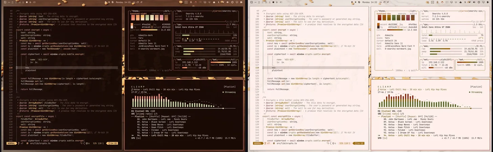](https://bjarneo.github.io/mineral-themes/#sunstone)

`099` · Variety of oligoclase · Signature palette · Folder: [`sunstone/`](sunstone/) · [Open on the site](https://bjarneo.github.io/mineral-themes/#sunstone)

Orange feldspar with tiny plates of hematite. The plates glitter in the light. The close-up shows a polished slab of the stone.

| Formula | System | Hardness | Luster | Streak | Density | Locality |
| --- | --- | --- | --- | --- | --- | --- |
| (Na,Ca)(Al,Si)₄O₈ | Triclinic | 6 to 6.5 | Vitreous | White | 2.65 g/cm³ | Tvedestrand, Norway |

| Variant | Theme name | `background` | `foreground` | `accent` | Icons |
| --- | --- | --- | --- | --- | --- |
| Night | [`sunstone-night`](sunstone/night/) | `#190905` | `#f2dcd5` | `#fea26b` | `Yaru` |
| Day | [`sunstone-day`](sunstone/day/) | `#fef0ec` | `#3f2620` | `#b15300` | `Yaru` |

<details>
<summary>All 16 ANSI colors of each variant</summary>

| Variant | Normal, 0 to 7 | Bright, 8 to 15 |
| --- | --- | --- |
| Night | `#2a1712` `#e1755a` `#b0bf85` `#ffc573` `#d79c73` `#e39096` `#edddb1` `#dcc5be` | `#876a61` `#ed937c` `#c7d4a4` `#fee3c0` `#e7b594` `#f1acb0` `#fbeeca` `#fdf5f2` |
| Day | `#f9d9d0` `#9b2d0f` `#647135` `#986500` `#8d5327` `#97464f` `#6c5c31` `#5f4740` | `#8f756e` `#841d00` `#536020` `#7e5300` `#7c410f` `#85333e` `#5b4b1d` `#22110c` |

</details>

```bash
curl -fsSL https://bjarneo.github.io/mineral-themes/install.sh | bash -s -- sunstone --set
```

### Lazurite

[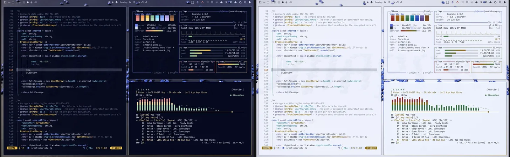](https://bjarneo.github.io/mineral-themes/#lazurite)

`100` · Signature palette · Folder: [`lazurite/`](lazurite/) · [Open on the site](https://bjarneo.github.io/mineral-themes/#lazurite)

The deep blue mineral of lapis lazuli. Painters ground it into the pigment ultramarine. The close-up shows a polished slab of the stone.

| Formula | System | Hardness | Luster | Streak | Density | Locality |
| --- | --- | --- | --- | --- | --- | --- |
| (Na,Ca)₈(AlSiO₄)₆(SO₄,S,Cl)₂ | Cubic | 5 to 5.5 | Vitreous to dull | Bright blue | 2.4 g/cm³ | Sar-e-Sang, Afghanistan |

| Variant | Theme name | `background` | `foreground` | `accent` | Icons |
| --- | --- | --- | --- | --- | --- |
| Night | [`lazurite-night`](lazurite/night/) | `#05081d` | `#d9e1f6` | `#758dfd` | `Yaru-blue` |
| Day | [`lazurite-day`](lazurite/day/) | `#edf1fc` | `#262d42` | `#4e61d9` | `Yaru-blue` |

<details>
<summary>All 16 ANSI colors of each variant</summary>

| Variant | Normal, 0 to 7 | Bright, 8 to 15 |
| --- | --- | --- |
| Night | `#10172f` `#df7f78` `#93c69d` `#f7cb58` `#7ba1fc` `#b5a4ea` `#7dd9fc` `#c3cadf` | `#66718f` `#ec9b94` `#b0dab7` `#fee5aa` `#9cb9fc` `#cabdf7` `#baeafe` `#f4f7fe` |
| Day | `#d4defc` `#983835` `#43784f` `#87690c` `#3155c0` `#6c599e` `#0b7796` `#454c61` | `#71788e` `#862323` `#2e663c` `#725700` `#2141af` `#5c478d` `#04637e` `#111524` |

</details>

```bash
curl -fsSL https://bjarneo.github.io/mineral-themes/install.sh | bash -s -- lazurite --set
```


## How the themes are made

The scripts in [`tools/`](tools/) make every file in this repo. They need Node.js 22 or later, Chromium, ImageMagick and ffmpeg. `tools/photo.mjs` and `tools/glint.mjs` also need a GPU that Chromium can use through Vulkan. `tools/capture.sh` also needs Omarchy, Hyprland and grim.

| Script | Output |
| --- | --- |
| `tools/palettes.mjs` | The mineral table and the color math. Every other script reads it. |
| `tools/crystals.js` | The face planes of each crystal shape. `tools/photo.html` and `tools/render.html` both load it. |
| `tools/build.mjs` | `colors.toml` and `icons.theme` of each variant, and `site/assets/themes.js` |
| `tools/render.mjs` | The data card of each variant at 6K. `tools/render.html` draws it on a canvas. |
| `tools/photo.mjs` | The 4 photographic backgrounds of each variant at 6K. `tools/photo.html` ray-marches the 3D scenes on the GPU. |
| `tools/glint.mjs` | The glint video of each variant. `tools/photo.html` renders a mask of the highlights of the specimen, `tools/glint.html` draws a glint on the brightest ones, and ffmpeg lays the glints over the specimen. |
| `tools/capture.sh` | `preview.png` of each variant and the site screenshots. It applies each variant on this desktop and takes a screenshot of workspace 8. |
| `tools/preview.mjs` | The fallback for a computer without Omarchy: it draws a desktop with the colors of each variant and writes the same files as `tools/capture.sh`. |
| `tools/assets.mjs` | The site previews, the thumbnails, the Aether copies and the mosaic |
| `tools/readme.mjs` | This README |

To build everything again, run the scripts in this order:

```bash
node tools/build.mjs
node tools/render.mjs
node tools/photo.mjs
node tools/glint.mjs
tools/capture.sh
node tools/assets.mjs
node tools/readme.mjs
```

On a computer without Omarchy, run `node tools/preview.mjs` instead of `tools/capture.sh`.

`tools/capture.sh` takes about 30 minutes. It changes the theme of the desktop 200 times and shows workspace 8 the whole time. Open the windows that you want in the screenshots on workspace 8 first. If you switch to another workspace, the script stops and restores your theme. Run it again to continue where it stopped.

`tools/photo.mjs` takes about 2.5 hours for all 800 photos on an Intel Arc GPU. `tools/glint.mjs` takes about 1 hour for the 200 videos. It draws small tiles and waits for the GPU after every 6 tiles. Some GPU drivers reset the GPU when one job runs longer than 5 seconds. The first photo of each scene waits for the shader to compile, which can take a minute.

To change a mineral, edit its row in `tools/palettes.mjs`, then run the scripts with the theme name, for example `node tools/photo.mjs malachite` and `tools/capture.sh malachite`.

The site in [`site/`](site/) is a static page. The workflow in `.github/workflows/pages.yml` copies `install.sh` and every `colors.toml` into it and publishes it to GitHub Pages.
